# [Linux下使用eclipse进行交叉编译简单示例](https://www.cnblogs.com/zhanghanbing/p/7420423.html)
众所周知，在Linux下进行c/c++的开发，远没有windows下那种利用VS工具进行开发的舒爽感，尤其是刚刚接触，使用VIM或是其他文本编辑工具编写程序时，在没有熟练使用GDB的情况下，开发一个程序有种吃屎的感觉 o((⊙﹏⊙))oo((⊙﹏⊙))o。所以就有了这个简单的示例，借用eclipse来开发。
·下载eclipse
进入eclipse官网

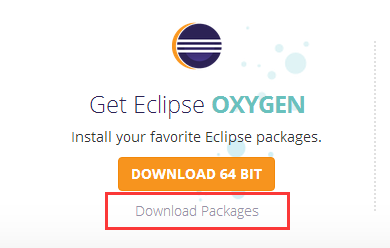

或直接打开eclipse for C/C++

按所需位数下载完毕后，可看到文件名为：eclipse-cpp-oxygen-R-linux-gtk.tar.gz
将其拷贝到ubuntu系统当中，执行：
sudo tar xzvf eclipse-cpp-oxygen-R-linux-gtk.tar.gz -C /opt
将其解压至 /opt 目录下，然后进入/opt/eclipse目录下，直接执行 ./eclipse就可直接安装。
·安装JDK
由于eclipse工具是运行在JVM当中，所以需要在ubuntu当中安装JDK。执行：
sudo apt-get install openjdk-8-jre-headless
安装成功后，通过 java –version就可看到JDK的版本：

·运行eclipse
注意，在未设定相关环境变量的前提下，启动eclipse只能在 /opt/eclipse目录下。
打开后，File -> New -> C project：
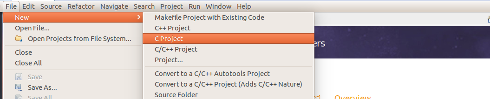
接着输入工程名，注意工具链选择 Cross GCC，代表使用交叉编译环境。
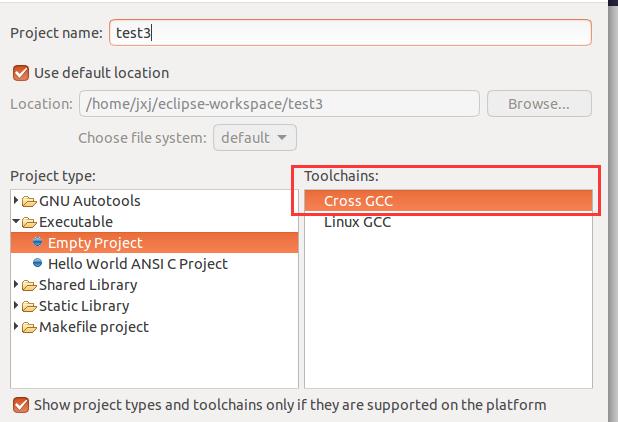
在 Cross GCC Command这里，将所需的交叉编译工具的前缀加上，再将交叉编译工具的路径加上。（路径可通过查看环境变量 echo $PATH 得到）
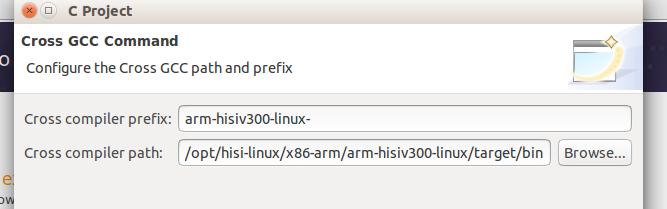
Finish完成：
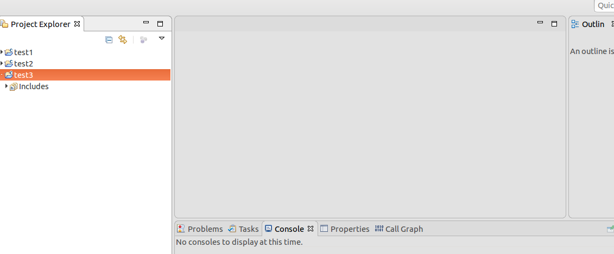
在该工程当中添加相应的c文件，每次编译之前都要保存一下。(不知道是不是版本的问题，不能自动保存。。。)
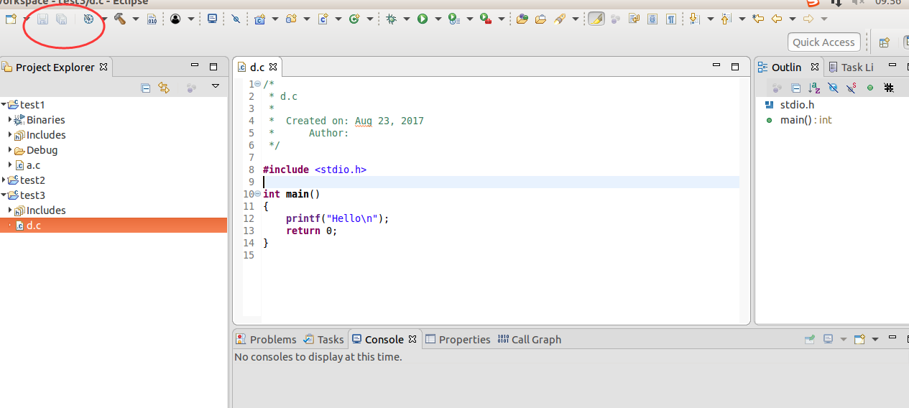
在编译前还要设置一些选项，打开 Project -> Properties:
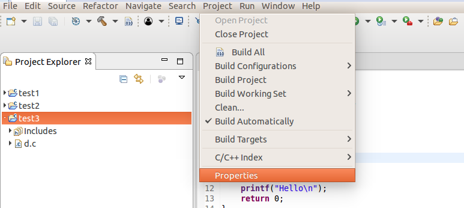
找到 C/C++ Build:

选择 Binary Parsers ，勾上红圈里的选项:
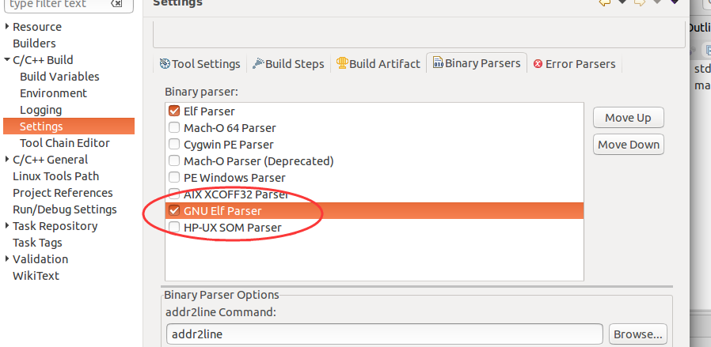
然后 Project -> Build Project:
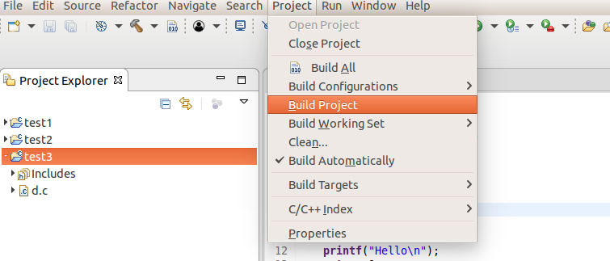
出现以下信息，证明成功:
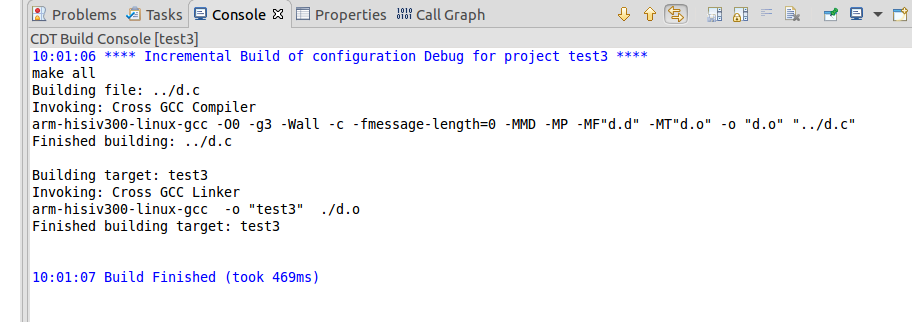
在工程目录下，可看到一个 Binaries，其目录下生成的就是相应的可执行文件:
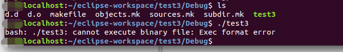
在相应目录下可以看到已生成的可执行文件:

将其导入开发板中即可。