# [linux vscode 安装与配置 简单的程序例子](https://blog.csdn.net/iamsongyu/article/details/89630951)


linux vscode 安装与配置 简单的程序例子
关于vscode 这里说三个要点
（1）下载与安装
（2）插件
（3）编译配置
 
下载与安装
首先去官网下载文件
https://code.visualstudio.com/docs?dv=linux64
有32位和64位版本的，并且有不同的压缩包

下载一个tar包就可以，然后复制到linux磁盘上
高级点的可以直接右键-提取到此处


不行的话就是用命令解压‘
tar -xvzf code-stable-1536736541.tar.gz
 
进入文件的目录，可以直接双击code可执行文件直接运行Visual Studio Code
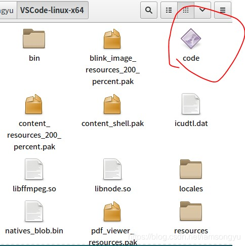 
 

插件
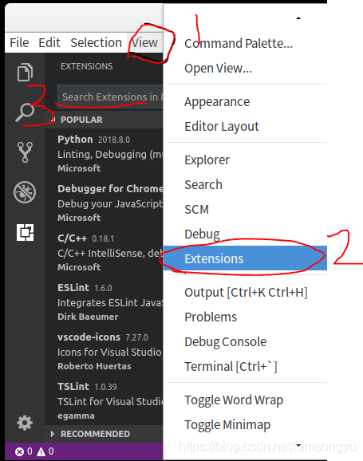 

必装推荐
C/C++为必装，提供C/C++支持
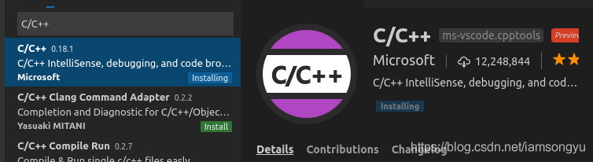 
//安装cpptools插件 ，也是关键的调试
 
C/C++ Snippets建议 提供一些常用的C/C++片段，如for(;;){},安装后写代码方便(tip.如果想要添加自己写的代码段可以点左下角齿轮->用户代码片段)
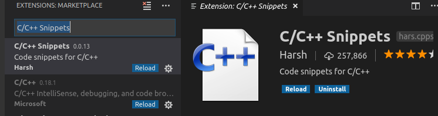 

Code Runner必装,提供编译后程序的运行环境
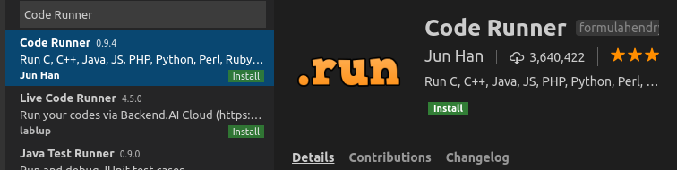 

Include Autocomplete 头文件自动补全
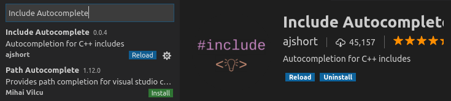 

One Dark Pro 一个好看的vscode主题
更多的推荐主题可以参见http://www.css88.com/archives/8284
完事之后重新打开vscode，安装完毕就可以使用了，包括代码提示，显示，补全等还是不错的
 
常用的一些东西
首先是选项卡的结构，我们常用的两个，一个是工程结构，一个是调试
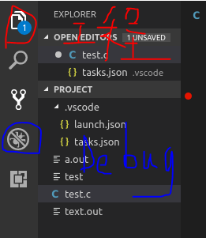 

工程目录里包含我们的工程文件夹和文件与配置文件
一般是打开文件夹作为一个项目，然后再打开或者创建文件
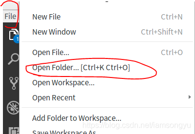 

你的项目就在该文件夹下
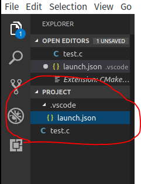 

并且点击的时候，右侧有创建文件和文件夹的快捷方式
我测试的c文件如下：
```C
#include<stdio.h>

main(int argc, char const *argv[])

{

    int aa;

    printf("hello word \n");  //防止行缓存导致无法输出 所以使用\n 表示此行完毕

    scanf("%d",&aa);

    return 0;

}
```
配置调试的时候
launch.json很重要，是配置文件。我们在debug选项卡里可以设置，点击添加配置,选择C++(GDB/LLDB)
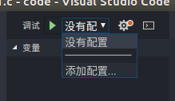 
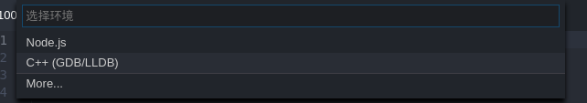 
而后出现了配置文件，launch.json大体内容如下
```C
{

    // Use IntelliSense to learn about possible attributes.

    // Hover to view descriptions of existing attributes.

    // For more information, visit: https://go.microsoft.com/fwlink/?linkid=830387

    "version": "0.2.0",

    "configurations": [

        

        {

            "name": "(gdb) Launch", //gdb调试

            "type": "cppdbg",

            "request": "launch",

            "program": "${workspaceFolder}/text.out", //目标文件 就是我们编辑的文件名.out

            //这里指向要调试的程序//标注:${workspaceFolder}为工作空间文件夹,${fileBasenameNoExtension}为当前打开的文件的文件名，不包括路径和后缀名

            "args": [],

            "stopAtEntry": false,

            "cwd": "${workspaceFolder}",

            "environment": [],

            "externalConsole": true,

            "MIMode": "gdb",

            "setupCommands": [

                {

                    "description": "Enable pretty-printing for gdb",

                    "text": "-enable-pretty-printing",

                    "ignoreFailures": true

                }

            ]

        }

    ]

}

```
添加一项参数（注意不要落下逗号）,这指的是在调试前要预先执行的任务(因为如果要使用gdb调试需要在编译时添加-g参数，所以不能直接使用运行时的文件，建议两个可执行文件分开命名)
"preLaunchTask": "build",
按F5调试一次,会提示没有找不到"build"，点击配置任务，使用tasks.json模板新建一个Others任务
ctrl+p唤出快捷执行
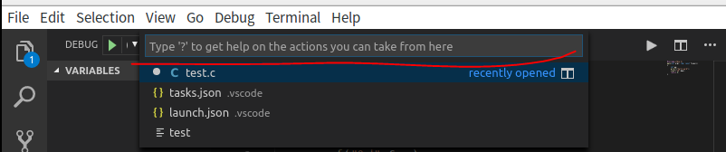 

输入>task
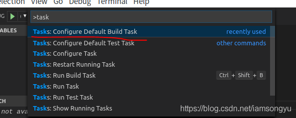 

而后选择菜单里的Other，就会给出默认的Task.json配置，我们需要修改里面的一些参数，用于配置调试之前执行build工作
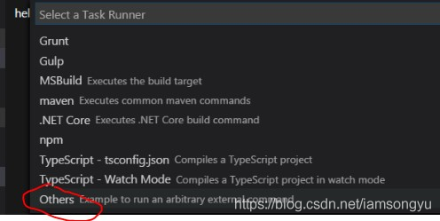 

```C

{

    "version": "2.0.0",

    "tasks": [

        {

            "label": "build",

            "type": "shell",

            "group": {

                "kind": "build",

                "isDefault": true

            },

             "command": "gcc ${file} -o ${workspaceFolder}/text.out -g"

        }

    ]

}

//我们需要手工定义该build命令执行的内容 而后连接g++进行调试 w我们的vscode就可以实现调试了

//看样子是借助的g++的调试功能
```
再次点击调试即可
 
遇到新的问题，首先就是找不到stdio.h的printf.c路径
Unable to open 'printf.c': File not found (file:///build/glibc-mUak1Y/glibc-2.23/stdio-common/printf.c).
从网上下载http://ftp.gnu.org/gnu/glibc/对应的版本
解压到创建的build/glibc-mUak1Y/目录即可
操作步骤如下：
```C

$cd /

$sudo mkdir build

$cd build

$sudo mkdir glibc-mUak1Y

$sudo wget http://ftp.gnu.org/gnu/glibc/...

$sudo tar –xvzf glibc-2.27.tar.gz

//如果需要密码 就直接 $su 然后输入密码就可以 以后也不用sudo了
```
再次点击调试，提示丢失头文件，输入C/Cpp: Edit configurations，就自动生成了一个c_cpp_properties.json文件，这样你就可以在该文件中编写参数来调整设置。
网上有人说，这个在引入include时就会在右侧提醒你

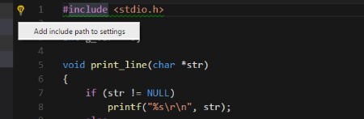 

```C

{

    "configurations": [

        {

            "name": "Linux",

            "includePath": [    //下面就是我们设置头文件路径的地方

                "/build/libc-mUak1Y/glibc-2.23/include/*",   //glibc自带的头文件路径

                "/usr/include/*"                             //系统的头文件路径

            ],

            "defines": [],

            "compilerPath": "/usr/bin/gcc",

            "cStandard": "c11",

            "cppStandard": "c++17",

            "intelliSenseMode": "clang-x64"

        }

    ],

    "version": 4

}
```
里面的includePath就是我们要设置头文件在的地方，添加就可以了
最后的结果如下：  {注意：点击调试的时候，vscode选项卡一定要选择我们的.c主文件}
一些小总结
注意：
1.一般Linux的图形操作界面不允许控制台程序直接运行，所以一般是控制台下运行。还有某些版本会有在控制台下运行的选项，所以我们编译的控制台程序双击试运行不了的，只能在vscode里调试。
2.gcc是编译c语言的 g++默认c++的
3.  launch.json 目标文件 "program": "${workspaceFolder}/test",
    可能有.out 可能不用 看你是怎么生成的了
1.我们一个工程通常包含以下几个内容
launch.json 配置程序启动的，文件目录，启动方式等
tasks.json 配置启动前任务的，build,g++命令设置等
c_cpp_properties.json 配置头文件路径和编译器信息的
大多数是自动感知的，只有少部分需要我们修改，例如路径和任务等。
还有我们编辑的源文件.c             连接的源文件.out          生成的可执行文件源文件.exe
 
2.在launch.json中会使用到一些预定变量, 这些变量的具体含义如下
```C
${workspaceRoot}  the path of the folder opened in VS Code(VSCode中打开文件夹的路径)

${workspaceRootFolderName} the name of the folder opened in VS Code without any solidus (/)(VSCode中打开文件夹的路径, 但不包含"/")

${file} the current opened file(当前打开的文件)

${relativeFile} the current opened file relative to workspaceRoot(当前打开的文件,相对workspaceRoot)

${fileBasename} the current opened file's basename(当前打开文件的文件名, 不含扩展名)

${fileDirname} the current opened file's dirname(当前打开文件的目录名)

${fileExtname} the current opened file's extension(当前打开文件的扩展名)

${cwd} the task runner's current working directory on startup()
```
3.据大佬们说，单个文件调试使用gcc这个就可以，大的项目还得使用cmake，以后试一试
 
4.界面下面有一些可以点击选择的地方

右下角的这个是选择语言模式的.
CRLF, LF 是用来表示文本换行的方式。CR(Carriage Return) 代表回车，对应字符 '\r'；LF(Line Feed) 代表换行，对应字符 '\n'。
utf-8表示默认的文本编码方式
 
最后说一下，关键就是路径的配置，包含头文件的位置，也可以通过更改文件，包含自定义的头文件位置为默认搜索位置。
 
附上快捷键

在terminal打开vccode code
```C 

ctrl+p 查看搜索打开目录下的所有的文件 
ctrl+shift+p 或者 F1 打开控制台 
alt+shift+up/down 列选择 
alt+up/down 选中后使用快捷键，整块代码向上/下移动 
alt+click Multiple cursors多处编辑（注：ubuntu和本身快捷键冲突，按alt会弹出菜单，需要设置gsettings set org.gnome.desktop.wm.preferences mouse-button-modifier "<Super>"） 
ctrl+  将一个文档分分为两个窗口，最多三个 
ctrl+tab 切换打开的tab栏，按tab选择 
ctrl+g 跳转到指定的行 
ctrl+shift+f 在打开的文件夹中寻找（可以选择文件搜索范围，支持正则表达式,反向引用：$1）
ctrl+f 在当前文件查找
ctrl+h在当前文件中
shift+alt+鼠标 块选择
ctrl+` 启动终端 
ctrl+/ 加/解注释
```