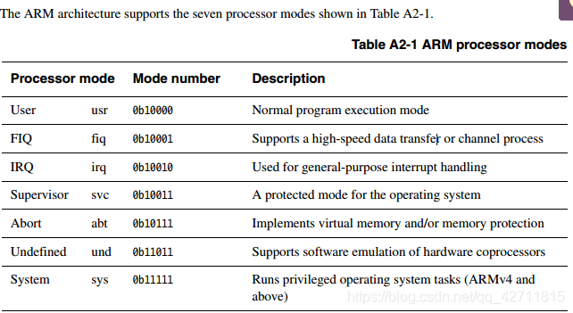
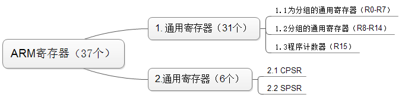

# [第二季-专题2-我从内部看ARM ](https://blog.csdn.net/qq_42711815/article/details/102903217)

专题2-我从内部看ARM
## 第一课-家族检阅
一．用的型号
芯片：6410（A11，三星公司）；2440（A9，三星公司）；210（A8，三星公司）
Arm核：ArmA8（v7）；ArmA9（v4指令架构）；Arm11（V6）
指令架构：ArmV6；ArmV7，ArmV4
芯片之中包含arm核，核包含指令架构
二．性能变迁

 
 
 
 
 
## 第2课-arm处理器工作模式
         学习ARM的知识，最全面的书籍就是Arm公司的手册ARM Architecture Reference Manual，能全面的介绍与Arm相关的知识。
 
 

一．Arm有37个寄存器，31个通用寄存器，还有6个程序状态寄存器
通用寄存器：R0-R7不分组寄存器，R8-R14(不同工作模式下使用的名字不同、寄存器不同)分组寄存器，R15是PC指针，分成三组。
R13-R15十分特殊，`R13当做pc的堆栈指针；R14是链接寄存器`，保存函数的返回地址，当发生异常的时候返回地址；`R15被称为程序计数器，也就是pc指针`。
程序状态寄存器：CPSR、SPSR。SPSR只有在Excrption mode下才存在。`当有中断发生的时候，程序寄存器CPSR发生改`变，为了使得中断结束后CPSR的状态能保持之前没中断之前的状态，把它的值保存在同样是程序状态寄存器的`SPSR`中。`当中断结束的时候，SPSR将其中保存的值再传给CPSR`，使得程序保持之前的运行状态。
二．书写格式
程序状态寄存器的格式如下：
 
对于程序状态寄存器中所有的量，并不需要我们都了解，但是需要了解标记为黄色的量的意义。
 
N表示当两个数进行减法操作，结果为正数是1，结果为负数是0；
Z表示当两个数进行减法操作，结果为0是1，其他结果是0；
 
I表示，当它的值是1的时候，不能进行中断；
F表示，当它的值是1的时候，不能进行快速中断，快速中断比中断级别高；
         M能表明处理器的7中工作模式，具体如上面的图。
## 第四课-arm的寻址方式
**一．寻址方式**
所谓的寻址方式就是处理器根据指令中给出的信息来找到指令所需要的操作数的方式。
**二．主要的寻址方式**
立即数寻址
立即数寻址，是一种特殊的寻址方式，操作数本身就在给定的指令中，只要取出指令也就找到了操作数。这个操作数被称为立即数，对应的寻址方式就是立即数寻址。
ADD R0，R0，#0x3f；R0R0+0x3f
在以上的两条指令中，第二个源操作数就是立即数，要求以“#”为前缀。
寄存器寻址
寄存器寻址就是利用寄存器中的数值作为操作数，这种寻址方式是一种执行效率较高的寻址方式。
ADD R0，R1，R2；R0R1+R2
该指令的执行效果是将寄存器R1和R2的内容相加，结果放在寄存器R0中。
寄存器间接寻址
寄存器间接寻址就是寄存器中存放的是操作数在内存中的地址。立即数寻址，数就在操作指令中；寄存器寻址的数在寄存器中；寄存器间接寻址的数在内存中。
LDR R0，R1, [R2]; R0[R2]
在第一条指令中，以寄存器R2的值作为操作数的地址，在存储器中取得一个操作数后与R1相加，结果存入寄存器R0中。
基址变址寻址
基址变址寻址就是将寄存器里的内容（基地址）与指令中给出的地址偏移量相加，从而得到操作数在内存中的地址：
LDR R0，[R1, #4]; R0[R1+4]
相对寻址
与基址变址寻址方式类似，相对寻址PC指针的当前值为基地址，指令中的地址符号为偏移量，将两者相加之后得到的操作数的有效地址。以下程序段为完成子程序的调用和返回，跳转指令BL采用了相对寻址方式：
BL  NEXT；跳转到程序NEXT处执行
 
NEXT
 
MOV PC，LR；从子程序返回