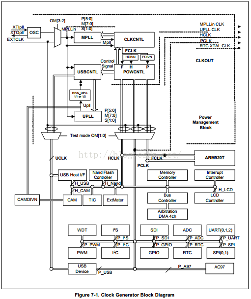
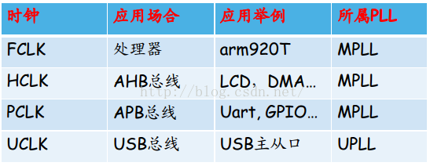
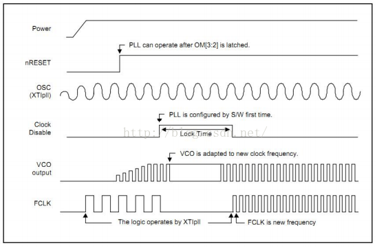
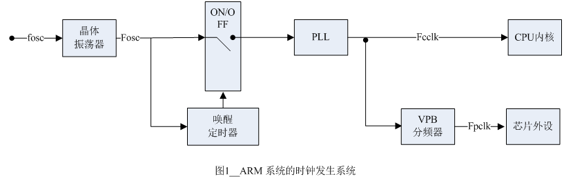

# [第二季-专题7-ARM跑快了---时钟初始化 ](https://www.cnblogs.com/free-1122/p/11452022.html)

专题7-ARM跑快了---时钟初始化
## 一．概念解析
1．时钟脉冲信号
时钟脉冲信号：按一定的电压幅度，一定的时间间隔连续发出的脉冲信号。时钟脉冲信号是时序逻辑的基础，它用于决定逻辑单元中的状态核实更新。数字芯片中众多的晶体管都工作在开关状态，他们的导通和管段动作无不适按照时钟信号的节奏进行的。



2．时钟频率
时钟脉冲频率：在单位时间（如1秒）内产生的时钟脉冲个数。
S3C2440可以使用外部晶振（XTIpll）(默认为12MHZ)和外部时钟（EXTCLK）两种方式输入时钟信号。它由跳线OM[3:2]决定。 
S3C2440 默认的工作主频为12MHz（晶振频率），S3C2440有两个PLL：MPLL和UPLL。通
过MPLL会产生三个部分的时钟频率：FCLK、HCLK、PLCK。UPLL则负责产生USB所需时钟UCLK。

3．时钟源
         时钟信号有两种产生的方式：晶振和锁相环PLL .s3c2440 的时钟控制逻辑既可以外接晶振，然后通过内部电路产生时钟源，也可以直接使用外部提供的时钟源，它们通过引脚的设置来选择。时钟控制逻辑给整个芯片提供3种时钟：FCLK用于CPU核，HCLK用于AHB总线上的设备，比如CPU核、存储控制器、中断控制器、LCD控制器、DMA和USB主机模块等，PCLK用于APB总线上的设备，比如watchdog、IIS、I2C、PWM定时器、MMC接口、ADC、UART、GPIO、RTC和SPI

    AHB（Advanced High performance Bus）总线主要用于高性能模块（CPU、DMA、DSP）之间的连接，APB（Advanced Peripheral Bus）总线主要用于低带宽的周边外设之间的连接，如UART、I2C。

    s3c2440的cpu核心工作电压为1.3V时，主频可以达到400Mhz，为了降低电磁干扰、降低板间布线的要求，s3c2440外接的晶振频率通常很低，本开发板为12Mhz，需要通过时钟控制逻辑的PLL提高系统时钟。

    s3c2440有两个PLL：MPLL和UPLL。UPLL专用于USB设备，MPLL专用于设置FCLK，HCLK，PCLK。

    上电时，PLL没有启动，FCLK等于外部输入时钟，称为Fin，如果要提高系统时钟，需要软件来启动PLL。下面来介绍PLL的设置过程。   
 
晶振：
（1）晶振全称晶体振荡器，
 如下图 所示，ARM的时钟系统包括4部分，分为晶体振荡器、唤醒定时器、锁相环（PLL）和VPB分频器。其中晶体振荡器为系统提供基本的时钟信号（频率为Fosc）。当复位或者处理器从掉电模式唤醒时，“唤醒定时器”要对输入的时钟信号做计数延时，使芯片内部的部件有时间进行初始化。然后Fosc被PLL提高到一个符合用户需要的频率Fcclk，Fcclk用于CPU内核。因为CPU内核通常比外设部件的工作速度要快，用户可以通过设置VPB分频器，把Fcclk信号降低到一个合适的值Fpclk，该信号用于外设部件。
 
## 二．[时钟体系](https://blog.csdn.net/my_way_/article/details/47615903)
学习步骤：
（1）了解晶振频率
（2）了解它的PLL
（3）有PLL产生了什么时钟
（4）这些时钟是干什么的
**时钟工作流程**
1、上电几毫秒后，晶振输出稳定，FCLK=晶振频率，nRESET信号恢复高电平后，CPU开始执行指令。
2、我们的程序开头启动MPLL，设置MPLL的寄存器
3、在设置MPLL的寄存器后，需要等待一段时间(LockTime)，MPLL的输出才稳定。在这段时间(Lock Time)内，FCLK停振，CPU停止工作。Lock Time的长短 由寄存器LOCKTIME设定。
 4、Lock Time之后，MPLL输出正常，CPU工作在新的FCLK下。

**时钟初始化--寄存器配置**
   1、设置locktime（LOCKTIME 寄存器）
   2、设置分频系数（CLKDIVN 寄存器）
   3、如果FCLK  ！= HCLCK （即CLKDIVN 寄存器 PDIVN 位不为0）应设置CPU至异步模式。
   4、设置UCLK与FCLK频率（UPLLCON 寄存器、MPLLCON 寄存器）
   5、NOTE: When you set MPLL&UPLL values, you have to set the UPLL value first and then the MPLL value. (Needs intervals
    approximately 7 NOP)

6、启动代码时钟初始化
```C
#define CLKDIVN 0x4c000014
#define MPLLCON 0x4c000004
#define MPLL_405MHZ ((127<<12)|(2<<4)|(1<<0))
 
init_clock:
	ldr r0, =CLKDIVN
	mov r1, #0x5
	str r1, [r0]
	
	mrc p15,0,r0,c1,c0,0
	orr r0,r0,#0xc0000000
	mcr p15,0,r0,c1,c0,0
	
	ldr r0, =MPLLCON
	ldr r1, =MPLL_405MHZ
	str r1, [r0]
	mov pc, lr

```
## 三．配置流程
在s3c2440芯片手册的第7章可以找到：
 
  这是2440的时钟启动流程，反映了CPU上电以后，cpu由低频率到高频率的演变过程。
FCLK是给ARM核使用的。一旦上电FCLK的频率就是晶振频率，是很慢的。利用软件配置锁相环PLL，当配置完成的时候，发现CPU频率变成0了，这段时间是`locktime`。这段时间很短，结束之后，CPU就会按照新的配置好的频率去工作了。设计始终初始化软件，需要知道软件要完成什么工作，然后才是软件执行的顺序。芯片手册的第七章，下面有：
 
         
软件的工作流程：
（1）配置locktime
（2）配置分频系数（Hclk和Pclk通过分频的设置来完成分别会Fclk的1/2和1/4，设置分频系数），设置好Fclk，对应的Hclk与Pclk也就完整了频率的设置。
（3）如果Fclk（核）和Hclk（总线）不相等，设置cpu为异步模式，这个条件基本是不存在的。这是上面的注意事项所提示的。 
（4）设置Fclk
 
## 四．写代码
写代码的依据：软件的工作流程与芯片手册。
 
2440：
首先在芯片手册上找到，Lock time的寄存器，如下：
 
  它有两个需要设置的分别是U_LTIME和M_TIME，如下：
 
在设置Lock time的时候，我们一般采取默认值，也就是初始值。
分频系数的选择并不是随意选择的，而是按照芯片手册中的下表进行的：
 
 怎么设置系数，需要考虑HDIVN和PDIVN，找个寄存器来设置它们。CLKDIVN的地址是0xC000014就是来设置它们的，如下：
 
设置异步的工作模式，在上面的Note里面有记载，如下：
MMU_SetAsyncBusMode
mrc p15,0,r0,c1,c0,0
orr r0,r0,#R1_nF:OR:R1_iA
mcr p15,0,r0,c1,c0,0
打开芯片核手册，找到对应的CP15的寄存器，这里提到了nF位和iA位，记录如下：
 
需要这两个位位是1，其他的位是0。
 
设置Fclk，可以按公式计算，也可以在芯片手册里面找到PLL VALUE SELECTION TABLE
 
从表中可以看到三个影响因子，在MPLLCON寄存器中可以找到对应的，设置位。MPLLCON的地址是0x4c000004，对应的关系如下：
 
加入新的start.s的代码部分：
```C
reset:
         bl set_svc
         bl disable_watchdog
         bl disable_interrupt
         bl disable_mmu
         bl init_clock
         bl light_led
#define CLKDIVN 0x4c000014      @分频寄存器的地址，用来设置HDIVN和PDIVN
#define MPLLCON 0x4c000004     @设置MPLLCON的地址
#define MPLL_405MHZ ((127<<12)|(2<<4)|(1<<0))
init_clock:
         ldr r0, =CLKDIVN       @分频寄存器
         mov r1, #0x5          @HDIVN、PDIVN分别为2、1，对应二进制为0b101
         str r1, [r0]            @对应的Fclk、Hclk和Pclk系数比例是1:4:8
          
         mrc p15,0,r0,c1,c0,0     @设置异步工作模式
         orr r0,r0,#0xc0000000  @只有开头的两位是1，其他的30位都是0
         mcr p15,0,r0,c1,c0,0    @将设置好的值，再次写回c1这个寄存器
         
         ldr r0, =MPLLCON
         ldr r1, =MPLL_405MHZ  @将设置的值导入r1
         str r1, [r0]
         mov pc, lr
 ```
6410：
设置locktime。在6410中有APLL_LOCK，MPLL_LOCK和EPLL_LOCK三个，它们的默认值都是0x0000FFFF，
我们一般采取默认值
设置分频系数，在6410芯片手册的125页，可以看到下图：
 
   6410中采用的是12MHz的晶振，经过锁相环APLL和MPLL处理之后，产生两个锁相环的输出时钟。在经过分频后，产生ARMCLK和HCLKx2，其中HCLKx2再次经过分频又产生了HCLK、PCLK、CLKJPEG和CLKSECUR。
         6410的一系列时钟信号的产生，需要不断的分频，我们需要做的就是设置一些分频系数，ARMCLK=APLLCLK/(DIVARM+1)；HCLx2=MPLLCLK/(DIVHCLKx2+1)
HCLK=HCLKx2/(DIVHCK+1)；PCLK=HCLKx2/(DIVPCLK+1)。下面要考虑的是这些因子的值如何设置。这里采用u-boot里面设置的值，DivPclk=3（第12位），DIvHclk=1（第8位），Hclkx2=1（第9位），Divarm=0（第0位）。对应算得ARMCLK、HCLK、HCLKx2、PCLK的值分别是533、266、133、66。
         这一切的设置都是有CLK_DIV0设置的，它的地址是0x7E00F020
异步模式。在2440控制它的异步模式，使用的是`CP15协处理器`。在6410的芯片手册的169页有OTHER寄存器，它的地址是0x7E00F900，它的第七位就是用来设置6410的同步模式（1）与异步模式（0）的。它的第六位是SYNCMUX，在上图中的作用是选择器，当系统工作在异步模式的时候，MPLL的输出产生后面的时候，它的值是0。当它的值是1的时候，用APLL产生后面的时钟
设置FCLK。在6410中，只要设置好了APLL和MPLL的输出频率，就因为分频，得到Fclk的大小，参考表格是芯片手册的142页的：
 
   这两个寄存器的地址配置如下：
 
附加：
         在6410中还有一个CLK_SRC没有设置，当它取值1的时候，表示通过MPLL产生是时钟源，当它为0的时候表示直接通过晶振产生时钟源。
         它的地址,0x7E00F01C，它的0-2这三位就是控制选择哪个时钟源，它的默认值是0，我们需要将这三位都设置为1.
 
代码：
```C
reset:
         bl set_svc
         bl set_peri_port
         bl disable_watchdog
         bl disable_interrupt
         bl disable_mmu
         bl init_clock
         bl light_led
 
#define CLK_DIV0 0x7e00f020   @设置分频系数，设置寄存器地址
#define OTHERS 0x7e00f900     @设置异步工作模式，设置OTHER寄存器
#define MPLL_CON 0x7e00f010  @设置Flck，间接设置M PLL的地址
#define APLL_CON 0x7e00f00c   @设置Flck，间接设置APLL的地址
#define CLK_SRC 0x7e00f01c    @设置附加选项CLK_SRC
#define DIV_VAL ((0x0<<0)|(0x1<<9)|(0x1<<8)|(0x3<<12))  @设置分频系数，赋予寄存器的值
#define PLL_VAL ((1<<31)|(266<<16)|(3<<8)|(1<<0)) @设置Flck,设置APLL和MPLL控制寄存器
 
init_clock:
         ldr r0, =CLK_DIV0    @设置分频系数，设置寄存器地址
         ldr r1, =DIV_VAL     @赋予寄存器的值
         str r1, [r0]      
         
         ldr r0, =OTHERS   @设置异步工作模式，设置OTHER寄存器
         ldr r1, [r0]       @将它的值读出来
         bic r1,r1,#0xc0    @将第7位变成0，对应二进制是0b110000
         str r1, [r0]       @将它的值写回去
         
         ldr r0, =APLL_CON    @设置Flck，间接设置M PLL的地址
         ldr r1, =PLL_VAL     @设置Flck，设置APLL控制寄存器
         str r1, [r0]
         
         ldr r0, =MPLL_CON   @设置Flck，间接设置M PLL的地址
         ldr r1, =PLL_VAL     @设置Flck，设置MPLL控制寄存器
         str r1, [r0]
         
         ldr r0, =CLK_SRC  @设置附加选项CLK_SRC
         mov r1, #0x3     @设置附加选项CLK_SRC寄存器的后三位都是1，对应0b111
         str r1, [r0]
         
         mov pc, lr
```
         将代码编译，导入开发板，发现LED灯可以亮，说明程序的正确。
 
210：
         在210的芯片手册361页，可以看到时钟的启动图：
 
   210的晶振是24MHz的，利用锁相环APLL和MPLL产生下面需要的时钟。在256页可以找到时钟信号的计算公式： 
设置locktime。在芯片手册中搜索locktime，找到4个locktime寄存器，每个寄存器都有一个初始值，可以跳过。
设置分频系数。在上图上可以看到有很多的分频系数需要设置。我们要知道两点，这些分频系数需要在哪里设置和怎么设置。在上表中的搜索DIVAPLL，找到设置它的寄存器是CLK_DIV0，地址是0x0100300。设置它的值可以使用芯片手册，不会的话可以使用使用u-boot代码。其中显示
((0x0<<0)|(4<<4)|(4<<8)|(1<<12)|(3<<16)|(1<<20)|(4<<24)|(1<<28))，实际对应的是下表：
 
设置异步工作模式，在210中是不需要设置的
设置fclk。前面设置了分频系数，并没有设置APLL和MPLL的值。它们共同决定fclk的值。APLL_CON的地址是0xe0100100（367页），MPLL_CON的地址是0xe0100108。它们所遵循的控制格式是372页的：
 
  为了安方便设置，参考371页的表：
 
附加：设置CLK_SRC选择器
    CLK_SRC地址为0xe0100200。APLL和MPLL产生的信号可以作为时钟源，也可以是晶振产生的时钟源
代码：
```C
reset:
        bl set_svc
        bl disable_watchdog
        bl disable_interrupt
        bl disable_mmu
        bl init_clock
        bl light_led
#define CLK_DIV0 0xe0100300  @设置CLK_DIV0的地址
#define MPLL_CON 0xe0100108  @ 设置MPLL_CON 地址0xe0100108
#define APLL_CON 0xe0100100  @ 设置APLL_CON 地址0xe0100100
#define CLK_SRC  0xe0100200  @ 设置CLK_SRC  地址0xe0100200
 
#define DIV_VAL ((0x0<<0)|(4<<4)|(4<<8)|(1<<12)|(3<<16)|(1<<20)|(4<<24)|(1<<28))
@设置CLK_DIV0表示的分频系数，按照u-boot中仿制写的
#define APLL_VAL ((1<<31)|(3<<8)|(125<<16)|(1<<0))
#define MPLL_VAL ((1<<31)|(12<<8)|(667<<16)|(1<<0))
init_clock:
    ldr r0, =CLK_DIV0   @设置CLK_DIV0的地址
    ldr r1, =DIV_VAL    @设置CLK_DIV0表示的分频系数，设置分频寄存器的值
    str r1, [r0]
    
    ldr r0, =APLL_CON   @ 设置APLL_CON
    ldr r1, =APLL_VAL
    str r1, [r0]
    
    ldr r0, =MPLL_CON  @ 设置MPLL_CON
    ldr r1, =MPLL_VAL
    str r1, [r0]
    
    ldr r0, =CLK_SRC   @设置CLK_SRC
    ldr r1, =0x1111    @二进制0001000100010001，对应0,4,8,12位是1，控制选择
    str r1, [r0]
    
    mov pc, lr
``` 
学习步骤：首先在u-boot上借鉴启动的流程。在芯片手册上摸索着前进，凡是有不会写的内容再次借鉴u-boot上的代码。