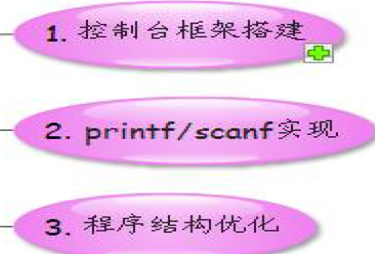

# [第二季-专题14-串口来做控制台](https://www.cnblogs.com/free-1122/p/11452187.html) 
专题14-串口来做控制台
## 第1课-串口工作常识
串口角色分析
数据分析，充当控制台
串口通讯参数
 
串口通讯，分为同步通讯和异步通讯，我们通常使用的都是异步串口。通讯时，双方先约定好数据帧的格式，即波特率，数据位，停止位，奇偶校验位等。
波特率：这是一个衡量通信速度的参数。它表示每秒钟传送的bit的个数。例如300波特表示每秒钟发送300个bit。常用的波特率有38400,115200。
`起始位`：当线路空闲时候，电平为高。一旦检测到一个下降沿，则视为一个起始位。然后接收方按照约定好的格式，接收这一帧数据。
`数据位`：一帧中实际有效数据的位数。
`停止位`：表示这帧数据的结束。
`校验位`：用于检测数据传输是否正确的位。

串口硬件引脚 
我们通常使用的RS232的9帧串口，其中最为重要的是2,3,5脚
2 ：`RXD:接收数据`
3 ：`TXD:发送数据`
5 ：`GND:接地`
 
## 第2课-串口驱动程序设计
串口初始化
（1）     引脚设置
（2）     帧格式设置
（3）     工作模式设置
（4）     波特率设置
数据发送
数据接收
第2课补充-6410与210波特率设置
```C
#define GPHCON (*(volatile unsigned long*)0x56000070)
#define ULCON0 (*(volatile unsigned long*)0x50000000)
#define UCON0  (*(volatile unsigned long*)0x50000004)
#define UBRDIV0  (*(volatile unsigned long*)0x50000028)
#define UTRSTAT0 (*(volatile unsigned long*)0x50000010)
#define UTXH0 (*(volatile unsigned long*)0x50000020)
#define URXH0 (*(volatile unsigned long*)0x50000024)
 
#define PCLK 50000000
#define BAUD 115200
 
void uart_init()
{
    //1.配置引脚功能
    GPHCON &= ~(0xf<<4);
    GPHCON |= (0xa<<4);
   
    //2.1 设置数据格式
    ULCON0 = 0b11;
   
    //2.2 设置工作模式
    UCON0 = 0b0101;
   
    //3. 设置波特率 
    UBRDIV0 =(int)(PCLK/(BAUD*16)-1);
}
 
 
void putc(unsigned char ch)
{
    while (!(UTRSTAT0 & (1<<2)));
    UTXH0 = ch; 
}
 
 
unsigned char getc(void)
{
    unsigned char ret;
 
    while (!(UTRSTAT0 & (1<<0)));
    // 取数据
    ret = URXH0; 
   
    if ( (ret == 0x0d) || (ret == 0x0a) )
    {
        putc(0x0d);
        putc(0x0a); 
    }       
    else
        putc(ret);
       
        return ret;
}
``` 
## [第3课-串口控制台建立](https://www.cnblogs.com/FORFISH/p/5188823.html)
串口控制台建立这一节的主要有三个内容：


1.1控制台的分类介绍：

    1.1.1菜单型控制台：就是选中设置好的数字或者字母选项后执行相应功能的控制台：

例如刚进入uboot之后的界面，就是菜单型控制台：

等待我们输入命令，来执行相应的操作。例如上面，如果此时我们输入1，就是进行Format the nand Flash的操作：

 1.1.2解析型控制台：在上面的菜单型控制台里，选择5：Exit to command line：后会出现：
就进入了解析型控制台：

我们输入help后，控制台会去解析这一命令是不是该控制台所支持的，如果是，它会去调用相应的help函数来运行。会列出这个uboot所在的解析型控制台所支持的命令：
由于解析型控制台实现起来会很复杂，今天就选择相对简单的菜单型控制台，来实现一个相对简单的自己的uboot控制台。

   菜单型控制台：
可以看到一个菜单型控制台，第一件事就是先把菜单打印出来，而且会循环打印，首先想到的就是使用printf来打印菜单信息。代码：

上面就是uboot里的提示信息，根据用户的选项来执行对应的功能函数，通过switch来选择实现。上面就是菜单型框架。

在上面的菜单型控制台的实现里，最主要的两个函数是scanf和printf。

2. scanf和printf的实现

首先先实现printf函数，在实现一个函数的时候，第一考虑的是它的功能，printf的功能是打印信息的，printf在PC机里打印信息是打印到显示器里的。然而在开发板里，printf的信息是打印到串口终端的。接着就是要了解该函数的参数。要了解它的参数需要在命令行执行：man 3 printf：

可以看到第一个就是我们的printf函数，只是它的参数是采用的变参的方式，变参用三个点表示，就是该函数的参数是不一定的。可以为零，可以为一个，可以为很多个。后面变参的形式由前面的const char *format来决定的。就是如果const char *format指定的是一个整形参数，那么。。。就得是整形参数，如果const char *format是字符型参数，那么。。。就得是字符型参数。

 

实现思路：将传进来的参数转化为字符串型的buffer，然后字符串型的buffer通过一个while循环，利用上一节实现的void putc(unsigned char ch)函数输出到串口终端。

实现思路的难点是怎么把传进来的参数转化为字符串型的buffer。

 

1）在上一节的uboot工程里创建一个printf.c：
2）接着把printf.c加入到Makefile里面去：
3）printf.c的实现：（1）将变参转化为字符串。（2）打印字符串到串口。

   对于（2）打印字符串到串口。起始实现起来很方便，因为前面已经实现了putc()函数：
 有难度的是（1）将变参转化为字符串。这里需要用到C语言中已经实现好的一些宏。关于变参处理的一些宏（函数）。来帮我们完成。（1）将变参转化为字符串。实现步骤：
上面就实现了将变参转化为字符串。但是问题又来了。上面的三个宏（函数）又得我们实现，而且实现起来是非常复杂的，而且是很标准的。这里就可以采用移植的方法。

 

我们去实现这种嵌入式的软件，并不是说，所有的代码都需要自己去编写。比如后面还有实现tftp，tftp还需要ip协议栈，对于ip协议栈，我们是无法实现的。所以就是在实现嵌入式的软件的时候，很大时候需要做的是移植。

我们实现移植的地方有两个，一个是Linux内核里，或是C库。这里谈到移植，对于现阶段的我们来说，难度太大了。所以现在我们只要知道，这三个函数的功能是什么，和会使用这些从Linux内核提取好的一些文件，集成到自己的uboot工程里面使用就可以了。

下面是两个提取好的文件目录：
## [第4课-210控制台故障分析](https://blog.csdn.net/ashe9657/article/details/101103033)

待分析


