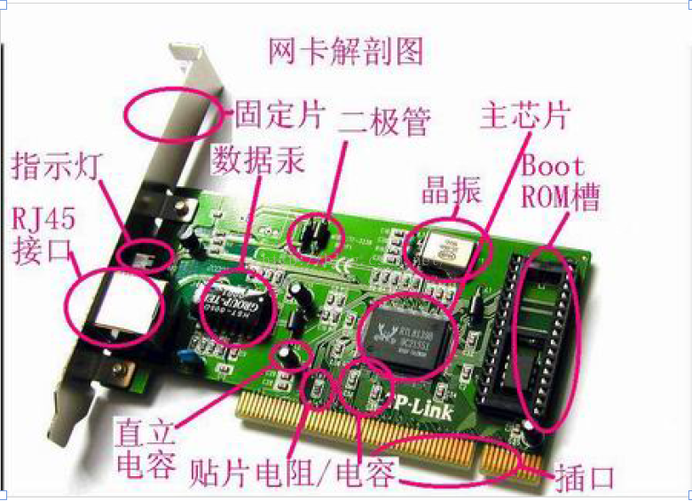
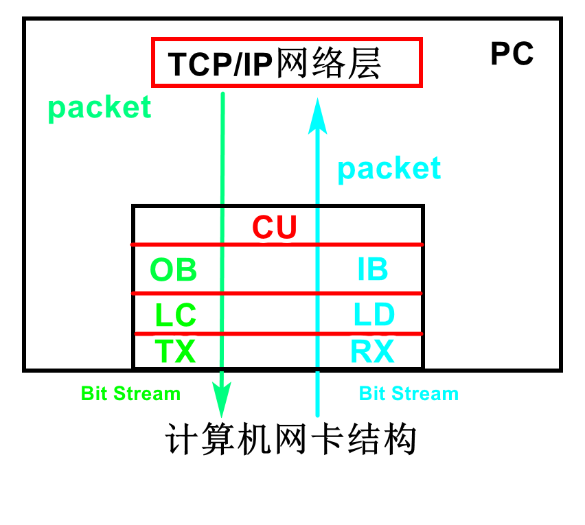

# [第二季-专题18-网卡搭建新通道 ](https://www.cnblogs.com/free-1122/p/11452226.html)

专题18-网卡搭建新通道
## 第1课-网卡基本工作原理
### 网络模型
（1）     OSI七层模型
OSI(Open SystemInterconnection)，开放式系统互联参考模型。它把网络协议从逻辑上分为了7层。通过七个层次使不同的系统网络之间实现可靠的通讯。
  
（2）     Linux四层模型
OSI参考模型的过于庞大、复杂招致了许多批评。与此对照，由技术人员自己开发的TCP/IP协议栈获得了更为广泛的应用。 
 
**网卡硬件模型**
 一块网卡包括OSI 模型的两个层， 物理层和数据链路层：
     1》物理层定义了数据传送与接收所需要的电与光信号、线路状态、时钟基准、数据编码和电路等， 并向数据链路层设备提供标准接口。
     2》数据链路层则提供寻址机构、数据帧的构建、数据差错检查、传送控制、向网络层 提供标准的数据接口等功能。

（4）     MII接口
MII：媒体独立接口, “媒体独立”表明MAC一定情况下，任何类型的PHY设备都可以正常工作。
 
 
DM9000工作特性
（1）     片选
（2）     对外接口
 **网卡的组要作用**
        网卡的功能主要有两个:
       一是将电脑的数据封装为帧，并通过网线(对无线网络来说就是电磁波)将数据发送到网络上去;
       二是接收网络上其它设备传过来的帧，并将帧重新组合成数据，发送到所在的电脑中。
        网卡能接收所有在网络上传输的 信号，但正常情况下只接受发送到该电脑的帧和广播帧，将其余的帧丢弃。然后，传送到系统CPU 做进一步处理。当电 脑发送数据时，网卡等待合适的时间将分组插入到数据流中。接收系统通知电脑消息是否完整地到达，如果出现问题， 将要求对方重新发送。
### 三：网卡的组成和工作原理
网卡包含7个功能模块，分别是`CU（Control Unit，控制单元）、OB（Output Buffer，输出缓存）、IB（Input Buffer，输入缓存）、LC（Line Coder，线路编码器）、LD（Line Decoder，线路解码器）、TX（Transmitter，发射器）、RX（Receiver，接收器）`。  以最常见的PCI接口的网卡为例：

网卡的组成：
       （1）主芯片： 网卡的主控制芯片是网卡的核心元件，一块网卡性能的好坏和功能的强弱多寡，主要就是看这块芯片的质量。如下图所示：
（2）BOOTROM槽：BOOTROM 插座也就是常说的无盘启动ROM 接口，其是用来通过远程启动服务构造无盘工作站的。如下图所示：

（3）数据泵：作用一是传输数据；二是隔离网线连接的不同网络设备间的不同电平，还能对设备起到一定的防雷保护作用。如下图所示：

（4）晶振即石英振荡器，提供基准频率,如下图所示：

（5）LED指示灯：用来标识网卡的不同工作状态，例如，Link/Act表示连接活动状态，Full表示是否全双工，而Power是电源指示。
（6）网线接口：有BNC接口和RJ-45接口，目前主要使用8芯线的RJ-45接口。

（7）总线接口：用于网卡与电脑相连接，内置式网卡需要通过俗称“金手指”的总线接口插在计算机主板的扩展槽中。主要有ISA,PCI,PCMCIA和USB等常见的是PCI总线接口的网卡。
### 四：网卡的工作原理
   网卡充当计算机和网络缆线之间的物理接口或连线，负责将计算机中的数字信号转换成电或光信号。
网卡要承担串行数据或并行数据间的转换，数据在计算机总线中并行传输，而在网络的物理缆线中以串行的比特流传输。
以太网卡中数据链路层的芯片一般简称之为` MAC 控制器`，物理层的芯片我们简称之 为`PHY`。许多网卡的芯片把MAC 和PHY 的功能做到了一颗芯片中，比如Intel 82559 网卡 的和3COM 3C905 网卡。但是MAC 和PHY 的机制还是单独存在的，只是外观的表现形式 是一颗单芯片。当然也有很多网卡的MAC 和PHY 是分开做的，比如D-LINK 的DFE-530TX 等。
**1 数据链路层MAC 控制器**
首先我们来说说以太网卡的 MAC 芯片的功能。以太网数据链路层其实包含MAC（介 质访问控制）子层和LLC（逻辑链路控制）子层。一块以太网卡MAC 芯片的作用不但要实 现MAC 子层和LLC 子层的功能，还要提供符合规范的PCI 界面以实现和主机的数据交换。 MAC 从PCI 总线收到IP 数据包（或者其他网络层协议的数据包）后，将之拆分并重 新打包成最大1518Byte，最小64Byte 的帧。这个帧里面包括了目标MAC 地址、自己的源 MAC 地址和数据包里面的协议类型（比如IP 数据包的类型用80 表示）。最后还有一个 DWORD(4Byte)的CRC 码。 可是目标的 MAC 地址是哪里来的呢？这牵扯到一个`ARP 协议`（介乎于网络层和数据 链路层的一个协议）。第一次传送某个目的IP 地址的数据的时候，先会发出一个ARP 包， 其MAC 的目标地址是广播地址，里面说到："谁是xxx.xxx.xxx.xxx 这个IP 地址的主人？" 因为是广播包，所有这个局域网的主机都收到了这个ARP 请求。收到请求的主机将这个IP 地址和自己的相比较，如果不相同就不予理会，如果相同就发出ARP 响应包。这个IP 地址 的主机收到这个ARP 请求包后回复的ARP 响应里说到："我是这个IP 地址的主人"。这个 包里面就包括了他的MAC 地址。以后的给这个IP 地址的帧的目标MAC 地址就被确定了。 （其它的协议如IPX/SPX 也有相应的协议完成这些操作。） IP 地址和MAC 地址之间的关联关系保存在主机系统里面，叫做ARP 表，由驱动程序 和操作系统完成。在Microsoft 的系统里面可以用 arp -a 的命令查看ARP 表。收到数据帧 的时候也是一样，做完CRC 以后，如果没有CRC 效验错误，就把帧头去掉，把数据包拿出 来通过标准的借口传递给驱动和上层的协议客栈，最终正确的达到我们的应用程序。 还有一些控制帧，例如流控帧也需要MAC 直接识别并执行相应的行为。以太网MAC 芯片的一端接计算机PCI 总线，另外一端就接到PHY 芯片上。以太网的物理层又包括 `MII/GMII（介质独立接口）子层、PCS（物理编码子层）、PMA（物理介质附加）子层、PMD （物理介质相关）子层、MDI 子层`。而PHY 芯片是实现物理层的重要功能器件之一，实现 了前面物理层的所有的子层的功能。
**2 物理层PHY**
PHY 在发送数据的时候，收到MAC 过来的数据（对PHY 来说，没有帧的概念，对它 来说，都是数据而不管什么地址，数据还是CRC），每4bit 就增加1bit 的检错码，然后把并 行数据转化为串行流数据，再按照物理层的编码规则（10Based-T 的NRZ 编码或100based-T 的曼彻斯特编码）把数据编码，再变为模拟信号把数据送出去。（注：关于网线上数据是数 字的还是模拟的比较不容易理解清楚。最后我再说） 收数据时的流程反之。 发送数据时，PHY 还有个重要的功能就是实现CSMA/CD 的部分功能，它可以检测到 网络上是否有数据在传送。网卡首先侦听介质上是否有载波（载波由电压指示），如果有， 则认为其他站点正在传送信息，继续侦听介质。一旦通信介质在一定时间段内（称为帧间缝 隙IFG= 9.6 微秒）是安静的，即没有被其他站点占用，则开始进行帧数据发送，同时继续 侦听通信介质，以检测冲突。在发送数据期间，如果检测到冲突，则立即停止该次发送，并 向介质发送一个“阻塞”信号，告知其他站点已经发生冲突，从而丢弃那些可能一直在接收的 受到损坏的帧数据，并等待一段随机时间（CSMA/CD 确定等待时间的算法是二进制指数退 避算法）。在等待一段随机时间后，再进行新的发送。如果重传多次后（大于16 次）仍发生 冲突，就放弃发送。 接收时，网卡浏览介质上传输的每个帧，如果其长度小于64 字节，则认为是冲突碎片。 如果接收到的帧不是冲突碎片且目的地址是本地地址，则对帧进行完整性校验，如果帧长度 大于1518 字节（称为超长帧，可能由错误的LAN 驱动程序或干扰造成）或未能通过CRC 校验，则认为该帧发生了畸变。通过校验的帧被认为是有效的，网卡将它接收下来进行本地 处理 许多网友在接入 Internt 宽带时，喜欢使用"抢线"强的网卡，就是因为不同的PHY 碰撞 后计算随机时间的方法设计上不同，使得有些网卡比较"占便宜"。不过，抢线只对广播域的 网络而言的，对于交换网络和ADSL 这样点到点连接到局端设备的接入方式没什么意义。 而且"抢线"也只是相对而言的，不会有质的变化。
**3 关于网络间的冲突**
现在交换机的普及使得交换网络的普及，使得冲突域网络少了很多，极大地提高了网 络的带宽。但是如果用HUB，或者共享带宽接入Internet 的时候还是属于冲突域网络，有冲 突碰撞的。交换机和HUB 最大的区别就是：一个是构建点到点网络的局域网交换设备，一 个是构建冲突域网络的局域网互连设备。 我们的 PHY 还提供了和对端设备连接的重要功能并通过LED 灯显示出自己目前的连 接的状态和工作状态让我们知道。当我们给网卡接入网线的时候，PHY 不断发出的脉冲信 号检测到对端有设备，它们通过标准的"语言"交流，互相协商并却定连接速度、双工模式、 是否采用流控等。 通常情况下，协商的结果是两个设备中能同时支持的最大速度和最好的双工模式。这 个技术被称为Auto Negotiation 或者NWAY，它们是一个意思--`自动协商`。
**4 PHY 的输出部分**
现在来了解 PHY 的输出后面部分。一颗CMOS 制程的芯片工作的时候产生的信号电 平总是大于0V 的（这取决于芯片的制程和设计需求），但是这样的信号送到100 米甚至更 长的地方会有很大的直流分量的损失。而且如果外部网现直接和芯片相连的话，电磁感应（打 雷）和静电，很容易造成芯片的损坏。 再就是设备接地方法不同，电网环境不同会导致双方的0V 电平不一致，这样信号从A 传到B，由于A 设备的0V 电平和B 点的0V 电平不一样，这样会导致很大的电流从电势高 的设备流向电势低的设备。我们如何解决这个问题呢？ 这时就出现了 Transformer（隔离变压器）这个器件。它把PHY 送出来的差分信号用差 模耦合的线圈耦合滤波以增强信号，并且通过电磁场的转换耦合到连接网线的另外一端。这 样不但使网线和PHY 之间没有物理上的连接而换传递了信号，隔断了信号中的直流分量， 还可以在不同0V 电平的设备中传送数据。 隔离变压器本身就是设计为耐 2KV~3KV 的电压的。也起到了防雷感应（我个人认为 这里用防雷击不合适）保护的作用。有些朋友的网络设备在雷雨天气时容易被烧坏，大都是 PCB 设计不合理造成的，而且大都烧毁了设备的接口，很少有芯片被烧毁的，就是隔离变 压器起到了保护作用。
**5 关于传输介质**
隔离变压器本身是个被动元件，只是把PHY 的信号耦合了到网线上，并没有起到功率 放大的作用。那么一张网卡信号的传输的最长距离是谁决定的呢？ 一张网卡的传输最大距离和与对端设备连接的兼容性主要是 PHY 决定的。但是可以将 信号送的超过100 米的PHY 其输出的功率也比较大，更容易产生EMI 的问题。这时候就需 要合适的Transformer 与之配合。作PHY 的老大公司Marvell 的PHY，常常可以传送180~200 米的距离，远远超过IEEE 的100 米的标准。 RJ-45 的接头实现了网卡和网线的连接。它里面有8 个铜片可以和网线中的4 对双绞（8 根）线对应连接。其中100M 的网络中1、2 是传送数据的，3、6 是接收数据的。1、2 之间
是一对差分信号，也就是说它们的波形一样，但是相位相差180 度，同一时刻的电压幅度互 为正负。这样的信号可以传递的更远，抗干扰能力强。同样的，3、6 也一样是差分信号。 网线中的 8 根线，每两根扭在一起成为一对。我们制作网线的时候，一定要注意要让1、 2 在其中的一对，3、6 在一对。否则长距离情况下使用这根网线的时候会导致无法连接或连 接很不稳定。 现在新的 PHY 支持AUTO MDI-X 功能(也需要Transformer 支持)。它可以实现RJ-45 接口的1、2 上的传送信号线和3、6 上的接收信号线的功能自动互相交换。有的PHY 甚至 支持一对线中的正信号和负信号的功能自动交换。这样我们就不必为了到底连接某个设备需 要使用直通网线还是交叉网线而费心了。这项技术已经被广泛的应用在交换机和SOHO 路 由器上。 在 1000Basd-T 网络中，其中最普遍的一种传输方式是使用网线中所有的4 对双绞线， 其中增加了4、5 和7、8 来共同传送接收数据。由于1000Based-T 网络的规范包含了AUTO MDI-X 功能，因此不能严格确定它们的传出或接收的关系，要看双方的具体的协商结果。
**6 PHY 和MAC 之间如何进行沟通**
下面继续让我们来关心一下 PHY 和MAC 之间是如何传送数据和相互沟通的。通过 IEEE 定义的标准的MII/GigaMII（Media Independed Interfade，介质独立界面）界面连接MAC 和PHY。这个界面是IEEE 定义的。MII 界面传递了网络的所有数据和数据的控制。 而 MAC 对PHY 的工作状态的确定和对PHY 的控制则是使用SMI（Serial Management Interface）界面通过读写PHY 的寄存器来完成的。PHY 里面的部分寄存器也是IEEE 定义的， 这样PHY 把自己的目前的状态反映到寄存器里面，MAC 通过SMI 总线不断的读取PHY 的 状态寄存器以得知目前PHY 的状态，例如连接速度，双工的能力等。当然也可以通过SMI 设置PHY 的寄存器达到控制的目的，例如流控的打开关闭，自协商模式还是强制模式等。 我们看到了，不论是物理连接的 MII 界面和SMI 总线还是PHY 的状态寄存器和控制 寄存器都是有IEEE 的规范的，因此不同公司的MAC 和PHY 一样可以协调工作。当然为了 配合不同公司的PHY 的自己特有的一些功能，驱动需要做相应的修改。
**7 网卡的供电**
最后就是电源部分了。大多数网卡现在都使用 3.3V 或更低的电压。有的是双电压的。 因此需要电源转换电路。 而且网卡为了实现 Wake on line 功能，必须保证全部的PHY 和MAC 的极少一部分始 终处于有电的状态，这需要把主板上的5V Standby 电压转换为PHY 工作电压的电路。在主 机开机后，PHY 的工作电压应该被从5V 转出来的电压替代以节省5V Standby 的消耗。（许 多劣质网卡没有这么做）。 有 Wake on line 功能的网卡一般还有一个WOL 的接口。那是因为PCI2.1 以前没有PCI 设备唤醒主机的功能，所以需要着一根线通过主板上的WOL 的接口连到南桥里面以实现 WOL 的功能。 新的主板合网卡一般支持 PCI2.2/2.3，扩展了PME#信号功能，不需要那个接口而通过 PCI 总线就可以实现唤醒功能。
**8网卡信息发送**

2.1 计算机的应用软件会产生等待发送的原始数据，这些数据经过TCP/IP模型的应用层、传输层、网络层处理后，得到一个一个的数据包（Packet）。然后，网络层会将这些数据包逐个下传给网卡的CU。

2.2 CU 从网络层哪里接收到数据包之后，会将每个数据包封装成帧（Frame）。在以太网中封装的数据帧为以太帧（Ethernet Frame）。然后CU单元会将这些帧逐个传递给OB。

2.3 OB从CU哪里接收到帧以后，会按帧的接收顺序将这些帧排成一个队列，然后将队列中的帧逐个传递给LC。先从CU哪里接收的帧会先传给LC。

2.4 LC从OB哪里接收到帧之后，会对这些帧进行线路编码。从逻辑上讲，一个帧就是一个长度有限的一串“0”和“1”。OB中的“0”和“1”所对应的物理量（指电平、电流、电荷等）只适合于待在缓存之中，而不适合于在线路上进行传输。LC的作用就是将这些“0”和“1”所对应的物理量转换成适合于在线路上进行传输的物理信号，并将物理信号传递给TX。

2.5 TX从LC哪里接收到物理信号之后，会对物理信号的功率等特性进行调整，然后将调整后的物理信号通过线路发送出去。

**网卡信息接收**
3.1 RX从传输介质（例如双绞线）哪里接收到物理信号（指电压/电流波形等），然后对物理信号的功率特性进行调整，再将调整后的物理信号传递给LD。

3.2 LD会对来自RX的物理信号进行线路解码。线路解码：就是从物理信号中识别出逻辑上的“0”和“1”，并将这些“0”和“1”重新表达为适合于待在缓存中的物理量（指电平、电流、电荷等），然后将这些“0”和“1”以帧为单位逐渐传递给IB。

3.3 IB从LD哪里接收到帧以后，会按照帧的接收顺序将这些帧逐渐排列成一个队列，然后将队列中的帧逐个传递给CU，先从LD哪里接收的帧会先传给CU。

3.4 CU从IB哪里接收到帧以后，会对帧进行分析和处理，一个帧的处理结果有且只有两种可能：直接将这个帧丢弃，或者将这个帧的帧头和帧尾丢弃，得到数据包，然后将数据包上传给TCP/IP模型的网络层。

3.5 从CU上传到网络层的数据包会经过网络层、传输层、应用层逐层处理，处理后的数据被送达给应用软件使用。当然，数据也可能会在某一层的处理中提前丢失了，从而无法到达给应用软件。
## 第2课-DM9000驱动程序设计
```C
#include "dm9000.h"
 
#define DM_ADD (*((volatile unsigned short *)0x20000300))
#define DM_DAT (*((volatile unsigned short *)0x20000304))
 
#define GPFCON    (*(volatile unsigned *)0x56000050) //Port F control
#define EXTINT0   (*(volatile unsigned *)0x56000088) //External interrupt control register 0
#define EINTMASK  (*(volatile unsigned *)0x560000a4) //External interrupt mask
#define SRCPND     (*(volatile unsigned *)0x4a000000) //Interrupt request status
#define INTPND     (*(volatile unsigned *)0x4a000010) //Interrupt request status
#define INTMSK     (*(volatile unsigned *)0x4a000008) //Interrupt mask control
#define EINTPEND  (*(volatile unsigned *)0x560000a8) //External interrupt pending
 
#define BWSCON    (*(volatile unsigned *)0x48000000) //Bus width & wait status
#define BANKCON4  (*(volatile unsigned *)0x48000014) //BANK4 control
 
 
typedef unsigned int u32;
typedef unsigned short u16;
typedef unsigned char u8;
 
 
u8 mac_addr[6] = {9,8,7,6,5,4};
u8 buffer[1000];
 
void cs_init()
{
    BWSCON = BWSCON & (~(0x3<<16));
    BWSCON = BWSCON |(0x1<<16);
    BANKCON4 = (0x0<<13)|(0x0<<11)|(0x7<<8)|(0x1<<6)|(0x0<<4)|(0x0<<2)|(0x0<<0);
}
 
void int_init()
{
    GPFCON = GPFCON &(~(0x3<<14));
    GPFCON = GPFCON |(0x2<<14);
    EXTINT0 = EXTINT0 & (~(0x7<<28));
    EXTINT0 = EXTINT0 | (0x1<<28);
    INTMSK = INTMSK &(~(1<<4));
    EINTMASK = EINTMASK & (~(0x1<<7));
    SRCPND = (1<<4);
    INTPND = (1<<4);
}
 
void dm9000_reg_write(u16 reg,u16 data)
{
    DM_ADD = reg;
    DM_DAT = data;  
}
 
u8 dm9000_reg_read(u16 reg)
{
    DM_ADD = reg;
    return DM_DAT;  
}
 
void dm9000_reset()
{
    dm9000_reg_write(DM9000_GPCR, GPCR_GPIO0_OUT);
    dm9000_reg_write(DM9000_GPR, 0);  
   
    dm9000_reg_write(DM9000_NCR, (NCR_LBK_INT_MAC | NCR_RST));
    dm9000_reg_write(DM9000_NCR, 0);
   
    dm9000_reg_write(DM9000_NCR, (NCR_LBK_INT_MAC | NCR_RST));
    dm9000_reg_write(DM9000_NCR, 0);
}
 
void dm9000_probe(void)
{
    u32 id_val;
    id_val = dm9000_reg_read(DM9000_VIDL);
    id_val |= dm9000_reg_read(DM9000_VIDH) << 8;
    id_val |= dm9000_reg_read(DM9000_PIDL) << 16;
    id_val |= dm9000_reg_read(DM9000_PIDH) << 24;
    if (id_val == DM9000_ID) {
        printf("dm9000 is found !\n");
        return ;
    } else {
        printf("dm9000 is not found !\n");
        return ;
    }
}
 
void dm9000_init()
{
    u32 i;
   
    /*设置片选*/
    cs_init();
   
    /*中断初始化*/
    int_init();
   
    /*复位设备*/
    dm9000_reset();
   
    /*捕获dm9000*/
    dm9000_probe();
   
    /*MAC初始化*/
    /* Program operating register, only internal phy supported */
    dm9000_reg_write(DM9000_NCR, 0x0);
    /* TX Polling clear */
    dm9000_reg_write(DM9000_TCR, 0);
    /* Less 3Kb, 200us */
    dm9000_reg_write(DM9000_BPTR, BPTR_BPHW(3) | BPTR_JPT_600US);
    /* Flow Control : High/Low Water */
    dm9000_reg_write(DM9000_FCTR, FCTR_HWOT(3) | FCTR_LWOT(8));
    /* SH FIXME: This looks strange! Flow Control */
    dm9000_reg_write(DM9000_FCR, 0x0);
    /* Special Mode */
    dm9000_reg_write(DM9000_SMCR, 0);
    /* clear TX status */
    dm9000_reg_write(DM9000_NSR, NSR_WAKEST | NSR_TX2END | NSR_TX1END);
    /* Clear interrupt status */
    dm9000_reg_write(DM9000_ISR, ISR_ROOS | ISR_ROS | ISR_PTS | ISR_PRS);
   
    /*填充MAC地址*/
    for (i = 0; i < 6; i++)
        dm9000_reg_write(DM9000_PAR+i, mac_addr[i]);
   
    /*激活DM9000*/
    dm9000_reg_write(DM9000_RCR, RCR_DIS_LONG | RCR_DIS_CRC | RCR_RXEN);
    /* Enable TX/RX interrupt mask */
    dm9000_reg_write(DM9000_IMR, IMR_PAR);
}
 
void dm9000_tx(u8 *data,u32 length)
{
    u32 i;
   
    /*禁止中断*/
    dm9000_reg_write(DM9000_IMR,0x80);
   
    /*写入发送数据的长度*/
    dm9000_reg_write(DM9000_TXPLL, length & 0xff);
    dm9000_reg_write(DM9000_TXPLH, (length >> 8) & 0xff);
   
    /*写入待发送的数据*/
    DM_ADD = DM9000_MWCMD;
  
    for(i=0;i<length;i+=2)
    {
    DM_DAT = data[i] | (data[i+1]<<8);
    }
   
    /*启动发送*/
    dm9000_reg_write(DM9000_TCR, TCR_TXREQ);
   
    /*等待发送结束*/
    while(1)
    {
       u8 status;
       status = dm9000_reg_read(DM9000_TCR);
       if((status&0x01)==0x00)
           break;
    }
   
    /*清除发送状态*/
    dm9000_reg_write(DM9000_NSR,0x2c);
   
    /*恢复中断使能*/
    dm9000_reg_write(DM9000_IMR,0x81);
}
 
#define PTK_MAX_LEN 1522
 
u32 dm9000_rx(u8 *data)
{
    u8 status,len;
    u16 tmp;
    u32 i;
   
    /*判断是否产生中断，且清除*/
    if(dm9000_reg_read(DM9000_ISR) & 0x01)
        dm9000_reg_write(DM9000_ISR,0x01);
    else
        return 0;
       
    /*空读*/
    dm9000_reg_read(DM9000_MRCMDX);
   
    /*读取状态*/
    status = dm9000_reg_read(DM9000_MRCMD);
   
    /*读取包长度*/
    len = DM_DAT;
   
    /*读取包数据*/
    if(len<PTK_MAX_LEN)
    {
       for(i=0;i<len;i+=2)
       {
           tmp = DM_DAT;
           data[i] = tmp & 0x0ff;
           data[i+1] = (tmp>>8)&0x0ff;
       }
    }
}
 
void int_issue()
{
    u32 i;
    i = dm9000_rx(buffer);
   
    SRCPND = (1<<4);
    INTPND = (1<<4);
    EINTPEND |= 1<<7;
}
```
## 第3课-ARP协议实现
**ARP协议介绍**
在计算机网络中，数据发送的过程，就是一个把数据按照各层协议层层封装的过程。在这个过程中，最终要使用的协议通常是以太网协议（数据链路层协议）。
（1）     以太网通讯格式
目的MAC地址：接收者的物理地址源
MAC地址：发送者的物理地址
类型：标明高层的数据使用的协议类型
数据：高层的数据
CRC：校验码
 
（2）     ARP协议功能
在以太网络中，每台计算机的唯一身份标示是MAC地址（物理层的地址），两台计算机要进行通讯，也必须知道对方的MAC地址，但是用户通常只知道对方的IP地址，这个时候，就可以利用ARP（地址解析协议）来向局域网中的所有计算机发送ARP请求包，收到请求包且满足条件的计算机将回复ARP应答包，告知其MAC地址。所以ARP协议是一种利用IP地址或者MAC地址的协议。
（3）     ARP通讯格式
 
ARP包分为请求包和应答包，通过OP字段来区别。
编程实现ARP