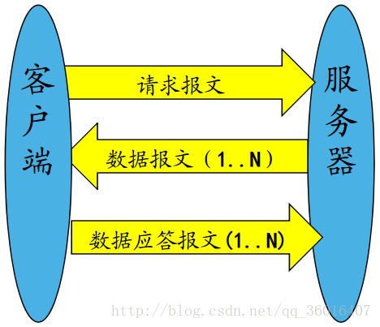
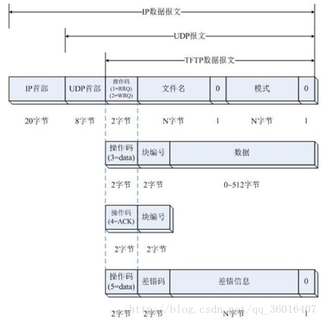

# [专题19-移植tftp客户端]()
一.tftp作用：在嵌入式开发中进行数据传输
二.交互过程：
1.客户端发送请求包（请求报文）
2.根据选项参数，服务器决定是否发送应答确认包，进而客户端发送确认接收包，这步是可选的。
3.服务器发送数据包1,。服务器会将要传输的数据拆分成许多小块，每512字节一个块。（数据报文）
4.客户端回应数据包1（应答报文）
5.服务器如果没有收到数据包1回应包，就会重复发送数据包1直到超时.收到了就继续发送数据包2.
6.客户端回应数据包2.
7.以此类推，服务器发送数据包n，客户端回应数据包n。
8.。。。。。。。。。。。。。

三.报文格式：

1.tftp是属于UDP协议的，UDP又是属于IP协议的。IP又是属于以太网的。所以客户端必须知道目的端的mac地址，所以之前要发送一个ARP包。
2.根据操作码来区分不同的tftp报文。
3.操作码 = 1：表示客户端要从服务器下载数据，属于请求读。后面跟上要读些的文件名，再追加一个0.再后面是读取的模式，分为ASCiI码和普通的八位二进制数格式，末尾追加一个0.
4.操作码 = 2：表示请求从客户端上传数据到服务器。 后面格式和读取（下载）一样。
5.操作码 = 3：表示数据报文，后面紧跟块编号，末尾就是真正的数据内容
6.操作码 = 4：表示应答报文，后面以他应答的数据块编号结尾，
7.操作码 = 5：表示出错。后面紧跟差错码和差错信息。
四.修改网卡驱动
1.在arp.c增加网络处理函数。判断是什么类型的包。之前的代码默认是一个ARP包，但实际情况很复杂，所以要判断网卡接收到的是什么包。
2.在dm9000.c的中断处理里面对参数进行修改。包括buffer，以及调用通用处理函数，而不是简单地调用ARP应答解析函数。
```C
arp.h
typedef unsigned int   u32;
typedef unsigned short u16;
typedef unsigned char  u8;

typedef struct eth_hdr
{
    u8 d_mac[6];
    u8 s_mac[6];
    u16 type;
}ETH_HDR;

typedef struct arp_hdr
{
    ETH_HDR ethhdr;
    u16 hwtype;
    u16 protocol;
    u8 hwlen;
    u8 protolen;
    u16 opcode;
    u8 smac[6];
    u8 sipaddr[4];
    u8 dmac[6];
    u8 dipaddr[4];
}ARP_HDR;

typedef struct ip_hdr
{
    ETH_HDR ethhdr;
    u8 vhl;
    u8 tos;
    u16 len;
    u16 ipid;
    u16 ipoffset;
    u8 ttl;
    u8 proto;
    u16 ipchksum;
    u8 srcipaddr[4];
    u8 destipaddr[4];
}IP_HDR;

typedef struct udp_hdr
{
    IP_HDR iphdr;
    u16 sport;
    u16 dport;
    u16 len;
    u16 udpchksum;
}UDP_HDR;

typedef struct tftp_package
{
    u16 opcode;
    u16 blocknum;
    u8 data[0]; 
}TFTP_PAK;

ARP_HDR arpbuf;

#define PROTO_ARP 0x0806
#define PROTO_IP 0x0800
#define PROTO_UDP 0x11

extern u8 host_mac_addr[6];
extern u8 mac_addr[6];
extern u8 ip_addr[4];
extern u8 host_ip_addr[4];
extern u16 packet_len;

arp.c

#include "arp.h"

#define HON(n) ((((u16)((n) & 0xff)) << 8) | (((n) & 0xff00) >> 8))

/*1.发送arp请求包*/
void arp_request()
{
     /*1.构成arp请求包*/
     memcpy(arpbuf.ethhdr.d_mac,host_mac_addr,6);
     memcpy(arpbuf.ethhdr.s_mac,mac_addr,6);
     arpbuf.ethhdr.type = HON(0x0806);

     arpbuf.hwtype = HON(1);
     arpbuf.protocol = HON(0x0800);

     arpbuf.hwlen = 6;
     arpbuf.protolen = 4;

     arpbuf.opcode = HON(1);

     memcpy(arpbuf.smac,mac_addr,6);
     memcpy(arpbuf.sipaddr,ip_addr,4);
     memcpy(arpbuf.dipaddr,host_ip_addr,4);

     packet_len = 14+28;

     /*2.调用dm9000发送函数，发送应答包*/   
     dm9000_tx(&arpbuf,packet_len);
}

/*2.解析arp应答包，提取mac*/
u8 arp_process(u8 *buf, u32 len)
{
    u32 i;
    ARP_HDR *arp_p = (ARP_HDR *)buf;

    if (packet_len<28)
        return 0;

    switch (HON(arp_p->opcode))
    {
        case 2: /*arp响应包*/
            memcpy(host_ip_addr,arp_p->sipaddr,4);
            printf("host ip is : ");
            for(i=0;i<4;i++)
               printf("%03d ",host_ip_addr[i]);
            printf("\n\r");

            memcpy(host_mac_addr,arp_p->smac,6);
            printf("host mac is : ");
            for(i=0;i<6;i++)
            printf("%02x ",host_mac_addr[i]);
            printf("\n\r");

            break;

        case 1: /*arp请求包*/
        /*发送arp响应包*/
            memcpy(arpbuf.ethhdr.d_mac,arp_p->smac,6);
            memcpy(arpbuf.ethhdr.s_mac,mac_addr,6);
            arpbuf.ethhdr.type = HON(0x0806);

            arpbuf.hwtype = HON(1);
            arpbuf.protocol = HON(0x0800);

            arpbuf.hwlen = 6;
            arpbuf.protolen = 4;

            arpbuf.opcode = HON(2);

            memcpy(arpbuf.smac,mac_addr,6);
            memcpy(arpbuf.sipaddr,ip_addr,4);
            memcpy(arpbuf.dmac,arp_p->smac,6);
            memcpy(arpbuf.dipaddr,arp_p->sipaddr,4);

            packet_len = 14+28;

         /*2.调用dm9000发送函数，发送应答包*/   
            dm9000_tx(&arpbuf,packet_len);           
            break;
     }
}

void udp_process(u8* buf, u32 len)
{
     UDP_HDR *udphdr = (UDP_HDR *)buf;

     tftp_process(buf,len,HON(udphdr->sport));      
}

void ip_process(u8 *buf, u32 len)
{
     IP_HDR *p = (IP_HDR *)buf; 

     switch(p->proto)
     {
        case PROTO_UDP:
            udp_process(buf,len);
            break;

        default:
            break;  
     }
}

void net_handle(u8 *buf, u32 len)
{
     ETH_HDR *p = (ETH_HDR *)buf;

     switch (HON(p->type))
     {
        case PROTO_ARP:
            arp_process(buf,len);
            break;

        case PROTO_IP:
            ip_process(buf,len);
            break;

        default:
            break;
     }
}

void dm9000_arp()
{
    while(1)
        arp_request();  
}

tftp.c

#include "string.h"
#include "arp.h"

u8 sendbuf[1024];
u8* tftp_down_addr = 0x31000000;
u16 serverport = 0;
u16 curblock = 1;

#define HON(n) ((((u16)((n) & 0xff)) << 8) | (((n) & 0xff00) >> 8))

u16 checksum(u8 *ptr, int len)
{
    u32 sum = 0;
    u16 *p = (u16 *)ptr;

    while (len > 1)
    {
        sum += *p++;
        len -= 2;
    }

    if(len == 1)
        sum += *(u8 *)p;

    while(sum>>16)
        sum = (sum&0xffff) + (sum>>16);

    return (u16)((~sum)&0xffff);
}

void tftp_send_request(const char *filename)
{
    u8 *ptftp = &sendbuf[200];
    u32 tftp_len = 0;
    UDP_HDR *udphdr;
    u8 *iphdr;

    ptftp[0] = 0x00;
    ptftp[1] = 0x01;
    tftp_len += 2 ;

    sprintf(&ptftp[tftp_len],"%s",filename);
    tftp_len += strlen(filename);
    ptftp[tftp_len] = '\0';
    tftp_len += 1;

    sprintf(&ptftp[tftp_len],"%s","octet");
    tftp_len += strlen("octect");
    ptftp[tftp_len] = '\0';
    tftp_len += 1;

    udphdr = ptftp-sizeof(UDP_HDR);
    iphdr =  ptftp-sizeof(UDP_HDR)+ sizeof(ETH_HDR);

    /*UDP帧头信息*/
    udphdr->sport = HON(48915);
    udphdr->dport = HON(69);
    udphdr->len = HON(tftp_len+sizeof(UDP_HDR)-sizeof(IP_HDR));
    udphdr->udpchksum = 0x00;

    /*IP帧头信息*/
    udphdr->iphdr.vhl = 0x45;
    udphdr->iphdr.tos = 0x00;
    udphdr->iphdr.len = HON(tftp_len+sizeof(UDP_HDR)-sizeof(ETH_HDR));
    udphdr->iphdr.ipid = HON(0x00);
    udphdr->iphdr.ipoffset = HON(0x4000);
    udphdr->iphdr.ttl = 0xff;
    udphdr->iphdr.proto = 17;
    memcpy(udphdr->iphdr.srcipaddr,ip_addr,4);
    memcpy(udphdr->iphdr.destipaddr,host_ip_addr,4);
    udphdr->iphdr.ipchksum = 0;
    udphdr->iphdr.ipchksum = checksum(iphdr,20);

    memcpy(udphdr->iphdr.ethhdr.s_mac,mac_addr,6);
    memcpy(udphdr->iphdr.ethhdr.d_mac,host_mac_addr,6);
    udphdr->iphdr.ethhdr.type = HON(PROTO_IP);

    dm9000_tx((u32 *)udphdr,sizeof(UDP_HDR)+tftp_len);
}

void tftp_send_ack(u16 blocknum)
{
    u8 *ptftp = &sendbuf[200];
    u32 tftp_len = 0;
    UDP_HDR *udphdr;
    u8 *iphdr;

    ptftp[0] = 0x00;
    ptftp[1] = 0x04;
    tftp_len += 2 ;

    ptftp[2] = (blocknum&0xff00)>>8;
    ptftp[3] = (blocknum&0xff);
    tftp_len += 2 ;

    udphdr = ptftp-sizeof(UDP_HDR);
    iphdr =  ptftp-sizeof(UDP_HDR)+ sizeof(ETH_HDR);

    /*UDP帧头信息*/
    udphdr->sport = HON(48915);
    udphdr->dport = HON(serverport);
    udphdr->len = HON(tftp_len+sizeof(UDP_HDR)-sizeof(IP_HDR));
    udphdr->udpchksum = 0x00;

    /*IP帧头信息*/
    udphdr->iphdr.vhl = 0x45;
    udphdr->iphdr.tos = 0x00;
    udphdr->iphdr.len = HON(tftp_len+sizeof(UDP_HDR)-sizeof(ETH_HDR));
    udphdr->iphdr.ipid = HON(0x00);
    udphdr->iphdr.ipoffset = HON(0x4000);
    udphdr->iphdr.ttl = 0xff;
    udphdr->iphdr.proto = 17;
    memcpy(udphdr->iphdr.srcipaddr,ip_addr,4);
    memcpy(udphdr->iphdr.destipaddr,host_ip_addr,4);
    udphdr->iphdr.ipchksum = 0;
    udphdr->iphdr.ipchksum = checksum(iphdr,20);

    memcpy(udphdr->iphdr.ethhdr.s_mac,mac_addr,6);
    memcpy(udphdr->iphdr.ethhdr.d_mac,host_mac_addr,6);
    udphdr->iphdr.ethhdr.type = HON(PROTO_IP);

    dm9000_tx((u32 *)udphdr,sizeof(UDP_HDR)+tftp_len);
}

void tftp_process(u8 *buf, u32 len, u16 port)
{
     u32 i;
     u32 tftp_len;

     serverport = port;

     TFTP_PAK *ptftp = buf + sizeof(UDP_HDR);

     tftp_len = len - sizeof(UDP_HDR);

     if(HON(ptftp->opcode) == 3)
     {
         if (HON(ptftp->blocknum) == curblock)
         {
              for (i = 0;i<(tftp_len-4);i++)
              {
                  *(tftp_down_addr) = *(ptftp->data+i);
              } 

              tftp_send_ack(HON(ptftp->blocknum));

              curblock++;

              if ((tftp_len-4)<512)
                  curblock = 1;
         }
    }
}
```
五.IP协议格式

相应的数据结构为

六.UDP协议格式

数据结构

七。关于DM9000打开接收广播功能的datasheet部分


八.处理触发中断的网络包

九.对IP协议的包以及从属于IP协议的UDP协议的包进行处理

十.TFTP发送请求信号，准备读取服务器的数据

十一.客户端接收到来自服务器端的数据包的应答函数

十二.TFTP客户端处理函数