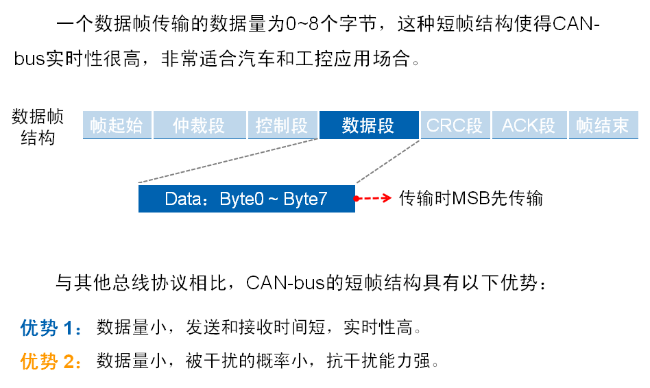

# [CAN总线通讯原理](https://blog.csdn.net/wargames_dc/article/details/106460363)

CAN（Controller Area Network，控制器局域网）是一种能有效支持分布式控制和实时控制的串行通讯网络。

CAN-bus： Controller Area Network-bus，控制器局域网总线技术

 

CAN总线系统结构

CAN 控制器
接收控制单元中微处理器发出的数据，处理数据并传给CAN收发器

CAN收发器
将数据传到总线 or 从总线接收数据给控制器

CAN数据传递终端
避免数据传输终了反射回来

CAN数据总线

传输数据的数据线，两根 CAN-high and CAN-low，差分信号

CAN总线系统的数据传输

 

CAN总线节点上的节点发送数据是以报文的形式广播给网络中所有节点。收发器接收到数据就把数据传送给控制器，再由控制器检查判断是不是所需数据。不是则忽略。

网络上任何一个节点在任何时候都可以发送数据
多个节点发送数据，优先级低主动退出发送
短帧结构，每帧数据信息为0~8字节（具体用户定义），对数据编码而不是地址编码
CAN每帧都有CRC校验和其他检验措施，严重错误的情况下具有自动关闭输出的功能
 

CAN总线系统数据格式

CAN-bus通信帧共分为数据帧、远程帧、错误帧、过载帧和帧间隔

五种类型。

数据帧

结构上由7个段组成，其中根据仲裁段ID码长度的不同，分为标准帧（CAN2.0A）和扩展帧（CAN2.0B）。

帧起始、帧结束

仲裁段

显性隐性

总线仲裁

 

从该分析过程得出结论是：帧ID值越小，优先级越高
对于同为扩展格式数据帧、标准格式远程帧和扩展格式远程帧的情况同理。

控制段

数据段

CRC段

ACK段

 

远程帧

数据帧与远程帧的区别

 

CAN-bus 错误类型

 

过载帧

 

帧间隔

 

 

