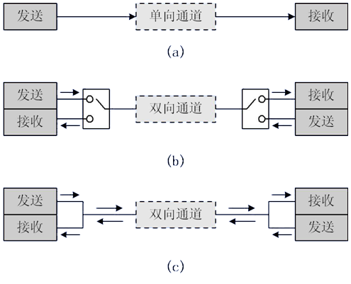
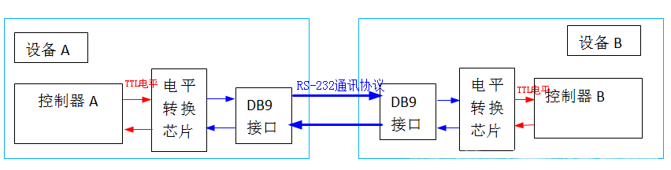
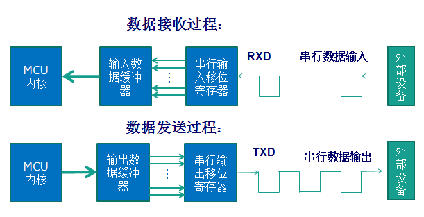
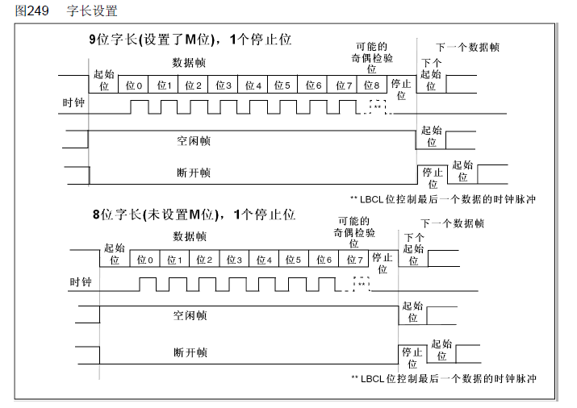
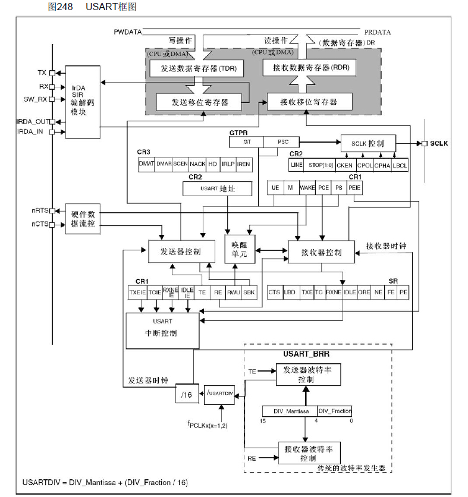

# [串口通信基本原理](https://blog.csdn.net/qq_38410730/article/details/79887200)

串行通信的分类
1、按照数据传送方向，分为：

单工：数据传输只支持数据在一个方向上传输；
半双工：允许数据在两个方向上传输。但是，在某一时刻，只允许数据在一个方向上传输，它实际上是一种切换方向的单工通信；它不需要独立的接收端和发送端，两者可以合并一起使用一个端口。
全双工：允许数据同时在两个方向上传输。因此，全双工通信是两个单工通信方式的结合，需要独立的接收端和发送端。

2、按照通信方式，分为：

同步通信：带时钟同步信号传输。比如：SPI，IIC通信接口。
异步通信：不带时钟同步信号。比如：UART(通用异步收发器)，单总线。
在同步通讯中，收发设备上方会使用一根信号线传输信号，在时钟信号的驱动下双方进行协调，同步数据。例如，通讯中通常双方会统一规定在时钟信号的上升沿或者下降沿对数据线进行采样。

在异步通讯中不使用时钟信号进行数据同步，它们直接在数据信号中穿插一些用于同步的信号位，或者将主题数据进行打包，以数据帧的格式传输数据。通讯中还需要双方规约好数据的传输速率（也就是波特率）等，以便更好地同步。常用的波特率有4800bps、9600bps、115200bps等。

在同步通讯中，数据信号所传输的内容绝大部分是有效数据，而异步通讯中会则会包含数据帧的各种标识符，所以同步通讯效率高，但是同步通讯双方的时钟允许误差小，稍稍时钟出错就可能导致数据错乱，异步通讯双方的时钟允许误差较大。

UART引脚连接方法
RXD：数据输入引脚，数据接受；
TXD：数据发送引脚，数据发送。

对于两个芯片之间的连接，两个芯片GND共地，同时TXD和RXD交叉连接。这里的交叉连接的意思就是，芯片1的RxD连接芯片2的TXD，芯片2的RXD连接芯片1的TXD。这样，两个芯片之间就可以进行TTL电平通信了。

若是芯片与PC机（或上位机）相连，除了共地之外，就不能这样直接交叉连接了。尽管PC机和芯片都有TXD和RXD引脚，但是通常PC机（或上位机）通常使用的都是RS232接口（通常为DB9封装），因此不能直接交叉连接。RS232接口是9针（或引脚），通常是TxD和RxD经过电平转换得到的。故，要想使得芯片与PC机的RS232接口直接通信，需要也将芯片的输入输出端口也电平转换成rs232类型，再交叉连接。

经过电平转换后，芯片串口和rs232的电平标准是不一样的：

单片机的电平标准（TTL电平）：+5V表示1，0V表示0；
Rs232的电平标准：+15/+13 V表示0，-15/-13表示1。
RS-232通讯协议标准串口的设备间通讯结构图如下： 

所以单片机串口与PC串口通信就应该遵循下面的连接方式：在单片机串口与上位机给出的rs232口之间，通过电平转换电路(如下面图中的Max232芯片) 实现TTL电平与RS232电平之间的转换。

具体要了解RS232串口的，可以查看链接RS232串口简介。

STM32的UART特点
全双工异步通信；
分数波特率发生器系统，提供精确的波特率。发送和接受共用的可编程波特率，最高可达4.5Mbits/s；
可编程的数据字长度（8位或者9位）；
可配置的停止位（支持1或者2位停止位）；
可配置的使用DMA多缓冲器通信；
单独的发送器和接收器使能位；
检测标志：① 接受缓冲器  ②发送缓冲器空 ③传输结束标志；
多个带标志的中断源，触发中断；
其他：校验控制，四个错误检测标志。
 

串口通信过程

STM32中UART参数
串口通讯的数据包由发送设备通过自身的TXD接口传输到接收设备的RXD接口，通讯双方的数据包格式要规约一致才能正常收发数据。STM32中串口异步通信需要定义的参数：起始位、数据位（8位或者9位）、奇偶校验位（第9位）、停止位（1,15,2位）、波特率设置。

UART串口通信的数据包以帧为单位，常用的帧结构为：1位起始位+8位数据位+1位奇偶校验位（可选）+1位停止位。如下图所示：

奇偶校验位分为奇校验和偶校验两种，是一种简单的数据误码校验方法。奇校验是指每帧数据中，包括数据位和奇偶校验位的全部9个位中1的个数必须为奇数；偶校验是指每帧数据中，包括数据位和奇偶校验位的全部9个位中1的个数必须为偶数。

校验方法除了奇校验(odd)、偶校验(even)之外，还可以有：0 校验(space)、1 校验(mark)以及无校验(noparity)。 0/1校验：不管有效数据中的内容是什么，校验位总为0或者1。

UART（USART）框图

这个框图分成上、中、下三个部分。本文大概地讲述一下各个部分的内容，具体的可以看《STM32中文参考手册》中的描述。

框图的上部分，数据从RX进入到接收移位寄存器，后进入到接收数据寄存器，最终供CPU或者DMA来进行读取；数据从CPU或者DMA传递过来，进入发送数据寄存器，后进入发送移位寄存器，最终通过TX发送出去。

然而，UART的发送和接收都需要波特率来进行控制的，波特率是怎样控制的呢？

这就到了框图的下部分，在接收移位寄存器、发送移位寄存器都还有一个进入的箭头，分别连接到接收器控制、发送器控制。而这两者连接的又是接收器时钟、发送器时钟。也就是说，异步通信尽管没有时钟同步信号，但是在串口内部，是提供了时钟信号来进行控制的。而接收器时钟和发送器时钟有是由什么控制的呢？

可以看到，接收器时钟和发送器时钟又被连接到同一个控制单元，也就是说它们共用一个波特率发生器。同时也可以看到接收器时钟（发生器时钟）的计算方法、USRRTDIV的计算方法。

这里需要知道一个知识点：

UART1的时钟：PCLK2（高速）；
UART2、UART3、UART4的时钟：PCLK1（低速）。
框图的中部分，涉及到UART（USART）的中断控制部分，在后面的文章中会具体介绍到。