# [Flash硬件原理](https://www.cnblogs.com/yuanqiangfei/p/9400435.html)
1.2.1. 什么是Flash

Flash全名叫做Flash Memory，从名字就能看出，是种数据存储设备，存储设备有很多类，Flash属于非易失性存储设备(Non-volatile Memory Device)，与此相对应的是易失性存储设备(Volatile Memory Device)。关于什么是非易失性/易失性，从名字中就可以看出，非易失性就是不容易丢失，数据存储在这类设备中，即使断电了，也不会丢失，这类设备，除了Flash，还有其他比较常见的入硬盘，ROM等，与此相对的，易失性就是断电了，数据就丢失了，比如大家常用的内存，不论是以前的SDRAM，DDR SDRAM，还是现在的DDR2，DDR3等，都是断电后，数据就没了。

1.2.1.1. Flash的硬件实现机制
Flash的内部存储是MOSFET，里面有个悬浮门(Floating Gate)，是真正存储数据的单元。

在Flash之前，紫外线可擦除(uv-erasable)的EPROM，就已经采用了Floating Gate存储数据这一技术了。

图 1.1. 典型的Flash内存单元的物理结构
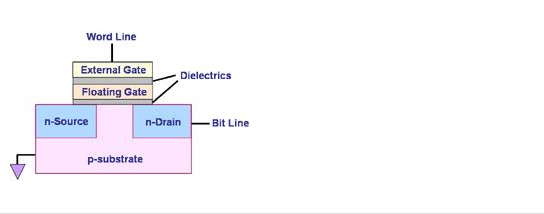

数据在Flash内存单元中是以电荷(electrical charge) 形式存储的。存储电荷的多少，取决于图中的外部门（external gate）所被施加的电压，其控制了是向存储单元中冲入电荷还是使其释放电荷。而数据的表示，以所存储的电荷的电压是否超过一个特定的阈值Vth来表示，因此，Flash的存储单元的默认值，不是0（其他常见的存储设备，比如硬盘灯，默认值为0），而是1，而如果将电荷释放掉，电压降低到一定程度，表述数字0。

 

1.2.2. 什么是Nand Flash
Flash主要分两种，Nand Flash和nor flash。

关于Nand Flash和Nor Flash的区别，参见[6]

不过，关于两者区别，除了那个解释之外，这里再多解释解释：

Nor的成本相对高，容量相对小，比如常见的只有128KB，256KB，1MB，2MB等等，优点是读写数据时候，不容易出错。所以在应用领域方面，Nor Flash比较适合应用于存储少量的代码。

Nand flash成本相对低，说白了就是便宜，缺点是使用中数据读写容易出错，所以一般都需要有对应的软件或者硬件的数据校验算法，统称为ECC。但优点是，相对来说容量比较大，现在常见的Nand Flash都是1GB，2GB，更大的8GB的都有了，相对来说，价格便宜，因此适合用来存储大量的数据。其在嵌入式系统中的作用，相当于PC上的硬盘，用于存储大量数据。

所以，一个常见的应用组合就是，用小容量的Nor Flash存储启动代码，比如uboot，用大容量的Nand Flash做整个系统和用户数据的存储。

而一般的嵌入式平台的启动流程也就是，系统从装有启动代码的Nor Flash启动后，初始化对应的硬件，包括SDRAM等，然后将Nand Flash上的Linux 内核读取到内存中，做好该做的事情后，就跳转到SDRAM中去执行内核了，然后内核解压（如果是压缩内核的话，否则就直接运行了）后，开始运行，在Linux内核启动最后，去Nand Flash上，挂载根文件，比如jffs2，yaffs2等，挂载完成，运行初始化脚本，启动consle交互，才允许你通过console和内核交互。至此完成整个系统启动过程。

而Nor Flash就分别存放的是Uboot，Nand Flash存放的是Linux的内核镜像和根文件系统，以及余下的空间分成一个数据区。

1.2.2.1. Nand Flash的详细分类
Nand Flash，按照硬件类型，可以分为

Bare NAND chips：
裸片。单独的Nand Flash芯片。

SmartMediaCards：
裸片+一层薄塑料。常用于数码相机和MP3播放器中。之所以称smart，是由于其软件smart，而不是硬件本身有啥smart之处。

DiskOnChip：
裸片+glue logic。glue logic=硬件ECC产生器+用于静态的nand 芯片控制的寄存器+直接访问一小片地址窗口，那块地址中包含了引导代码的stub桩，其可以从Nand Flash中拷贝真正的引导代码。

 

1.2.3. SLC和MLC的实现机制
Nand Flash按照内部存储数据单元的电压的不同层次，也就是单个内存单元中，是存储1位数据，还是多位数据，可以分为SLC和MLC。

1.2.3.1. SLC（Single Level Cell）
单个存储单元，只存储一位数据，表示1或0。

就是上面介绍的，对于数据的表示，单个存储单元中内部所存储电荷的电压，和某个特定的阈值电压Vth，相比，如果大于此Vth值，就是表示1，反之，小于Vth，就表示0。

对于Nand Flash的数据的写入1，就是控制External Gate去充电，使得存储的电荷够多，超过阈值Vth，就表示1了。而对于写入0，就是将其放电，电荷减少到小于Vth，就表示0了。

关于为何Nand Flash不能从0变成1，我的理解是，物理上来说，是可以实现每一位的，从0变成1的，但是实际上，对于实际的物理实现，出于效率的考虑，如果对于，每一个存储单元都能单独控制，即，0变成1就是，对每一个存储单元单独去充电，所需要的硬件实现就很复杂和昂贵，同时，所进行对块擦除的操作，也就无法实现之前所说的的，Flash的速度，即一闪而过的速度了，也就失去了Flash的众多特性了。

1.2.3.2. MLC（Multi Level Cell）
与SLC相对应的，就是单个存储单元，可以存储多个位，比如2位，4位等。其实现机制，说起来比较简单，就是通过控制内部电荷的多少，分成多个阈值，通过控制里面的电荷多少，而达到我们所需要的存储成不同的数据。比如，假设输入电压是Vin＝4V（实际没有这样的电压，此处只是为了举例方便），那么，可以设计出2的2次方＝4个阈值， 1/4 的Vin＝1V，2/4的Vin＝2V，3/4的Vin＝3V，Vin＝4V，分别表示2位数据00，01，10，11，对于写入数据，就是充电，通过控制内部的电荷的多少，对应表示不同的数据。

对于读取，则是通过对应的内部的电流（与Vth成反比），然后通过一系列解码电路完成读取，解析出所存储的数据。这些具体的物理实现，都是有足够精确的设备和技术，才能实现精确的数据写入和读出的。

单个存储单元可以存储2位数据的，称作2的2次方＝4 Level Cell，而不是2 Level Cell，关于这点，之前看Nand flash的数据手册（datasheet）的时候，差点搞晕了。

同理，对于新出的单个存储单元可以存储4位数据的，称作 2的4次方＝16 Level Cell。

1.2.3.3. 关于如何识别SLC还是MLC
Nand Flash设计中，有个命令叫做Read ID，读取ID，意思是读取芯片的ID，就像大家的身份证一样，这里读取的ID中，是读取好几个字节，一般最少是4个，新的芯片，支持5个甚至更多，从这些字节中，可以解析出很多相关的信息，比如此Nand Flash内部是几个芯片（chip）所组成的，每个chip包含了几片（Plane），每一片中的页大小，块大小，等等。在这些信息中，其中有一个，就是识别此flash是SLC还是MLC。下面这个就是最常见的Nand Flash的datasheet中所规定的，第3个字节，3rd byte，所表示的信息，其中就有SLC/MLC的识别信息：

表 1.1. Nand Flash第3个ID的含义

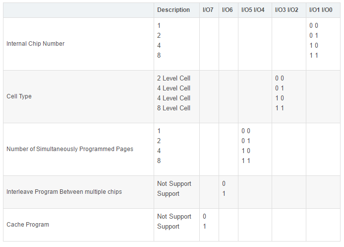

1.2.4. Nand Flash数据存储单元的整体架构
简单说就是，常见的Nand Flash，内部只有一个chip，每个chip只有一个plane。

而有些复杂的，容量更大的Nand Flash，内部有多个chip，每个chip有多个plane。这类的Nand Flash，往往也有更加高级的功能，比如下面要介绍的Multi Plane Program和Interleave Page Program等。

概念上，由大到小来说，就是：

Nand Flash ⇒ Chip ⇒ Plane ⇒ Block ⇒ Page ⇒ oob

用图表来表示，更加易懂：

图 1.2. Nand Flash的结构图
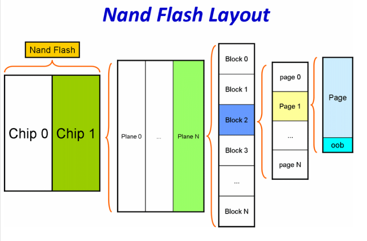

 

 

比如，型号为K9K8G08U0A这块Nand Flash（有时候也被称为此块chip芯片），其内部有两个K9F4G08U0A的chip，chip#1和chip#2，每个K9F4G08U0A的chip包含了2个Plane，每个Plane是2Gbbit，所以K9F4G08U0A的大小是2Gb×2 = 4Gb = 512MB，因此，K9K8G08U0A内部有2个K9F4G08U0A，或者说4个Plane，总大小是×256MB＝1GB。

用公式表示如下：

公式 1.1. K9K8G08U0A的物理结构所组成的总容量

K9K8G08U0A(这块Nand Flash)

= 2 × K9F4G08U0A(K9F4G08U0A是chip，1 K9F4G08U0A = 2 Plane)

= 2 × 2个Plane

= 4 Plane(1 Plane = 2048 Block)

= 4 × 2048个Block(1 Block = 64 Page)

= 4 × 2048 × 64Page(1 Page = 2KB)

= 4 × 2048 × 64Page × 2KB

= 4 × 2048 × 128KB(1 Block = 128KB)

= 4 × 256MB(1 Plane = 2Gb = 256MB)

= 2 × 512MB(1 K9F4G08U0A = 4Gb = 512MB)

= 1GB(1 K9K8G08U0A = 1GB)

 

而型号是K9WAG08U1A的Nand Flash，内部包含了2个K9K8G08U0A，所以，总容量是K9K8G08U0A的两倍＝1GB×2＝2GB，类似地K9NBG08U5A，内部包含了4个K9K8G08U0A，总大小就是4×1GB＝4GB。

 
下面详细介绍一下，Nand Flash的一个chip内部的硬件逻辑组织结构。

1.2.5. Nand Flash的物理存储单元的阵列组织结构
Nand Flash的内部组织结构，此处还是用图来解释，比较容易理解：

图 1.3. Nand Flash物理存储单元的阵列组织结构

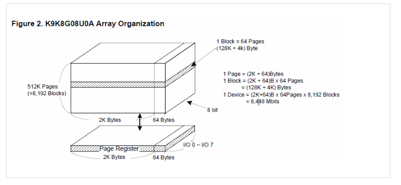

上图是K9K8G08U0A的datasheet中的描述。

简单解释就是:

1.2.5.1. Block块
一个Nand Flash（的chip，芯片）由很多个块（Block）组成，块的大小一般是128KB，256KB，512KB，此处是128KB。其他的小于128KB的，比如64KB，一般都是下面将要介绍到的small block的Nand Flash。

块Block，是Nand Flash的擦除操作的基本/最小单位。

1.2.5.2. Page页
每个块里面又包含了很多页（page）。每个页的大小，对于现在常见的Nand Flash多数是2KB，最新的Nand Flash的是4KB、8KB等，这类的页大小大于2KB的Nand Flash，被称作big block的Nand Flash，对应的发读写命令地址，一共5个周期(cycle)，而老的Nand Flash，页大小是256B，512B，这类的Nand Flash被称作small block，地址周期只有4个。

页Page，是读写操作的基本单位。

不过，也有例外的是，有些Nand Flash支持subpage（1/2页或1/4页）子页的读写操作，不过一般很少见。

1.2.5.3. oob / Redundant Area / Spare Area
每一个页，对应还有一块区域，叫做空闲区域（spare area）/冗余区域（redundant area），而Linux系统中，一般叫做OOB（Out Of Band），这个区域，是最初基于Nand Flash的硬件特性：数据在读写时候相对容易错误，所以为了保证数据的正确性，必须要有对应的检测和纠错机制，此机制被叫做EDC(Error Detection Code)/ECC（Error Code Correction, 或者 Error Checking and Correcting），所以设计了多余的区域，用于放置数据的校验值。

Oob的读写操作，一般是随着页的操作一起完成的，即读写页的时候，对应地就读写了oob。

关于oob具体用途，总结起来有：

标记是否是坏快
存储ECC数据
存储一些和文件系统相关的数据。如jffs2就会用到这些空间存储一些特定信息，而yaffs2文件系统，会在oob中，存放很多和自己文件系统相关的信息。
 

 

1.2.6. Flash名称的由来
Flash的擦除操作是以block块为单位的，与此相对应的是其他很多存储设备，是以bit位为最小读取/写入的单位，Flash是一次性地擦除整个块：在发送一个擦除命令后，一次性地将一个block，常见的块的大小是128KB/256KB。。，全部擦除为1，也就是里面的内容全部都是0xFF了，由于是一下子就擦除了，相对来说，擦除用的时间很短，可以用一闪而过来形容，所以，叫做Flash Memory。所以一般将Flash翻译为 （快速）闪存。

1.2.7. Flash相对于普通设备的特殊性
根据上面提到过的，Flash最小操作单位，相对于普通存储设备，就显得有些特殊。

因为一般存储设备，比如硬盘或内存，读取和写入都是以位（bit）为单位，读取一个bit的值，将某个值写入对应的地址的位，都是可以按位操作的。

但是Flash由于物理特性，使得内部存储的数据，只能从1变成0，这点，这点可以从前面的内部实现机制了解到，对于最初始值，都是1，所以是0xFFFFFFFF，而数据的写入，即是将对应的变成0，而将数据的擦出掉，就是统一地，以block为单位，全部一起充电，所有位，都变成初始的1，而不是像普通存储设备那样，每一个位去擦除为0。而数据的写入，就是电荷放电的过程，代表的数据也从1变为了0。

所以，总结一下Flash的特殊性如下：

表 1.2. Flash和普通设备相比所具有的特殊性
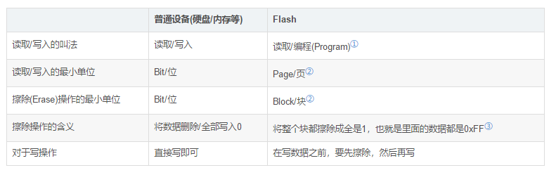

1.2.8. Nand Flash的位反转特性
Nand Flash的位反转，也叫做位翻转，对应的英文表达有：Bit Flip=Bit Flipping=Bit-Flip=Bit twiddling。

Nand Flash由于本身硬件的内在特性，会导致（极其）偶尔的出现位反转的现象。

所谓的位反转，bit flip，指的是原先Nand Flash中的某个位，变化了，即要么从1变成0了，要么从0变成1了。

1.2.8.1. Nand Flash位反转的原因
Nand Flash的位反转现象，主要是由以下一些原因/效应所导致：

漂移效应（Drifting Effects）
漂移效应指的是，Nand Flash中cell的电压值，慢慢地变了，变的和原始值不一样了。

编程干扰所产生的错误（Program-Disturb Errors）
此现象有时候也叫做，过度编程效应（over-program effect）。

对于某个页面的编程操作，即写操作，引起非相关的其他的页面的某个位跳变了。

读操作干扰产生的错误（Read-Disturb Errors）
此效应是，对一个页进行数据读取操作，却使得对应的某个位的数据，产生了永久性的变化，即Nand Flash上的该位的值变了。

1.2.8.2. Nand Flash位反转的影响
位反转，说白了，就是读取数据的时候，数据出错了。

因此，如果你读取的数据正好是属于某个重要的文件中的数据，比如系统的配置文件等，那么此时错了一位，都会导致系统出现异常，问题相对会很严重。

而如果此数据属于音视频流中的数据，那么此时即使错了一位，对整个音视频的播放产生的影响也很小，所以问题也不大。

1.2.8.3. Nand Flash位反转的类型和解决办法
对应的位反转的类型，有两种：

一种是nand flash物理上的数据存储的单元上的数据，是正确的，只是在读取此数据出来的数据中的某位，发生变化，出现了位反转，即读取出来的数据中，某位错了，本来是0变成1，或者本来是1变成0了。此处可以成为软件上位反转。此数据位的错误，当然可以通过一定的校验算法检测并纠正。
另外一种，就是nand flash中的物理存储单元中，对应的某个位，物理上发生了变化，原来是1的，变成了0，或原来是0的，变成了1，发生了物理上的位的数据变化。此处可以成为硬件上的位反转。此错误，由于是物理上发生的，虽然读取出来的数据的错误，可以通过软件或硬件去检测并纠正过来，但是物理上真正发生的位的变化，则没办法改变了。不过个人理解，好像也是可以通过擦除Erase整个数据块Block的方式去擦除此错误，不过在之后的Nand Flash的使用过程中，估计此位还是很可能继续发生同样的硬件的位反转的错误。
以上两种类型的位反转，其实对于从Nand Flash读取出来的数据来说，解决其中的错误的位的方法，都是一样的，即通过一定的校验算法，常称为ECC，去检测出来，或检测并纠正错误。

如果只是单独检测错误，那么如果发现数据有误，那么再重新读取一次即可。

实际中更多的做法是，ECC校验发现有错误，会有对应的算法去找出哪位错误并且纠正过来。

其中对错误的检测和纠正，具体的实现方式，有软件算法，也有硬件实现，即硬件Nand Flash的控制器controller本身包含对应的硬件模块以实现数据的校验和纠错的。

 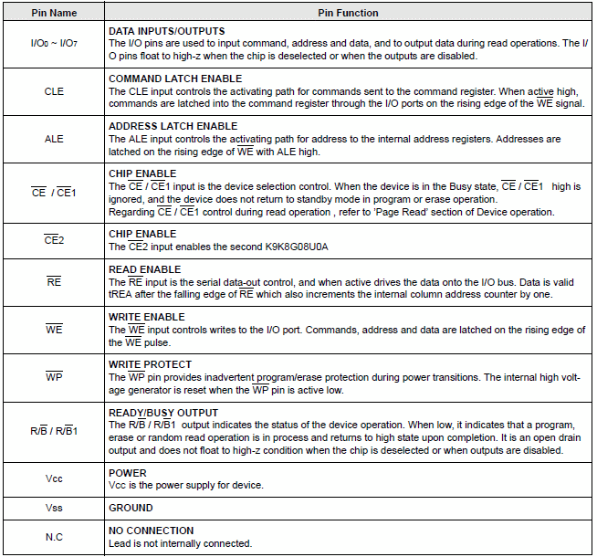

1.2.9. Nand Flash引脚(Pin)的说明
图 1.4. Nand Flash引脚功能说明

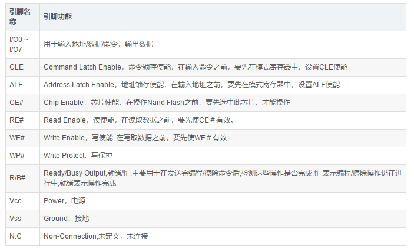

上图是常见的Nand Flash所拥有的引脚（Pin）所对应的功能，简单翻译如下：

表 1.3. Nand Flash引脚功能的中文说明

 

1.2.9.1. 为何需要ALE和CLE
硬件上，有了电源的Vcc和接地的Vss等引脚，很好理解，但是为何还要有ALE和CLE这样的引脚，为何设计这么多的命令,把整个系统搞这么复杂，关于这点，最后终于想明白了：

设计命令锁存使能(Command Latch Enable, CLE) 和 地址锁存使能(Address Latch Enable，ALE)，那是因为，Nand Flash就8个I/O，而且是复用的，也就是，可以传数据，也可以传地址，也可以传命令，为了区分你当前传入的到底是啥，所以，先要用发一个CLE（或ALE）命令，告诉Nand Flash的控制器一声，我下面要传的是命令（或地址），这样，里面才能根据传入的内容，进行对应的动作。否则,Nand Flash内部,怎么知道你传入的是数据,还是地址,还是命令,也就无法实现正确的操作了。

1.2.9.2. Nand Flash只有8个I/O引脚的好处
在Nand Flash的硬件设计中，你会发现很多个引脚。关于硬件上为何设计这样的引脚，而不是直接像其他存储设备，比如普通的RAM，直接是一对数据线引出来，多么方便和好理解啊。

关于这样设计的好处：

1.2.9.2.1. 减少外围连线
相对于并口(Parellel)的Nor Flash的48或52个引脚来说，的确是大大减小了引脚数目，这样封装后的芯片体积，就小很多。现在芯片在向体积更小，功能更强，功耗更低发展，减小芯片体积，就是很大的优势。同时，减少芯片接口，也意味着使用此芯片的相关的外围电路会更简化，避免了繁琐的硬件连线。

1.2.9.2.2. 提高系统的可扩展性
因为没有像其他设备一样用物理大小对应的完全数目的addr引脚，在芯片内部换了芯片的大小等的改动，对于用全部的地址addr的引脚，那么就会引起这些引脚数目的增加，比如容量扩大一倍，地址空间/寻址空间扩大一倍，所以，地址线数目/addr引脚数目，就要多加一个，而对于统一用8个I/O的引脚的Nand Flash，由于对外提供的都是统一的8个引脚，内部的芯片大小的变化或者其他的变化，对于外部使用者(比如编写Nand Flash驱动的人)来说，不需要关心，只是保证新的芯片，还是遵循同样的接口，同样的时序，同样的命令，就可以了。这样就提高了系统的扩展性。

说白了，对于旧的Nand Flash所实现的驱动，这些软件工作，在换新的硬件的Nand Flash的情况下，仍然可以工作，或者是通过极少的修改，就同样可以工作，使得软硬件兼容性大大提高。

 

1.2.10. Nand Flash的一些典型(typical)的特性
页擦除时间是200us，有些慢的有800us
块擦除时间是1.5ms
页数据读取到数据寄存器的时间一般是20us
串行访问（Serial access）读取一个数据的时间是25ns，而一些旧的Nand Flash是30ns，甚至是50ns
输入输出端口是地址和数据以及命令一起multiplex复用的
Nand Flash的编程/擦除的寿命：即，最多允许的擦除的次数
以前老的Nand Flash，编程/擦除时间比较短，比如K9G8G08U0M，才5K次，而后来的多数也只有10K=1万次，而现在很多新的Nand Flash，技术提高了，比如，Micron的MT29F1GxxABB，Numonyx的 NAND04G-B2D/NAND08G-BxC，都可以达到100K，也就是10万次的编程/擦除，达到和接近于之前常见的Nor Flash，几乎是同样的使用寿命了。

封装形式
48引脚的TSOP1封装 或 52引脚的ULGA封装

1.2.11. Nand Flash控制器与Nand Flash芯片
关于Nand Flash的控制器Controller和Nand Flash芯片chip之间的关系，觉得有必要解释一下：

首先，我们要知道的是，我们写驱动，是写Nand Flash 控制器的驱动，而不是Nand Flash 芯片的驱动，因为独立的Nand Flash芯片，一般来说，是很少直接拿来用的，多数都是硬件上有对应的硬件的Nand Flash的控制器，去操作和控制Nand Flash，包括提供时钟信号，提供硬件ECC校验等等功能，我们所写的驱动软件，是去操作Nand Flash的控制器

然后由控制器去操作Nand Flash芯片，实现我们所要的功能。

1.2.12. Nand Flash中的特殊硬件结构
由于Nand Flash相对其他常见设备来说，比较特殊，所以，特殊的设备，就有特殊的设计，就对应某些特殊的硬件特性，就有必要解释解释：

页寄存器（Page Register）：

由于Nand Flash读取和编程操作来说，一般最小单位是页，所以Nand Flash在硬件设计时候，就考虑到这一特性，对于每一片（Plane），都有一个对应的区域专门用于存放，将要写入到物理存储单元中去的或者刚从存储单元中读取出来的，一页的数据，这个数据缓存区，本质上就是一个缓存buffer，但是只是此处datasheet里面把其叫做页寄存器page register而已，实际将其理解为页缓存，更贴切原意。

 

而正是因为有些人不了解此内部结构，才容易产生之前遇到的某人的误解，以为内存里面的数据，通过Nand Flash的FIFO，写入到Nand Flash里面去，就以为立刻实现了实际数据写入到物理存储单元中了，而实际上只是写到了这个页缓存中，只有当你再发送了对应的编程第二阶段的确认命令，即0x10，之后，实际的编程动作才开始，才开始把页缓存中的数据，一点点写到物理存储单元中去。

 

所以，简单总结一下就是，对于数据的流向，实际是经过了如下步骤：

 

图 1.5. Nand Flash读写时的数据流向
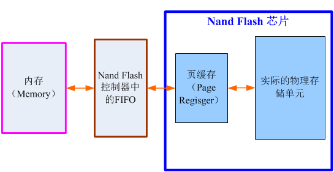

 

1.2.13. Nand Flash中的坏块(Bad Block)
Nand Flash中，一个块中含有1个或多个位是坏的，就称为其为坏块Bad Block。

坏块的稳定性是无法保证的，也就是说，不能保证你写入的数据是对的，或者写入对了，读出来也不一定对的。与此对应的正常的块，肯定是写入读出都是正常的。

1.2.13.1. 坏块的分类
坏块有两种：

出厂时就有存在的坏块
一种是出厂的时候，也就是，你买到的新的，还没用过的Nand Flash，就可以包含了坏块。此类出厂时就有的坏块，被称作factory (masked) bad block或initial bad/invalid block，在出厂之前，就会做对应的标记，标为坏块。

使用过程中产生的坏块
第二类叫做在使用过程中产生的，由于使用过程时间长了，在擦块除的时候，出错了，说明此块坏了，也要在程序运行过程中，发现，并且标记成坏块的。具体标记的位置，和上面一样。这类块叫做worn-out bad block。即用坏了的块。

1.2.13.2. 坏块的标记
具体标记的地方是，对于现在常见的页大小为2K的Nand Flash，是块中第一个页的oob起始位置（关于什么是页和oob，下面会有详细解释）的第1个字节（旧的小页面，pagesize是512B甚至256B的Nand Flash，坏块标记是第6个字节），如果不是0xFF，就说明是坏块。相对应的是，所有正常的块，好的块，里面所有数据都是0xFF的。

不过，对于现在新出的有些Nand Flash，很多标记方式，有些变化，有的变成该坏块的第一个页或者第二个页，也有的是，倒数最后一个或倒数第二个页，用于标记坏块的。

具体的信息，请参考对应的Nand Flash的数据手册，其中会有说明。

对于坏块的标记，本质上，也只是对应的flash上的某些字节的数据是非0xFF而已，所以，只要是数据，就是可以读取和写入的。也就意味着，可以写入其他值，也就把这个坏块标记信息破坏了。对于出厂时的坏块，一般是不建议将标记好的信息擦除掉的。

uboot中有个命令是

nand scrub
就可以将块中所有的内容都擦除了，包括坏块标记，不论是出厂时的，还是后来使用过程中出现而新标记的。一般来说，不建议用这个。

不过，在实际的驱动编程开发过程中，为了方便起见，我倒是经常用，其实也没啥大碍，呵呵。不过呢，其实最好的做法是，用

nand erase
只擦除好的块，对于已经标记坏块的块，不要轻易擦除掉，否则就很难区分哪些是出厂时就坏的，哪些是后来使用过程中用坏的了。

1.2.13.3. 坏块的管理
对于坏块的管理，在Linux系统中，叫做坏块管理（BBM，Bad Block Management），对应的会有一个表去记录好块，坏块的信息，以及坏块是出厂就有的，还是后来使用产生的，这个表叫做坏块表（BBT，Bad Block Table）。在Linux 内核MTD架构下的Nand Flash驱动，和Uboot中Nand Flash驱动中，在加载完驱动之后，如果你没有加入参数主动要求跳过坏块扫描的话，那么都会去主动扫描坏块，建立必要的BBT的，以备后面坏块管理所使用。

1.2.13.4. 坏块的比例
而关于好块和坏块，Nand Flash在出厂的时候，会做出保证：

关于好的，可以使用的块的数目达到一定的数目，比如三星的K9G8G08U0M，整个flash一共有4096个块，出厂的时候，保证好的块至少大于3996个，也就是意思是，你新买到这个型号的Nand Flash，最坏的可能， 有3096－3996＝100个坏块。不过，事实上，现在出厂时的坏块，比较少，绝大多数，都是使用时间长了，在使用过程中出现的。
保证第一个块是好的，并且一般相对来说比较耐用。做此保证的主要原因是，很多Nand Flash坏块管理方法中，就是将第一个块，用来存储上面提到的BBT，否则，都是出错几率一样的块，那么也就不太好管理了，连放BBT的地方，都不好找了，^_^。
一般来说，不同型号的Nand Flash的数据手册中，也会提到，自己的这个Nand Flash，最多允许多少个坏块。就比如上面提到的，三星的K9G8G08U0M，最多有100个坏块。

 

1.2.14. Nand Flash中页的访问顺序
在一个块内，对每一个页进行编程的话，必须是顺序的，而不能是随机的。比如，一个块中有128个页，那么你只能先对page0编程，再对page1编程，。。。。，而不能随机的，比如先对page3，再page1，page2，page0，page4，。。。

关于此处对于只能顺序给页编程的说法，只是翻译自datasheet，但是实际情况却发现是，程序中没有按照此逻辑处理，可以任意对某Block内的Page去做Program的动作，而不必是顺序的。但是datasheet为何如此解释，原因未知，有待知情者给解释一下。

1.2.15. 常见的Nand Flash的操作
要实现对Nand Flash的操作，比如读取一页的数据，写入一页的数据等，都要发送对应的命令，而且要符合硬件的规定，如图：

图 1.6. Nand Flash K9K8G08U0A的命令集合

 

从上图可以看到，如果要实现读一个页的数据，就要发送Read的命令，而且是分两个周期（Cycle），即分两次发送对应的命令，第一次是0x00h,第二次是0x30h，而两次命令中间，需要发送对应的你所要读取的页的地址，关于此部分详细内容，留待后表。

对应地，其他常见的一些操作，比如写一个页的数据(Page Program)，就是先发送0x80h,然后发生要写入的地址，再发送0x10h。

 

关于一些常见的操作，比如读一个页的Read操作和写一个页的Page Program，下面开始更深入的介绍。

1.2.15.1. 页编程（Page Program）注意事项
Nand flash的写操作叫做编程Program，编程，一般情况下，是以页为单位的。

有的Nand Flash，比如K9K8G08U0A，支持部分页编程（Partial Page Program），但是有一些限制：在同一个页内的，连续的部分页的编程，不能超过4次。

一般情况下，都是以页为单位进行编程操作的，很少使用到部分页编程。

关于这个部分页编程，本来是一个页的写操作，却用两个命令或更多的命令去实现，看起来是操作多余，效率不高，但是实际上，有其特殊考虑：

至少对于块擦除来说，开始的命令0x60是擦除设置命令(erase setup comman)，然后传入要擦除的块地址，然后再传入擦除确认命令（erase confirm command）0xD0，以开始擦除的操作。

这种完成单个操作要分两步发送命令的设计，即先开始设置，再最后确认的命令方式，是为了避免由于外部由于无意的/未预料而产生的噪音，比如，由于某种噪音，而产生了0x60命令，此时，即使被Nand Flash误认为是擦除操作，但是没有之后的确认操作0xD0，Nand Flash就不会去擦除数据，这样使得数据更安全，不会由于噪音而误操作。

1.2.15.2. 读（Read）操作过程详解
下面以最简单的read操作为例，解释如何理解时序图，以及将时序图中的要求，转化为代码。

解释时序图之前，让我们先要搞清楚，我们要做的事情：

从Nand Flash的某个页Page里面，读取我们要的数据。

要实现此功能，会涉及到几部分的知识，即使我们不太懂Nand Flash的细节，但是通过前面的基本知识的介绍，那么以我们的常识，至少很容易想到的就是，需要用到哪些命令，怎么发这些命令，怎么计算所需要的地址，怎么读取我们要的数据等等。

下面就一步步的解释，需要做什么，以及如何去做：

1.2.15.2.1. 需要使用何种命令
首先，是要了解，对于读取数据，要用什么命令：

根据前面关于Nand Flash的命令集合介绍，我们知道，要读取数据，要用到Read命令，该命令需要2个周期，第一个周期发0x00，第二个周期发0x30。

1.2.15.2.2. 发送命令前的准备工作以及时序图各个信号的具体含义
知道了用何命令后，再去了解如何发送这些命令。

 

图 1.7. Nand Flash数据读取操作的时序图

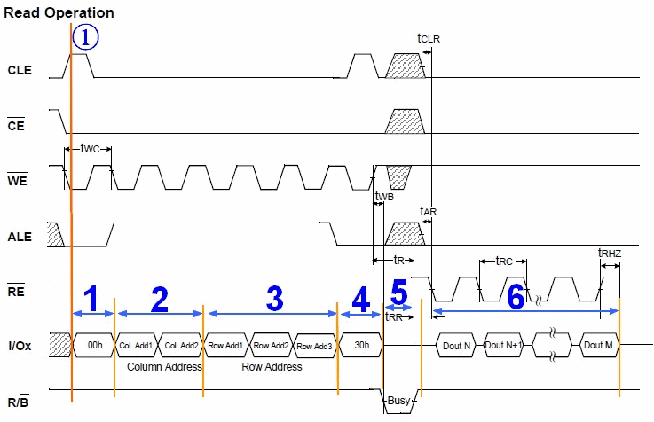

我们来一起看看，我在图6中的特意标注的①边上的黄色竖线。

黄色竖线所处的时刻，是在发送读操作的第一个周期的命令0x00之前的那一刻。

让我们看看，在那一刻，其所穿过好几行都对应什么值，以及进一步理解，为何要那个值。

黄色竖线穿过的第一行，是CLE。还记得前面介绍命令所存使能（CLE）那个引脚吧？CLE，将CLE置1，就说明你将要通过I/O复用端口发送进入Nand Flash的，是命令，而不是地址或者其他类型的数据。只有这样将CLE置1，使其有效，才能去通知了内部硬件逻辑，你接下来将收到的是命令，内部硬件逻辑，才会将受到的命令，放到命令寄存器中，才能实现后面正确的操作，否则，不去将CLE置1使其有效，硬件会无所适从，不知道你传入的到底是数据还是命令了。
而第二行，是CE#，那一刻的值是0。这个道理很简单，你既然要向Nand Flash发命令，那么先要选中它，所以，要保证CE#为低电平，使其有效，也就是片选有效。
第三行是WE#，意思是写使能。因为接下来是往Nand Flash里面写命令，所以，要使得WE#有效，所以设为低电平。
第四行，是ALE是低电平，而ALE是高电平有效，此时意思就是使其无效。而对应地，前面介绍的，使CLE有效，因为将要数据的是命令（此时是发送图示所示的读命令第二周期的0x30），而不是地址。如果在其他某些场合，比如接下来的要输入地址的时候，就要使其有效，而使CLE无效了。
第五行，RE#，此时是高电平，无效。可以看到，知道后面低6阶段，才变成低电平，才有效，因为那时候，要发生读取命令，去读取数据。
第六行，就是我们重点要介绍的，复用的输入输出I/O端口了，此刻，还没有输入数据，接下来，在不同的阶段，会输入或输出不同的数据/地址。
第七行，R/B#,高电平，表示R（Ready）/就绪，因为到了后面的第5阶段，硬件内部，在第四阶段，接受了外界的读取命令后，把该页的数据一点点送到页寄存器中，这段时间，属于系统在忙着干活，属于忙的阶段，所以，R/B#才变成低，表示Busy忙的状态的。
介绍了时刻①的各个信号的值，以及为何是这个值之后，相信，后面的各个时刻，对应的不同信号的各个值，大家就会自己慢慢分析了，也就容易理解具体的操作顺序和原理了。

1.2.15.2.3. 如何计算出我们要传入的行地址和列地址
在介绍具体读取数据的详细流程之前，还要做一件事，那就是，先要搞懂我们要访问的地址，以及这些地址，如何分解后，一点点传入进去，使得硬件能识别才行。

此处还是以K9K8G08U0A为例，此Nand Flash，一共有8192个块，每个块内有64页，每个页是2K+64 Bytes。

假设，我们要访问其中的第7000个块中的第64页中的1208字节处的地址，此时，我们就要先把具体的地址算出来：

物理地址

=块大小×块号 ＋ 页大小×页号 ＋ 页内地址

=128K×7000 ＋ 2K×64 ＋ 1208

=0x36B204B8

接下来，我们就看看，怎么才能把这个实际的物理地址，转化为Nand Flash所要求的格式。

在解释地址组成之前，先要来看看其datasheet中关于地址周期的介绍：

图 1.8. Nand Flash的地址周期组成
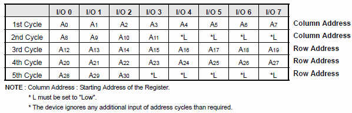

 

结合图 1.7 “Nand Flash数据读取操作的时序图”中的2，3阶段，我们可以看出，此Nand Flash地址周期共有5个，2个列(Column)周期，3个行（Row）周期。

对应地，列地址A0~A10，就是页内地址，地址范围是从0到2047。
细心的读者可能注意到了，为何此处多出来个A11呢？

这样从A0到A11，一共就是12位，可以表示的范围就是0~212，即0~4096了。

实际上，由于我们访问页内地址，可能会访问到oob的位置，即2048-2111这64个字节的范围内，所以，此处实际上只用到了2048～2111，用于表示页内的oob区域，其大小是64字节。

对应地，A12～A30，称作页号，页的号码，可以定位到具体是哪一个页。
A18～A30，表示对应的块号，即属于哪个块。

简单解释完了地址组成，那么就很容易分析上面例子中的地址了。

注意，下面这样的方法，是错误的：

0x36B204B8 = 11 0110 1011 0010 0000 0100 1011 1000，分别分配到5个地址周期就是：

 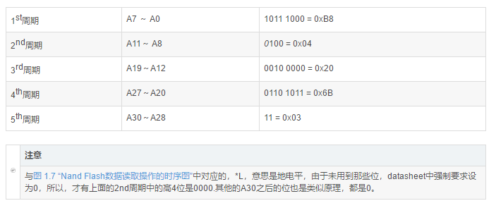

而至于上述计算方法为何是错误的，那是因为上面计算过程中，把第11位的值，本来是属于页号的位A11，给算成页内地址里面的值了。

应该是这样计算，才是对的：

0x36B204B8 = 11 0110 1011 0010 0000 0100 1011 1000

 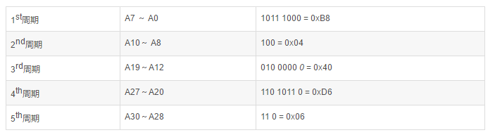

那有人会问了，上面表11中，不是明明写的A0到A30，其中包括A11，不是正好对应着此处地址中的bit0到bit30吗？

其实，我开始也是犯了同样的错误，误以为我们要传入的地址的每一位，就是对应着表11中的A0到A30呢，实际上，表11中的A11，是比较特殊的，只有当我们访问页内地址处于oob的位置，即属于2048~2111的时候，A11才会其效果，才会用A0-A11用来表示对应的某个属于2048~2111的某个值，属于oob的某个位置。

而我们此处的页内地址为2108，还没有超过2047呢，所以A11肯定是0。

 

这么解释，显得很绕，很难看懂。

换种方式来解释，就容易听懂了：

说白了，我们就是要访问第7000个块中的第64页中的1208字节处，对应着

页内地址

=1208

=0x4B8

 

页号

=块数×页数/块 + 块内的页号

= 7000×（128K/2K） + 64

= 7000×64 + 64

= 448064

=0x6D640

 

也就是，我们要访问0x6D640页内的0x4B8地址，这样很好理解吧,^_^。

然后对应的：

页内地址=0x4B8

分成两个对应的列地址，就变成

0x4B8 ：列地址1=0xB8，列地址2=0x04

 

页号=0x6D640，分成三个行号就是：

0x6D640：行号1=0x40，行号2=0xD6，行号3=0x06

再回头看看上面的计算方法，

最开始计算出来的：

列地址1=0xB8

列地址2=0x04

行号1=0x20

行号2=0x6B

行号3=0x03

是错误的。

 

而第二次计算正确的：

列地址1=0xB8

列地址2=0x04

行号1=0x40

行号2=0xD6

行号3=0x06

才是对的，也和我们此处自己手动计算，是一致的。

第一次之所以计算错，就是错误的把行地址的最低一位A11，放到列地址中的最高位了。

至此，才算把如何手动计算行地址和列地址，解释明白和正确了。

对应的，Linux的源码\drivers\mtd\nand\nand_base.c中，也是这样处理的：

static void nand_command_lp(struct mtd_info *mtd, unsigned int command,
                int column, int page_addr)
{
......
        /* Serially input address */
        if (column != -1) {
......
            chip->cmd_ctrl(mtd, column1, ctrl); /* 发送Col Addr 1 */
            ctrl &= ~NAND_CTRL_CHANGE;
            chip->cmd_ctrl(mtd, column >> 8, ctrl); /* 发送Col Addr 2 */
        }
        if (page_addr != -1) {
            chip->cmd_ctrl(mtd, page_addr2, ctrl); /* 发送Row Addr 1 */
            chip->cmd_ctrl(mtd, page_addr >> 8, /* 发送Row Addr 2 */
                       NAND_NCE | NAND_ALE);
            /* One more address cycle for devices > 128MiB */
            if (chip->chipsize > (128 << 20))
                chip->cmd_ctrl(mtd, page_addr >> 16, /* 发送Row Addr 3 */
                           NAND_NCE | NAND_ALE);
        }
}

因此，我们要访问第7000个块中的第64页中的1208字节处的话，所要传入的地址就是分5个周期：

分别传入两个列地址的：

列地址1=0xB8

列地址2=0x04

然后再传3个行地址的：

行号1=0x40

行号2=0xD6

行号3=0x06

这样硬件才能识别。

而接下来的内容，也就是介绍硬件是如何处理这些输入的。

 

1.2.15.2.4. 读操作过程的解释
准备工作终于完了，下面就可以开始解释说明，对于读操作的，上面图中标出来的，1-6个阶段，具体是什么含义。

操作准备阶段：此处是读（Read）操作，所以，先发一个图5中读命令的第一个阶段的0x00,表示，让硬件先准备一下，接下来的操作是读。

发送两个周期的列地址。也就是页内地址，表示，我要从一个页的什么位置开始读取数据。

接下来再传入三个行地址。对应的也就是页号。

然后再发一个读操作的第二个周期的命令0x30。接下来，就是硬件内部自己的事情了。

Nand Flash内部硬件逻辑，负责去按照你的要求，根据传入的地址，找到哪个块中的哪个页，然后把整个这一页的数据，都一点点搬运到页缓存中去。而在此期间，你所能做的事，也就只需要去读取状态寄存器，看看对应的位的值，也就是R/B#那一位，是1还是0，0的话，就表示，系统是busy，仍在”忙“（着读取数据），如果是1，就说系统活干完了，忙清了，已经把整个页的数据都搬运到页缓存里去了，你可以接下来读取你要的数据了。

对于这里。估计有人会问了，这一个页一共2048+64字节，如果我传入的页内地址，就像上面给的1208一类的值，只是想读取1028到2011这部分数据，而不是页开始的0地址整个页的数据，那么内部硬件却读取整个页的数据出来，岂不是很浪费吗？答案是，的确很浪费，效率看起来不高，但是实际就是这么做的，而且本身读取整个页的数据，相对时间并不长，而且读出来之后，内部数据指针会定位到你刚才所制定的1208的那个位置。

接下来，就是你“窃取“系统忙了半天之后的劳动成果的时候了，呵呵。通过先去Nand Flash的控制器中的数据寄存器中写入你要读取多少个字节(byte)/字(word)，然后就可以去Nand Flash的控制器的FIFO中，一点点读取你要的数据了。

至此，整个Nand Flash的读操作就完成了。

对于其他操作，可以根据我上面的分析，一点点自己去看datasheet，根据里面的时序图去分析具体的操作过程，然后对照代码，会更加清楚具体是如何实现的。

 

1.2.16. Nand Flash的一些高级特性
1.2.16.1. Nand Flash的Unique ID
1.2.16.1.1. 什么是Unique ID唯一性标识
Unique ID，翻译为中文就是，独一无二的ID，唯一性标识。

很明显，这个Unique ID是为了用来识别某些东西的，每一个东西都拥有一个独一无二的标识信息。

在Nand Flash里面的Unique ID，主要是某个ID信息，保证每个Nand Flash都是独一无二的。主要用于其它的使用Nand Flash的用户，根据此unique id去做加密等应用，实现某些安全方面的应用。

简而言之，就是用Nand Flash的Unique ID来实现安全相关的应用，比如加密，版权保护等等。

1.2.16.1.2. 不同Nand Flash厂商的对Unique ID的不同的实现方法
此处，继续解释之前，还要再次赘述一下：

目前Nand Flash的厂家有samsung，Toshiba，Intel， Hynix，Micron，Numonyx，Phison ，SanDisk，Sony，Spansion等。

由于前面所说的Nand Flash的规范之争，即Toshiba & Samsung和Intel + 其它厂商（Hynix，Micron，Numonyx，Phison ，SanDisk，Sony，Spansion等）之争，导致对于Unique ID这么个小的功能点（feature），不同的方面，弄出了不同的实现（做法）。

下面就来解释一下各个厂家关于Unique ID的实现方法，以及如何读取对应的Unique ID：

1.2.16.1.2.1. Toshiba东芝的Nand的Unique ID
网上找到一个datasheet：

Toshiba TH58NS512DC

http://datasheet.elcodis.com/pdf/11/23/112371/th58ns512dc-to51y.pdf

中有提到：

P1:“The TH58NS512DC is a SmartMediaTM with ID and each device has 128 bit unique ID number embedded in the device. This unique ID number is applicable to image files, music files, electronic books, and so on where copyright protection is required.”即每个Toshiba的TH58NS512DC中，都有一个128 bit=16 byte的Unique ID，可用于图片，音乐，电子书等应用中的版权保护。

P24:

图 1.9. Toshiba的Unique ID

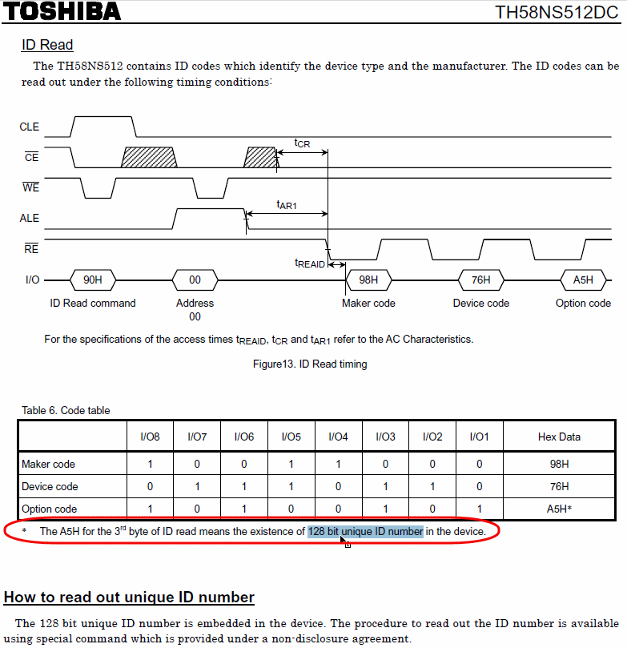
　　

1.2.16.1.2.2. 读取Toshiba的Nand的Unique ID
从上面可以看出，Toshiba的Nand中，关于Unique ID，是需要先通过普通的0x90，即Read ID的命令，去读取Nand的ID，找到第三个字节（3rd byte），然后判断其是否是0xA5，如果是0xA5，然后才能确定此Nand里面是有Unique ID的，然后才有去读取Unique ID这一说。

而关于如何独缺Unique ID，则需要和自己去联系Toshiba，和其签订NDA协议后，才可得知读取Nand的Unique ID的方法。

 

1.2.16.1.3. Samsung三星的Nand的Unique ID
网上找到的某款三星的Nand的datasheet：

Samsung K9F5608U0B

http://hitmen.c02.at/files/docs/psp/ds_k9f5608u0b_rev13.pdf

“

6. Unique ID for Copyright Protection is available

- The device includes one block sized OTP (One Time Programmable), which can be used to increase system security or to provide identification capabilities. Detailed information can be obtained by contact with Samsung

”
即，Samsung的Nand的Unique ID，也和Toshiba的用途类似，也主要是用于版权保护，但是其实现却不同。

Samsung的Unique ID的实现，是专门在Nand 里面配备了一个OTP的Block，而此Nand芯片的Block大小是16KB。

而关于如何操作此OTP，即如何写入数据和读取数据，此处未说明。

欲知详情，请联系三星。

不过个人理解，应该和普通的block的操作类似，即普通的block，包含很多page，每个page的操作，有对应的page read，用对应的page read命令来读取此特殊的OTP的block里面的数据。

而此OTP的block里面的数据是什么，完全取决于自己最开始往里面写入了什么数据。说白了就是，你根据自己需求，在你的产品出厂的时候，写入对应的数据，比如该款产品的SN序列号等数据，然后自己在用page read读取出相应数据后，自己解析，得到自己要的信息，用于自己的用途，比如版权保护等。

1.2.16.1.3.1. 读取Samsung的Nand的Unique ID
如前所述：

关于如何操作此OTP的block，即如何写入数据和读取数据，此处未说明。

即想要知道如何读取Samsung的Nand的Unique ID，请自己去问三星。

 

1.2.16.1.4. 遵循ONFI规范的厂商的Nand的Unique ID
主要指的是Intel英特尔，Hynix海力士，Micron美光，Numonyx恒亿，Spansion飞索等公司。

对应的Nand 的Unique ID的相关定义，ONFI的规范中都有，现简要摘录如下：

ONFI 2.2

http://onfi.org/wp-content/uploads/2009/02/ONFI%202_2%20Gold.pdf

ONFI规范中，在“5.7.1. Parameter Page Data Structure Definition”中，如图：

图 1.10. ONFI的参数页数据结构定义
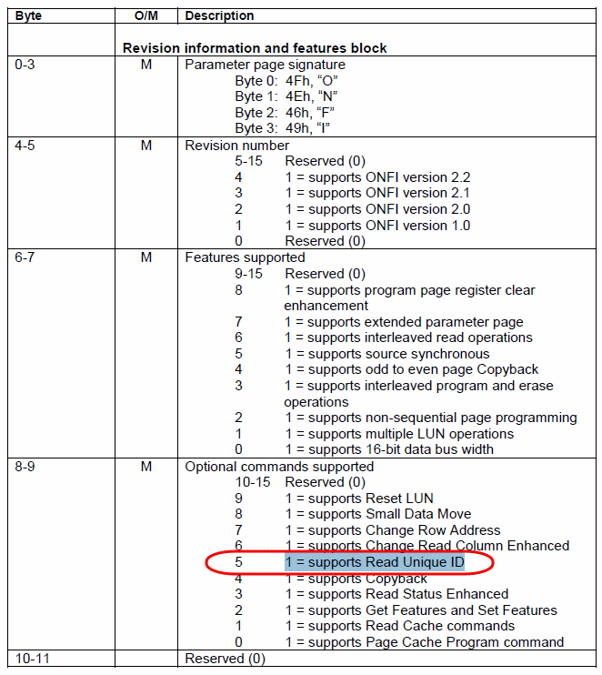

 

定义了一个page的数据，用于存储对应的Nand的各种参数，其中，有一个第8个字节的bit5==1的时候，表示支持“Read Unique ID”的命令，即说明此Nand芯片支持此命令，如果byte8的bit5==0，那么说明不支持，也就没法去读Unique ID了。

1.2.16.1.4.1. 读取遵循ONFI的厂商的Nand的Unique ID
如果经过上述判断，此符合ONFI的Nand Flash支持Read Unique ID命令，次此时就可以通过该命令来读取对应的Nand Flash的Unique ID了。

此Read Unique ID的详细解释为：

“ 5.8. Read Unique ID Definition
The Read Unique ID function is used to retrieve the 16 byte unique ID (UID) for the device. The unique ID when combined with the device manufacturer shall be unique.

The UID data may be stored within the Flash array. To allow the host to determine if the UID is without bit errors, the UID is returned with its complement, as shown in Table 47. If the XOR of the UID and its bit-wise complement is all ones, then the UID is valid.

”
即用Read Unique ID命令来读取128bit=16字节的Unique ID，但是呢，为了用于防止写入的Unique ID有误，因此在16字节后面又添了个对应的补码，即每位取反的结果，这样前16字节的Unique ID和后16字节的Unique ID的补码，构成了32字节，算作一组，如下图所示：

图 1.11. ONFI中Unique ID的结构

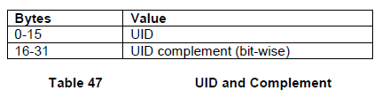

To accommodate robust retrieval of the UID in the case of bit errors, sixteen copies of the UID and the corresponding complement shall be stored by the target. For example, reading bytes 32-63 returns to the host another copy of the UID and its complement. Read Status Enhanced shall not be used during execution of the Read Unique ID command

 

Figure 57 defines the Read Unique ID behavior. The host may use any timing mode supported by the target in order to retrieve the UID data.

”

而为了进一步防止出错，将上面32字节算一组，重复了16次，将这16个32字节的数据，存在Nand Flash里面，然后用Read Unique ID命令去读取出来，取得其中某个32字节即可，然后判断前16字节和后16字节取反，如果结果所有位都是1，那么结果即为16个0xFF，那么说明Unique ID是正确的。否则说明有误。

Read Unique ID的命令的详细格式如下图所示：

图 1.12. ONFI中Read Unique ID命令的时序图

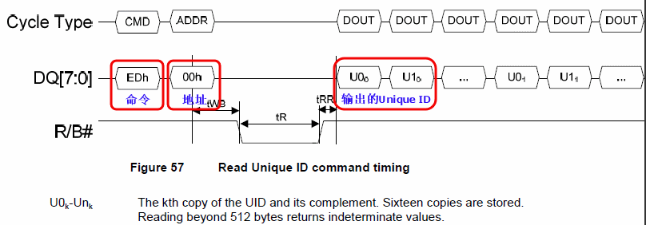

即先发送0xED命令，再发送0x00地址，然后等待Nand Flash的busy状态结束，就可以读取出来的那16组的32个字节了，然后用上面办法去判断，找到前16字节和后16字节异或得到结果全部16字节都为0xFF，即说明得到了正确的Unique ID。至此，符合ONFI规范的Unique ID，就读取出来了。

1.2.16.2. 片选无关(CE don’t-care)技术
很多Nand flash支持一个叫做CE don’t-care的技术，字面意思就是，不关心是否片选。

对此也许有人会问了，如果不片选，那还能对其操作吗？答案就是，这个技术，主要用在当时是不需要选中芯片，但是芯片内部却仍可以继续操作的这些情况：在某些应用，比如录音，音频播放等应用中，外部使用的微秒（us）级的时钟周期，此处假设是比较少的2us，在进行读取一页或者对页编程时，是对Nand Flash操作，这样的串行（Serial Access）访问的周期都是20/30/50ns，都是纳秒（ns）级的，此处假设是50ns，当你已经发了对应的读或写的命令之后，接下来只是需要Nand Flash内部去自己操作，将数据读取除了或写入进去到内部的数据寄存器中而已，此处，如果可以把片选取消，CE#是低电平有效，取消片选就是拉高电平，这样会在下一个外部命令发送过来之前，即微秒量级的时间里面，即2us－50ns≈2us，这段时间的取消片选，可以降低很少的系统功耗，但是多次的操作，就可以在很大程度上降低整体的功耗了。

总的来说就是：由于某些外部应用所需要的访问Nand Flash的频率比较低，而Nand Flash内部操作速度比较快，所以在针对Nand Flash的读或写操作的大部分时间里面，都是在等待外部命令的输入，同时却选中芯片，产生了多余的功耗，此“不关心片选”技术，就是在Nand Flash的内部的相对快速的操作（读或写）完成之后，就取消片选，以节省系统功耗。待下次外部命令/数据/地址输入来的时候，再选中芯片，即可正常继续操作了。这样，整体上，就可以大大降低系统功耗了。

1.2.16.3. 带EDC的拷回操作以及Sector的定义（Copy-Back Operation with EDC & Sector Definition for EDC）
Copy-Back功能，简单的说就是，将一个页的数据，拷贝到另一个页。

如果没有Copy-Back功能，那么正常的做法就是，先要将那个页的数据拷贝出来放到内存的数据buffer中，读出来之后，再用写命令将这页的数据，写到新的页里面。

而Copy-Back功能的好处在于，不需要用到外部的存储空间，不需要读出来放到外部的buffer里面，而是可以直接读取数据到内部的页寄存器（page register）然后写到新的页里面去。

而且，为了保证数据的正确，要硬件支持EDC（Error Detection Code）的，否则，在数据的拷贝过程中，可能会出现错误，并且拷贝次数多了，可能会累积更多错误。

而对于错误检测来说，硬件一般支持的是512字节数据，对应有16字节用来存放校验产生的ECC数值，而这512字节一般叫做一个扇区。对于2K＋64字节大小的页来说，按照512字节分，分别叫做A，B，C，D区，而后面的64字节的oob区域，按照16字节一个区，分别叫做E，F，G，H区，对应存放A，B，C，D数据区的ECC的值。

Copy-Back编程的主要作用在于，去掉了数据串行读取出来，再串行写入进去的时间，所以，而这部分操作，是比较耗时的，所以此技术可以提高编程效率，提高系统整体性能。

1.2.16.4. 多片同时编程(Simultaneously Program Multi Plane)
对于有些新出的Nand Flash，支持同时对多个片进行编程，比如上面提到的三星的K9K8G08U0A，内部包含4片(Plane)，分别叫做Plane0，Plane1，Plane2，Plane3。.由于硬件上，对于每一个Plane，都有对应的大小是2048+64=2112字节的页寄存器（Page Register），使得同时支持多个Plane编程成为可能。 K9K8G08U0A支持同时对2个Plane进行编程。

不过要注意的是，只能对Plane0和Plane1或者Plane2和Plane3，同时编程，而不支持Plane0和Plane2同时编程。

1.2.16.5. 交错页编程（Interleave Page Program）
多片同时编程，是针对一个chip里面的多个Plane来说的，

而此处的交错页编程，是指对多个chip而言的。

可以先对一个chip，假设叫chip1，里面的一页进行编程，然后此时，chip1内部就开始将数据一点点写到页里面，就出于忙的状态了，而此时可以利用这个时间，对出于就绪状态的chip2，也进行页编程，发送对应的命令后，chip2内部也就开始慢慢的写数据到存储单元里面去了，也出于忙的状态了。此时，再去检查chip1，如果编程完成了，就可以开始下一页的编程了，然后发完命令后，就让其内部慢慢的编程吧，再去检查chip2，如果也是编程完了，也就可以进行接下来的其他页的编程了。如此，交互操作chip1和chip2，就可以有效地利用时间，使得整体编程效率提高近2倍，大大提高Nand Flash的编程/擦写速度了。

1.2.16.6. 随机输出页内数据（Random Data Output In a Page）
在介绍此特性之前，先要说说，与Random Data Output In a Page相对应的是，普通的，正常的，sequential data output in a page。

正常情况下，我们读取数据，都是先发读命令，然后等待数据从存储单元到内部的页数据寄存器中后，我们通过不断地将RE#(Read Enale，低电平有效)置低，然后从我们开始传入的列的起始地址，一点点读出我们要的数据，直到页的末尾，当然有可能还没到页地址的末尾，就不再读了。所谓的顺序（sequential）读取也就是，根据你之前发送的列地址的起始地址开始，每读一个字节的数据出来，内部的数据指针就加1，移到下个字节的地址，然后你再读下一个字节数据，就可以读出来你要的数据了，直到读取全部的数据出来为止。

而此处的随机（random）读取，就是在你正常的顺序读取的过程中，先发一个随机读取的开始命令0x05命令，再传入你要将内部那个数据指针定位到具体什么地址，也就是2个cycle的列地址，然后再发随机读取结束命令0xE0，然后，内部那个数据地址指针，就会移动到你所制定的位置了，你接下来再读取的数据，就是从那个制定地址开始的数据了。

而Nand Flash数据手册里面也说了，这样的随机读取，你可以多次操作，没限制的。

请注意，上面你所传入的地址，都是列地址，也就是页内地址，也就是说，对于页大小为2K的Nand Flash来说，所传入的地址，应该是小于2048+64＝2112的。

不过，实际在Nand Flash的使用中，好像这种用法很少的。绝大多数，都是顺序读取数据。

好文要顶 关注我 收藏该文  