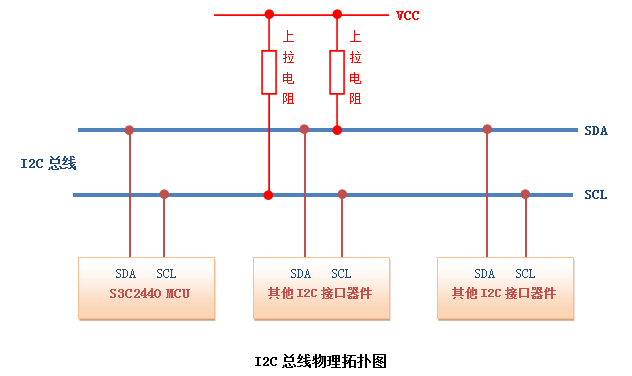
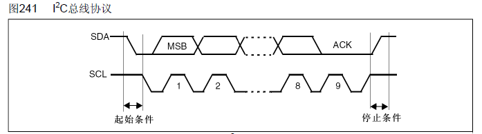
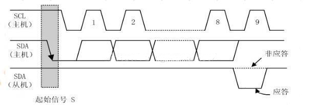

# [IIC的基本原理（实例：普通IO口模拟IIC时序读取24C02）](https://blog.csdn.net/qq_38410730/article/details/80312357)


IIC的基本介绍
IIC的简介
IIC（Inter－Integrated Circuit）总线是一种由PHILIPS公司在80年代开发的两线式串行总线，用于连接微控制器及其外围设备。它是半双工通信方式。

IIC总线最主要的优点是其简单性和有效性。由于接口直接在组件之上，因此IIC总线占用的空间非常小，减少了电路板的空间和芯片管脚的数量，降低了互联成本。总线的长度可高达25英尺，并且能够以10Kbps的最大传输速率支持40个组件。
IIC总线的另一个优点是，它支持多主控(multimastering)， 其中任何能够进行发送和接收的设备都可以成为主总线。一个主控能够控制信号的传输和时钟频率。当然，在任何时间点上只能有一个主控。


IIC串行总线一般有两根信号线，一根是双向的数据线SDA，另一根是时钟线SCL，其时钟信号是由主控器件产生。所有接到IIC总线设备上的串行数据SDA都接到总线的SDA上，各设备的时钟线SCL接到总线的SCL上。对于并联在一条总线上的每个IC都有唯一的地址。



一般情况下，数据线SDA和时钟线SCL都是处于上拉电阻状态。因为：在总线空闲状态时，这两根线一般被上面所接的上拉电阻拉高，保持着高电平。

STM32的IIC接口
目前绝大多数的MCU都附带IIC总线接口，STM32也不例外。但是在本文中，我们不使用STM32的硬件IIC来读取24C02，而是通过软件的方式来模拟。

原因是因为：STM32的硬件IIC非常复杂，更重要的是它并不稳定，故不推荐使用。

 

IIC协议
IIC总线在传输数据的过程中一共有三种类型信号，分别为：开始信号、结束信号和应答信号。这些信号中，起始信号是必需的，结束信号和应答信号，都可以不要。同时我们还要介绍其空闲状态、数据的有效性、数据传输。

先来看一下IIC总线的时序图：


这可能会比较复杂，可以先看一份简化了的时序图：



空闲状态
当IIC总线的数据线SDA和时钟线SCL两条信号线同时处于高电平时，规定为总线的空闲状态。此时各个器件的输出级场效应管均处在截止状态，即释放总线，由两条信号线各自的上拉电阻把电平拉高。 

起始信号与停止信号
起始信号：当时钟线SCL为高期间，数据线SDA由高到低的跳变；启动信号是一种电平跳变时序信号，而不是一个电平信号；
停止信号：当时钟线SCL为高期间，数据线SDA由低到高的跳变；停止信号也是一种电平跳变时序信号，而不是一个电平信号。


应答信号
发送器每发送一个字节（8个bit），就在时钟脉冲9期间释放数据线，由接收器反馈一个应答信号。 

应答信号为低电平时，规定为有效应答位（ACK，简称应答位），表示接收器已经成功地接收了该字节；
应答信号为高电平时，规定为非应答位（NACK），一般表示接收器接收该字节没有成功。 



对于反馈有效应答位ACK的要求是：接收器在第9个时钟脉冲之前的低电平期间将数据线SDA拉低，并且确保在该时钟的高电平期间为稳定的低电平。 如果接收器是主控器，则在它收到最后一个字节后，发送一个NACK信号，以通知被控发送器结束数据发送，并释放数据线SDA，以便主控接收器发送一个停止信号P。

数据有效性
IIC总线进行数据传送时，时钟信号为高电平期间，数据线上的数据必须保持稳定；只有在时钟线上的信号为低电平期间，数据线上的高电平或低电平状态才允许变化。 

即：数据在时钟线SCL的上升沿到来之前就需准备好。并在在下降沿到来之前必须稳定。


数据的传达
在IIC总线上传送的每一位数据都有一个时钟脉冲相对应（或同步控制），即在SCL串行时钟的配合下，在SDA上逐位地串行传送每一位数据。数据位的传输是边沿触发。

延时时间


 

IIC总线的数据传送
IIC总线上的每一个设备都可以作为主设备或者从设备，而且每一个设备都会对应一个唯一的地址（地址通过物理接地或者拉高），主从设备之间就通过这个地址来确定与哪个器件进行通信，在通常的应用中，我们把CPU带I2C总线接口的模块作为主设备，把挂接在总线上的其他设备都作为从设备。

也就是说，主设备在传输有效数据之前要先指定从设备的地址，地址指定的过程和上面数据传输的过程一样，只不过大多数从设备的地址是7位的，然后协议规定再给地址添加一个最低位用来表示接下来数据传输的方向，0表示主设备向从设备写数据，1表示主设备向从设备读数据。


主设备往从设备中写数据。数据传输格式如下：


淡蓝色部分表示数据由主机向从机传送，粉红色部分则表示数据由从机向主机传送。

写用0来表示（高电平），读用1来表示（低电平）。

主设备从从设备中读数据。数据传输格式如下：


在从机产生响应时，主机从发送变成接收，从机从接收变成发送。之后，数据由从机发送，主机接收，每个应答由主机产生，时钟信号仍由主机产生。若主机要终止本次传输，则发送一个非应答信号，接着主机产生停止条件。

 主设备往从设备中写数据，然后重启起始条件，紧接着从从设备中读取数据；或者是主设备从从设备中读数据，然后重启起始条件，紧接着主设备往从设备中写数据。数据传输格式如下：


在多主的通信系统中，总线上有多个节点，它们都有自己的寻址地址，可以作为从节点被别的节点访问，同时它们都可以作为主节点向其它的节点发送控制字节和传送数据。但是如果有两个或两个以上的节点都向总线上发送启动信号并开始传送数据，这样就形成了冲突。要解决这种冲突，就要进行仲裁的判决，这就是I2C总线上的仲裁。

I2C总线上的仲裁分两部分：SCL线的同步和SDA线的仲裁。

这部分就暂时不介绍了，想要了解：可以参考链接浅谈I2C总线或I2C总线协议图解。

 

IIC底层驱动程序分析
现拟采用PB6、PB7来模拟IIC时序，其中：PB6为时钟线，PB7为数据线。

首先进行一些必要的宏定义：
```C
//IO方向设置
#define SDA_IN()  {GPIOB->CRL&=0X0FFFFFFF;GPIOB->CRL|=(u32)8<<28;}
#define SDA_OUT() {GPIOB->CRL&=0X0FFFFFFF;GPIOB->CRL|=(u32)3<<28;}
 
//IO操作函数	 
#define IIC_SCL    PBout(6) //SCL
#define IIC_SDA    PBout(7) //SDA	 
#define READ_SDA   PBin(7)  //输入SDA 
 
//IIC所有操作函数
void IIC_Init(void);                //初始化IIC的IO口				 
void IIC_Start(void);				//发送IIC开始信号
void IIC_Stop(void);	  			//发送IIC停止信号
void IIC_Send_Byte(u8 txd);			//IIC发送一个字节
u8 IIC_Read_Byte(unsigned char ack);//IIC读取一个字节
u8 IIC_Wait_Ack(void); 				//IIC等待ACK信号
void IIC_Ack(void);					//IIC发送ACK信号
void IIC_NAck(void);				//IIC不发送ACK信号
```
由于IIC是半双工通信方式，因而数据线SDA可能会数据输入，也可能是数据输出，需要定义IIC_SDA来进行输出、READ_SDA来进行输入，与此同时就要对IO口进行模式配置：SDA_IN()和SDA_OUT()。

而时钟线SCL一直是输出的，所以就没有数据线SDA麻烦了。
```C
//初始化IIC
void IIC_Init(void)
{					     
	GPIO_InitTypeDef GPIO_InitStructure;
	RCC_APB2PeriphClockCmd(	RCC_APB2Periph_GPIOB, ENABLE );	//使能GPIOB时钟
	   
	GPIO_InitStructure.GPIO_Pin = GPIO_Pin_6|GPIO_Pin_7;
	GPIO_InitStructure.GPIO_Mode = GPIO_Mode_Out_PP ;   //推挽输出
	GPIO_InitStructure.GPIO_Speed = GPIO_Speed_50MHz;
	GPIO_Init(GPIOB, &GPIO_InitStructure);
	GPIO_SetBits(GPIOB,GPIO_Pin_6|GPIO_Pin_7); 	//PB6,PB7 输出高，空闲状态
}
//产生IIC起始信号
void IIC_Start(void)
{
	SDA_OUT();     //sda线输出
	IIC_SDA=1;	  	  
	IIC_SCL=1;
	delay_us(4);
 	IIC_SDA=0;    //START:when CLK is high,DATA change form high to low 
	delay_us(4);
	IIC_SCL=0;    //钳住I2C总线，准备发送或接收数据 
}	  
//产生IIC停止信号
void IIC_Stop(void)
{
	SDA_OUT();    //sda线输出
	IIC_SCL=0;
	IIC_SDA=0;    //STOP:when CLK is high DATA change form low to high
 	delay_us(4);
	IIC_SCL=1; 
	IIC_SDA=1;    //发送I2C总线结束信号
	delay_us(4);							   	
}
//发送数据后，等待应答信号到来
//返回值：1，接收应答失败，IIC直接退出
//        0，接收应答成功，什么都不做
u8 IIC_Wait_Ack(void)
{
	u8 ucErrTime=0;
	SDA_IN();      //SDA设置为输入  
	IIC_SDA=1;delay_us(1);	   
	IIC_SCL=1;delay_us(1);	 
	while(READ_SDA)
	{
		ucErrTime++;
		if(ucErrTime>250)
		{
			IIC_Stop();
			return 1;
		}
	}
	IIC_SCL=0;    //时钟输出0 	   
	return 0;  
} 
//产生ACK应答
void IIC_Ack(void)
{
	IIC_SCL=0;
	SDA_OUT();
	IIC_SDA=0;
	delay_us(2);
	IIC_SCL=1;
	delay_us(2);
	IIC_SCL=0;
}
//不产生ACK应答		    
void IIC_NAck(void)
{
	IIC_SCL=0;
	SDA_OUT();
	IIC_SDA=1;
	delay_us(2);
	IIC_SCL=1;
	delay_us(2);
	IIC_SCL=0;
}					 				     
//IIC发送一个字节
//返回从机有无应答
//1，有应答
//0，无应答			  
void IIC_Send_Byte(u8 txd)
{                        
    u8 t;   
	SDA_OUT(); 	    
    IIC_SCL=0;            //拉低时钟开始数据传输
    for(t=0;t<8;t++)
    {              
        //IIC_SDA=(txd&0x80)>>7;
		if((txd&0x80)>>7)
			IIC_SDA=1;
		else
			IIC_SDA=0;
		txd<<=1; 	  
		delay_us(2);       //对TEA5767这三个延时都是必须的
		IIC_SCL=1;
		delay_us(2); 
		IIC_SCL=0;	
		delay_us(2);
    }	 
} 	    
//读1个字节，ack=1时，发送ACK，ack=0，发送nACK   
u8 IIC_Read_Byte(unsigned char ack)
{
	unsigned char i,receive=0;
	SDA_IN();        //SDA设置为输入
    for(i=0;i<8;i++ )
	{
        IIC_SCL=0; 
        delay_us(2);
		IIC_SCL=1;
        receive<<=1;
        if(READ_SDA)receive++;   
		delay_us(1); 
    }					 
    if (!ack)
        IIC_NAck();        //发送nACK
    else
        IIC_Ack();         //发送ACK   
    return receive;
}
```
这里是通过普通IO口（PB6、PB7）来模拟IIC时序的程序，其实本质上都是严格按照IIC的时序图进行的，认真读，仔细对比，应该是没有什么困难的。

就提一下：IIC_Read_Byte()函数，这个函数的参数表示读取一个字节之后，需要给对方应答信号或非应答信号。

 

普通IO口模拟IIC时序读取24C02
24C02芯片介绍
EEPROM (Electrically Erasable Programmable read only memory)，带电可擦可编程只读存储器——一种掉电后数据不丢失的存储芯片。 

24Cxx芯片是EEPROM芯片的一种，它是基于IIC总线的存储器件，遵循二线制协议，由于其具有接口方便，体积小，数据掉电不丢失等特点，在仪器仪表及工业自动化控制中得到大量的应用。24Cxx在电路的作用主要是在掉电的情况下保存数据。

本文使用的是24C02芯片，总容量是2k个bit（256个字节）。这里芯片名称里的02代表着总容量。

24C02芯片的引脚分布和具体的作用见下图：


 

24C02芯片的引脚说明
引脚名称	说明
A0-A2	地址输入线
SDA	数据线
SCL	时钟线
WP	写保护
GND、VCC	提供电源
下图是本文中24C02和STM32的引脚连接图：


从图中可以看出：A0、A1、A2都为0。

对于并联在一条IIC总线上的每个IC都有唯一的地址。那么看一下从器件地址，可以看出对于不同大小的24Cxx，具有不同的从器件地址。由于24C02为2k容量，也就是说只需要参考图中第一行的内容：


根据图中的内容：如果是写24C02的时候，从器件地址为10100000（0xA0）；读24C02的时候，从器件地址为10100001（0xA1）。

24C02芯片的时序图
这部分的内容应结合上文：I2C总线的数据传送的内容一起理解。

24C02字节写时序


对24C02芯片进行写字节操作的时候，步骤如下：

开始位，后面紧跟从器件地址位（0xA0），等待应答，这是为了在IIC总线上确定24C02的从地址位置；
确定操作24C02的地址，等待应答，也就是将字节写入到24C02中256个字节中的位置；
确定需要写入24C02芯片的字节，等待应答，停止位。
24C02字节读时序


对24C02芯片进行读字节操作的时候，步骤如下：

开始位，后面紧跟从器件地址位（0xA0），等待应答，这是为了在IIC总线上确定24C02的从地址位置；
确定操作24C02的地址，等待应答，也就是从24C02中256个字节中读取字节的位置；
再次开始位，后面紧跟从器件地址位（0xA1），等待应答；
获取从24C02芯片中读取的字节，发出非应答信号，停止位。
读取24C02芯片程序
```C
#define AT24C01		127
#define AT24C02		255
#define AT24C04		511
#define AT24C08		1023
#define AT24C16		2047
#define AT24C32		4095
#define AT24C64	    8191
#define AT24C128	16383
#define AT24C256	32767  
//Mini STM32开发板使用的是24c02，所以定义EE_TYPE为AT24C02
#define EE_TYPE AT24C02
//初始化IIC接口
void AT24CXX_Init(void)
{
	IIC_Init();
}
//在AT24CXX指定地址读出一个数据
//ReadAddr:开始读数的地址  
//返回值  :读到的数据
u8 AT24CXX_ReadOneByte(u16 ReadAddr)
{				  
	u8 temp=0;		  	    																 
        IIC_Start();  
	if(EE_TYPE>AT24C16)            //为了兼容24Cxx中其他的版本
	{
		IIC_Send_Byte(0XA0);	   //发送写命令
		IIC_Wait_Ack();
		IIC_Send_Byte(ReadAddr>>8);    //发送高地址
		IIC_Wait_Ack();		 
	}else      IIC_Send_Byte(0XA0+((ReadAddr/256)<<1));   //发送器件地址0XA0,写数据 	 
 
	IIC_Wait_Ack(); 
        IIC_Send_Byte(ReadAddr%256);   //发送低地址
	IIC_Wait_Ack();	    
	IIC_Start();  	 	   
	IIC_Send_Byte(0XA1);           //进入接收模式			   
	IIC_Wait_Ack();	 
        temp=IIC_Read_Byte(0);	    //读一个字节，非应答信号信号	   
        IIC_Stop();        //产生一个停止条件	    
	return temp;
}
//在AT24CXX指定地址写入一个数据
//WriteAddr  :写入数据的目的地址    
//DataToWrite:要写入的数据
void AT24CXX_WriteOneByte(u16 WriteAddr,u8 DataToWrite)
{				   	  	    																 
        IIC_Start();  
	if(EE_TYPE>AT24C16)
	{
		IIC_Send_Byte(0XA0);	    //发送写命令
		IIC_Wait_Ack();
		IIC_Send_Byte(WriteAddr>>8);    //发送高地址
 	}else
	{
		IIC_Send_Byte(0XA0+((WriteAddr/256)<<1));   //发送器件地址0XA0,写数据 
	}	 
	IIC_Wait_Ack();	   
        IIC_Send_Byte(WriteAddr%256);   //发送低地址
	IIC_Wait_Ack(); 	 										  		   
	IIC_Send_Byte(DataToWrite);     //发送字节							   
	IIC_Wait_Ack();  		    	   
        IIC_Stop();    //产生一个停止条件 
	delay_ms(10);	 
}
//在AT24CXX里面的指定地址开始写入长度为Len的数据
//该函数用于写入16bit或者32bit的数据.
//WriteAddr  :开始写入的地址  
//DataToWrite:数据数组首地址
//Len        :要写入数据的长度2,4
void AT24CXX_WriteLenByte(u16 WriteAddr,u32 DataToWrite,u8 Len)
{  	
	u8 t;
	for(t=0;t<Len;t++)
	{
		AT24CXX_WriteOneByte(WriteAddr+t,(DataToWrite>>(8*t))&0xff);
	}												    
}
 
//在AT24CXX里面的指定地址开始读出长度为Len的数据
//该函数用于读出16bit或者32bit的数据.
//ReadAddr   :开始读出的地址 
//返回值     :数据
//Len        :要读出数据的长度2,4
u32 AT24CXX_ReadLenByte(u16 ReadAddr,u8 Len)
{  	
	u8 t;
	u32 temp=0;
	for(t=0;t<Len;t++)
	{
		temp<<=8;
		temp+=AT24CXX_ReadOneByte(ReadAddr+Len-t-1); 	 				   
	}
	return temp;												    
}
//检查AT24CXX是否正常
//这里用了24XX的最后一个地址(255)来存储标志字.
//如果用其他24C系列,这个地址要修改
//返回1:检测失败
//返回0:检测成功
u8 AT24CXX_Check(void)
{
	u8 temp;
	temp=AT24CXX_ReadOneByte(255);//避免每次开机都写AT24CXX			   
	if(temp==0X55)return 0;		   
	else//排除第一次初始化的情况
	{
		AT24CXX_WriteOneByte(255,0X55);
	    temp=AT24CXX_ReadOneByte(255);	  
		if(temp==0X55)return 0;
	}
	return 1;											  
}
 
//在AT24CXX里面的指定地址开始读出指定个数的数据
//ReadAddr :开始读出的地址 对24c02为0~255
//pBuffer  :数据数组首地址
//NumToRead:要读出数据的个数
void AT24CXX_Read(u16 ReadAddr,u8 *pBuffer,u16 NumToRead)
{
	while(NumToRead)
	{
		*pBuffer++=AT24CXX_ReadOneByte(ReadAddr++);	
		NumToRead--;
	}
}  
//在AT24CXX里面的指定地址开始写入指定个数的数据
//WriteAddr :开始写入的地址 对24c02为0~255
//pBuffer   :数据数组首地址
//NumToWrite:要写入数据的个数
void AT24CXX_Write(u16 WriteAddr,u8 *pBuffer,u16 NumToWrite)
{
	while(NumToWrite--)
	{
		AT24CXX_WriteOneByte(WriteAddr,*pBuffer);
		WriteAddr++;
		pBuffer++;
	}
}
//要写入到24c02的字符串数组
const u8 TEXT_Buffer[]={"WarShipSTM32 IIC TEST"};
#define SIZE sizeof(TEXT_Buffer)	
	
 int main(void)
 {	 
	u8 key;
	u16 i=0;
	u8 datatemp[SIZE];
	delay_init();	    	 //延时函数初始化	  
        NVIC_PriorityGroupConfig(NVIC_PriorityGroup_2);//设置中断优先级分组为组2：2位抢占优先级，2位响应优先级
	uart_init(115200);	 	//串口初始化为115200
	LED_Init();		  		//初始化与LED连接的硬件接口
	LCD_Init();			   	//初始化LCD 	
	KEY_Init();				//按键初始化		 	 	
	AT24CXX_Init();			//IIC初始化 
 
 	POINT_COLOR=RED;//设置字体为红色 
	LCD_ShowString(30,50,200,16,16,"WarShip STM32");	
	LCD_ShowString(30,70,200,16,16,"IIC TEST");	
	LCD_ShowString(30,90,200,16,16,"ATOM@ALIENTEK");
	LCD_ShowString(30,110,200,16,16,"2015/1/15");	
	LCD_ShowString(30,130,200,16,16,"KEY1:Write  KEY0:Read");	//显示提示信息		
 	while(AT24CXX_Check())//检测不到24c02
	{
		LCD_ShowString(30,150,200,16,16,"24C02 Check Failed!");
		delay_ms(500);
		LCD_ShowString(30,150,200,16,16,"Please Check!      ");
		delay_ms(500);
		LED0=!LED0;//DS0闪烁
	}
	LCD_ShowString(30,150,200,16,16,"24C02 Ready!");    
 	POINT_COLOR=BLUE;//设置字体为蓝色	  
	while(1)
	{
		key=KEY_Scan(0);
		if(key==KEY1_PRES)//KEY_UP按下,写入24C02
		{
			LCD_Fill(0,170,239,319,WHITE);//清除半屏    
 			LCD_ShowString(30,170,200,16,16,"Start Write 24C02....");
			AT24CXX_Write(0,(u8*)TEXT_Buffer,SIZE);
			LCD_ShowString(30,170,200,16,16,"24C02 Write Finished!");//提示传送完成
		}
		if(key==KEY0_PRES)//KEY1按下,读取字符串并显示
		{
 			LCD_ShowString(30,170,200,16,16,"Start Read 24C02.... ");
			AT24CXX_Read(0,datatemp,SIZE);
			LCD_ShowString(30,170,200,16,16,"The Data Readed Is:  ");//提示传送完成
			LCD_ShowString(30,190,200,16,16,datatemp);//显示读到的字符串
		}
		i++;
		delay_ms(10);
		if(i==20)
		{
			LED0=!LED0;//提示系统正在运行	
			i=0;
		}		   
	}
}
 ```

IIC总结
进行数据传送时，在SCL为高电平期间，SDA线上电平必须保持稳定，只有SCL为低时，才允许SDA线上电平改变状态。并且每个字节传送时都是高位在前；
对于应答信号，ACK=0时为有效应答位，说明从机已经成功接收到该字节，若为1则说明接受不成功；
如果从机需要延迟下一个数据字节开始传送的时间，可以通过把SCL电平拉低并保持来强制主机进入等待状态；
主机完成一次通信后还想继续占用总线在进行一次通信，而又不释放总线，就要利用重启动信号。它既作为前一次数据传输的结束，又作为后一次传输的开始；
总线冲突时，按“低电平优先”的仲裁原则，把总线判给在数据线上先发送低电平的主器件；
在特殊情况下，若需禁止所有发生在I2C总线上的通信，可采用封锁或关闭总线，具体操作为在总线上的任一器件将SCL锁定在低电平即可；
SDA仲裁和SCL时钟同步处理过程没有先后关系，而是同时进行的。

