# [从零开始构建bootloader（基于韦东山JZ2440V3开发板）](https://blog.csdn.net/liangzc1124/article/details/112410745)
对比理解u-boot
对于常用的电脑：
1、一上电启动BIOS：目的是引导操作系统
2、操作系统：识别出各种硬盘
3、通过硬盘运行各种应用程序

对于嵌入式Linux开发板
1、一上电启动bootloader：目的是启动内核
2、内核启动之后，挂接根文件系统
3、通过根文件系统可以运行各种应用程序
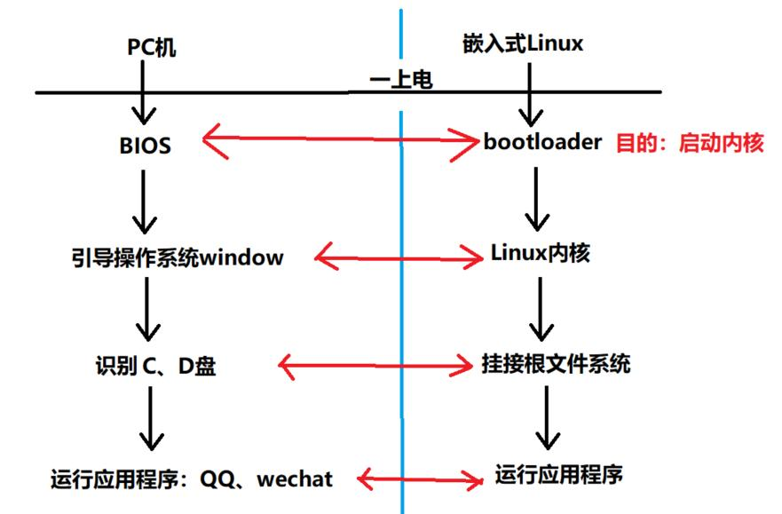
我们可以把bootloader理解成一个复杂的单片机程序，它主要实现以下功能：
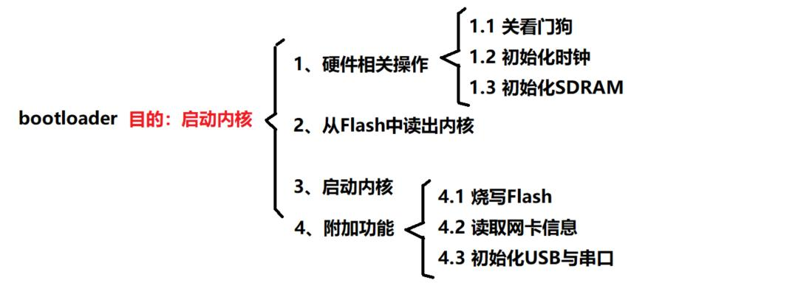
`项目步骤`：

第一阶段：

1、关看门狗；
2、时钟初始化；
3、内存初始化；
4、NandFlash初始化；
5、代码重定位（将flash中的代码复制到指定的内存地址处，也即代码段链接地址）；
6、跳转到main函数；

第二阶段：

7、写main函数，在函数中设置要传给内核的参数；
8、跳转到内核入口，启动内核
9、制作链接脚本

第三阶段：

10、编写Makefile文件
11、下载编译和运行

## 1、编写start.S文件，初始化片上硬件

本文件需要完成的目标：

**1.**关看门狗

**2.**设置时钟

**3.**开启指令缓存，初始化SDRAM

**4.**重定位(把bootloader本身的代码从flash复制到它的链接地址(c函数编写),然后清空bss段(c函数编写))

**5.**跳转到main函数。

```AL
#define CLKDIVN		0X4C000014	/*设置FCLK:HCLK:PCLK的比例*/
#define MPLLCON		0x4C000004	/*设置FCLK频率*/
#define S3C2440_MPLL_200MHZ     ((0x5c<<12)|(0x01<<4)|(0x02))
#define S3C2440_MPLL_400MHZ     ((0x5c<<12)|(0x01<<4)|(0x01))

#define WTCON	0x53000000		/*看门狗寄存器*/
#define BWSCON	0X48000000		/*BANK寄存器*/

.text					/*设置代码段*/
.global _start			/*定义全局变量，要被链接脚本用到*/
_start:					/*_start跳转到这里实现硬件初始化*/

	/* 1.关看门狗*/
	ldr r0, =WTCON
	mov r1, #0
	str r1, [r0]

	/* 2.设置时钟（必须设为异步总线模式） */
	ldr r0, =CLKDIVN
	mov r1, #5			/* FCLK:HCLK:PCLK=1:4:8 */
	str r1, [r0]

	mrc	p15, 0, r1, c1, c0, 0	/*设置为asynchronous bus mode*/
	orr	r1, r1, #0xc0000000
	mcr	p15, 0, r1, c1, c0, 0
 
	ldr r0, =MPLLCON			/* 设置时钟频率FCLK为400MHZ */
	ldr r1, =S3C2440_MPLL_400MHZ
	str r1, [r0]

	/* 3.使能ICache，加快指令访问速度；因为目前没有开启MMU，所以还不能开启数据缓存DCache */
	mrc p15, 0, r0, c1, c0, 0	/* read control reg */
	orr r0, r0, #(1<<12)
	mcr	p15, 0, r0, c1, c0, 0   /* write it back */


	/* 4.初始化SDRAM */
	ldr r0, =BWSCON
	adr r1, sdram_config     	/* 使用adr跳转，因为SDRAM未初始化 */
	add r3, r0, #(13*4)
1:
	ldr r2, [r1], #4
	str r2, [r0], #4
	cmp r0, r3
	bne 1b						/*back to 1 when no equal*/

	/* 4.重定位 */
	ldr sp, =0x34000000			/*因为SDRAM大小为64MB，所以堆栈指针设在最高地址处*/

	bl nand_init

	mov r0, #0					/* src = r0 */
	ldr r1, =_start				/* dest = r1,_start为代码段的起始和链接地址0x30000000 */
	ldr r2, =__bss_start
	sub r2, r2, r1				/* len = r2,代码段长度*/
	
	bl copy_code_to_sdram		/* 调用C函数copy_code_to_sdram(src, dest, len)*/
	bl clear_bss				/* 清除bss段*/
	
/* 5.执行main */
	ldr lr, =halt
	ldr pc, =main
	mov pc，lr					/* 若main函数跳出后,使PC等于lr链接寄存器，避免程序跑飞 */
halt:
	b halt						/* 死循环,避免跑飞 */

sdram_config:
	.long 0x22011110	 //BWSCON
	.long 0x00000700	 //BANKCON0
	.long 0x00000700	 //BANKCON1
	.long 0x00000700	 //BANKCON2
	.long 0x00000700	 //BANKCON3  
	.long 0x00000700	 //BANKCON4
	.long 0x00000700	 //BANKCON5
	.long 0x00018005	 //BANKCON6
	.long 0x00018005	 //BANKCON7
	.long 0x008C04F4	 // REFRESH
	.long 0x000000B1	 //BANKSIZE
	.long 0x00000030	 //MRSRB6
	.long 0x00000030	 //MRSRB7


```

关于时钟频率的设置解释：

将CPU频率设为最大值400MHZ(内核启动时间7S变为6S,因为HCLK和PCLK频率没有改变)
然后分频系数FCLK:HCLK:PCLK需要设置为1:4:8。
因为HCLK最高133MHZ,这里需要设置为100MHZ，PCLK最高50MHZ，所以这里需要设置为50HZ，所以得出 CLKDIVN寄存器需要等于0X5即可。
具体为什么等于0x5，可以参考下图：
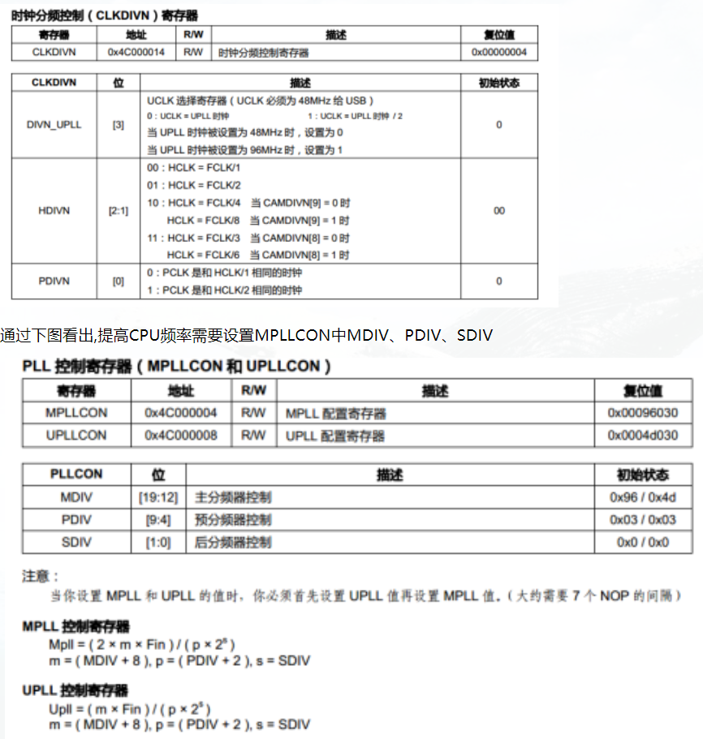
通过查看数据手册，得知当FCLK取400MHZ时,设置MDIV为0X5C，PDIV为0x1,SDIV为0x1。

关于Cache的设置解释：

通过高速缓存存储器可以加快对内存的数据访问,在CAHE中有ICAHE（指令缓存）和DCAHE（数据缓存）：
**ICAHE: ** 指令缓存,用来存放执行这些数据的指令；
**DCAHE: **用来存放数据,需要开启MMU才能开启DCAHE。
在没开启ICAHE之前,CPU读取SDRAM地址数据时,每次都需要先访问一次地址值,在读数据.
当开了ICAHE后,第一次读取SDRAM地址数据时,ICAHE发现缓存里没有这个地址数据,然后将SDRAM中需要读取的那部分一大块内存数据都复制在缓存中,后面陆续读取数据就不会再访问SDRAM了,直到CPU没有找到地址数据后ICAHE再从SDRAM中重新复制

通过CP15协处理器来开启ICAHE：ICAHE控制位在CP15的寄存器C1中位12(如下图), 然后通过MRS和MSR向该位12置1,开启ICAHE.所以代码如下(放在SDRAM初始化之前):
```AL
 mrc p15, 0, r0, c1, c0, 0      //将 CP15 的寄存器 C1 的值读到 r0 中
 orr r0, r0, #(1<<12)         //将r0中位12置1     
 mcr p15,0, r0,c1,c0,0        //开启ICAHE
```

## 2、编写init.c，用于重定位,bss段清除,初始化NandFlash

### （1）编写nand_init()函数
准备知识：

我使用的NandFlash型号为K9F2G08U0M，通过查阅芯片手册获知该flash大小=2048块Block=128KPages=256MB=2Gb 。且其构成为：

1个设备=2048（Block）

1块Block=64（Pages）

1页=(2K+64)（Byte） 因为每个地址里都存放了一个字节,所以用Byte表示，其中64B是存放ECC的OOB地址,(ECC:存放判断位反转的校验码)

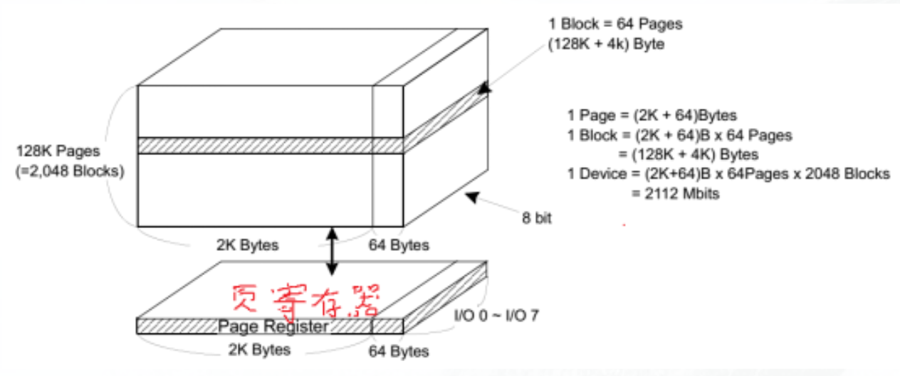

写过程：
写页
生成校验码ECC
写校验码到OOB页中
读过程：
读出页数据，并计算当前数据的ECC
读出存在OOB页里的原始ECC
比较两个校验码，相同则读成功，不同则出现了位反转，需重新读取。

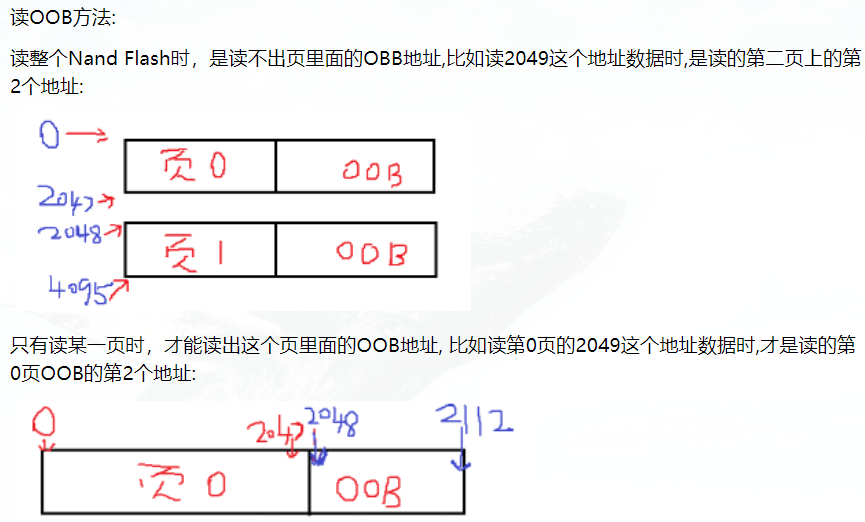

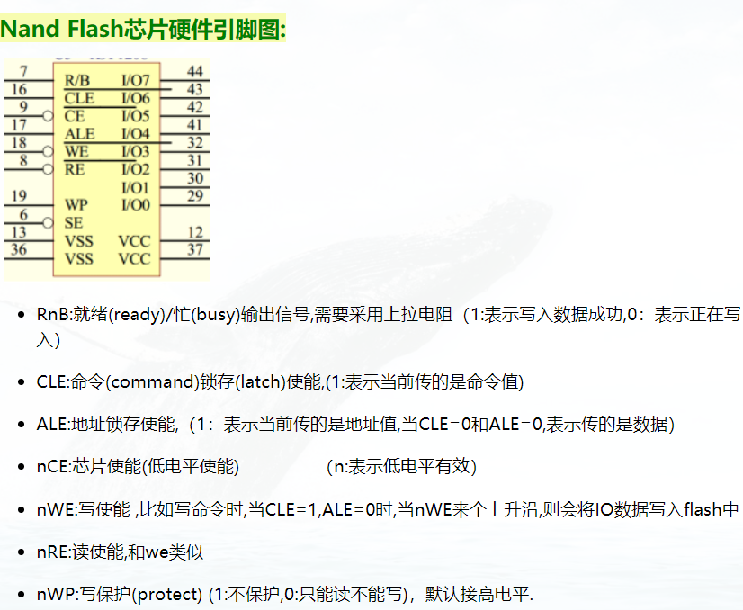

确定通信时序：

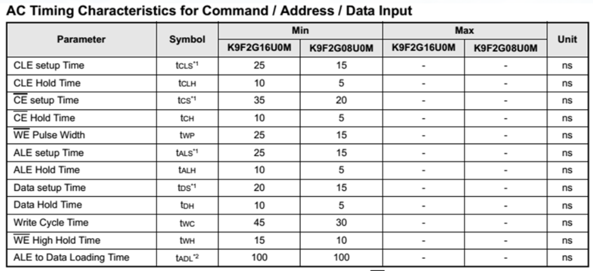

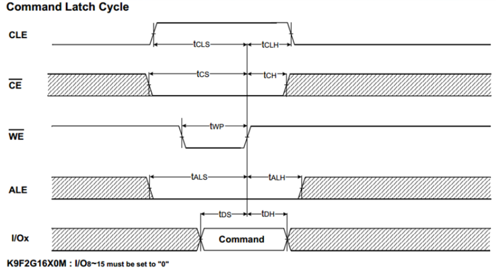
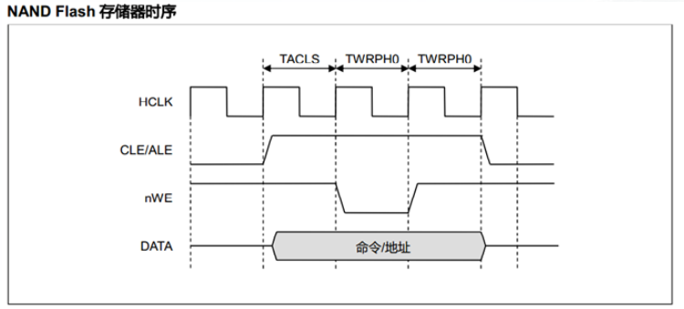
通过图2和图1可以看出:
tCS：等待芯片使能CE的时间, tCS=20nS

tCLS和tALS：等待WE（写信号）结束的时间, tCLS=tALS=15nS

tWP：WE（写信号）维持时间, tWP=15nS

tALH：等待命令写入成功的时间, tALH=5nS

tCLH：等待地址写入成功的时间, tCLH=5nS

通过查看2440芯片手册，nandflash时序图,需要设置TACLS，TWRPH0和TWRPH1
TACLS：属于等待WE(写信号)就绪的时间,对比图2得出TACLS= tCLS- tWP=0nS

TWRPH0：属于WE(写信号)的时间, 对比图2得出TWRPH0= tWP=15nS

TWRPH1：属于等待命令写入成功的时间,对比图2得出TWRPH1=tALH=tCLH=5nS

在NFCONF寄存器中设置这三个参数
TACLS[13:12] ：表示Duration(持续时间)=HCLK*TACLS,由于Duration=0nS，所以TACLS=0

TWRPH0 [10:8] ：表示Duration(持续时间)=HCLK*( TWRPH0+1),由于Duration=15nS，HCLK=10nS(100Mhz),所以TWRPH0 =1.

TWRPH1 [6:4] ：表示Duration(持续时间)= HCLK*( TWRPH1 +1),由于Duration=5nS，HCLK=10nS(100Mhz),所以TWRPH1 =0
```AL
/* nand flash  时序 */#define TACLS      0
#define TWRPH0     1
#define TWRPH1     0

/*     nand  flash  寄存器       */
#define   NFCONF     *((volatile unsigend long *)0X4E000000); //配置寄存器(用来设置时序)
#define   NFCONT     *((volatile unsigend long *)0X4E000000); //控制寄存器(用来使能nandflash控制器以及ECC编码器,还有控制芯片使能CE脚)
#define   NFCMMD    *((volatile unsigend char *)0X4E000000);//发送命令寄存器(命令只有8位)
#define   NFADDR     *((volatile unsigend char *)0X4E000000);//发送地址寄存器(地址只有8位)
#define   NFDATA      *((volatile unsigend int *)0X4E000000);//读/写数据寄存器(数据只有8位)
#define   NFSTAT      *((volatile unsigend int *)0X4E000000);//运行状态寄存器(用于判断RnB脚)

/*因为Nand Flash只有8位I/O脚，所以NFCMMD/ NFADDR/ NFDATA三个寄存器值都是unsigend char型  */

void nand_init(void)
{

 /* 设置时序 */
NFCONF = (TACLS<<12)|(TWRPH0<<8)|(TWRPH1<<4);

/* bit4=1:初始化ECC,  bit1=1:禁止片选  bit0=1:启动nandflash控制器*/    
NFCONT = (1<<4)|(1<<1)|(1<<0);

}
```

（2）编写nand_read()函数
在实现nand_read()函数前，还需要实现以下几个子函数：nand_select()、nand_deselect()、nand_cmd()、nand_waite_idle()、nand_read_data();

1. 片选使能函数(在读写FLASH之前都要选中片选)
void nand_select(void)               //使能片选
{
	int i;
	NFCONT&=~(1<<1);        // NFCONT控制器位1置0
	for(i=0;i<10;i++);           //等待芯片使能成功
}

2. 取消片选函数(在退出读写FLASH时要取消片选)
void nand_deselect(void)                 //取消片选
{
	int i;
	NFCONT&=~(1<<1);        // NFCONT控制器位1置0
	for(i=0;i<10;i++);           //等待芯片使能成功
}

3. nand写命令
void nand_cmd(unsigned char cmd)
{
	volatile int i;
	NFCMMD = cmd;
	for (i = 0; i < 10; i++);
}

4. 判断RnB状态函数(在写入所有命令后都要判断RnB脚是否为高电平就绪)
void nand_wait_ready(void)
{
	while (!(NFSTAT & 1));
}

5. 读数据命令
unsigned char nand_data(void)
{
	return NFDATA;
}

6. 写地址命令
首先Nand Flash引脚只有8位,然而地址共有2048(块)*64(页)*2KB,为了读出多个地址,如下图,所以需要分5个周期来实现发送地址:

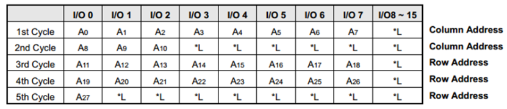

如上图,其中 A10~A0对应页大小(列),由于nandflash每页2048B，所以只用到A10~A0;

A28~A11对应页目录(行),表示共有2048块*64(每块有64页)个目录

例如，4097 地址就是：

A10~A0=4097%2048= 1(A0=1，其余为0)

A28~A11=4097/2048=2（A13=1，其余为0）
```AL
void nand_addr(unsigned int addr)
{
	unsigned int col  = addr % 2048;
	unsigned int page = addr / 2048;
	volatile int i;

	NFADDR = col & 0xff;		/* A7~A0,第1周期 */
	for (i = 0; i < 10; i++);
    
	NFADDR = (col >> 8) & 0xff;	/* A10~A8,第2周期 */
	for (i = 0; i < 10; i++);
	
	NFADDR  = page & 0xff;		/* A18~A11,第3周期 */
	for (i = 0; i < 10; i++);
    
	NFADDR  = (page >> 8) & 0xff;	/* A26~A19,第4周期 */
	for (i = 0; i < 10; i++);
    
	NFADDR  = (page >> 16) & 0xff;	/* A27~A28,第5周期 */
	for (i = 0; i < 10; i++);	
}
```

7. nand 读数据命令

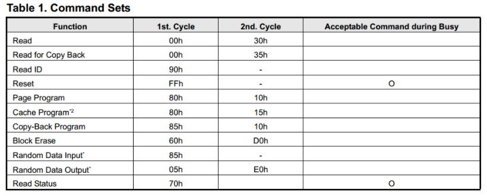
如上图，例如:当要reset复位nand flash时：

使能片选nand_select();

发送0XFF复位命令nand_cmd(0xFF);

等待RnB状态是否就绪 nand_wait_idle();

取消片选 nand_deselect();

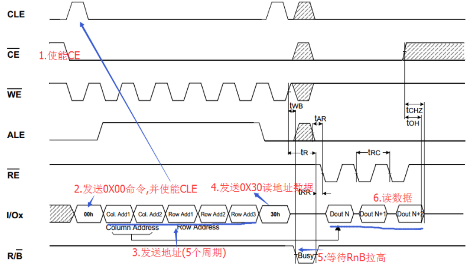

nand flash 读数据分为了以下几个步骤:

(1) 使能片选CE,将CLE置1,等待发送命令

(2) 将WE置低,将IO置为0X00,然后拉高WE,触发一次上升沿,则将把0x00写入flash中

(3) 将CLE置0,表示发送地址(分为5个周期)

(4) 发送读命令0X30

(5) 等待RnB信号为高电平

(6) 读数据(在同一页里，数据可以连续读,读下一页时，需要重新发送新的地址才行例如:读1000地址到2050地址时,

1.发出1000地址,到达页0的1000地址上,然后再连续读(2048-1000)次，直到读到页0的2047处.

2.再发出2048地址，到达页1的0地址上,然后连续读(2051-2048)次,直到读到2050为止)

(7) 取消片选nCE
* 
* src:源地址,为32位地址,所以用unsigend int表示
* dest:目的地址内容,由于这里是将数据读出到目的地址内容中,所以需要用到*指针,
*	   因为每个地址里存的是一个字节,所以用unsigend char型 
*/
void nand_read(unsigned int  src,unsigned char  *dest,unsigned int  len)
{

int col = src % 2048;      //第一次读，可能不是读的页首地址,所以需要记录当前页的位置
int i=0;                //当前读了0次

nand_select();           //1使能片选nCE     
while(i<len)
{ 
    nand_cmd(0X00);         //2发送读命令0X00  
    nand_addr(src);     	// 3发送yuan地址(分为5个周期)
    nand_cmd(0X30);         //4发送读命令0X30    
    nand_wait_idle();       //5等待RnB信号为高电平

   for(;(col<2048)&&(i<len);col++)      //连续读页内数据
   {
       dest[i]=nand_read_data();            //6.读数据
       i++;
       src++;
   }
   col=0;
}
nand_deselect();                // 取消片选nCE
}


（3）编写重定位函数：copy_code_tosdram()
/**************************************************/
/* 				 	重定位函数					  */
/**************************************************/

/* 复制代码段（长度为len = __bss_start- _start）到SDRAM链接地址dest(0x30000000)处*/
void copy_code_to_sdram(unsigned char* src, unsigned char* dest, unsigned int len)
{	
	unsigned int i = 0;
	
	/* 判断nor启动还是nand启动 */
	if (isBootFromNorFlash())
	{
		while (i < len)			/*Nor启动，则直接复制*/
		{
			dest[i] = src[i];
			i++;
		}
	}
	else
	{
		nand_read((unsigned int)src, dest, len);
	}
}


（4）编写isBootFramNorFlash()函数,来判断nand启动还是nor启动
/*******************************************************/
/* 				判断是NOR启动还是NAND启动				*/
/*******************************************************/

int isBootFromNorFlash(void)
{
	volatile int *p = (volatile int *)0;
	
	unsigned int tmp = *p;
	
	*p = 0x12345678;		/*向flash写*/
	if (*p == 0x12345678)
	{
		*p = tmp;			/* 若能成功写入,就是nand flash */
		return 0;
	}
	else
	{
		return 1;			/* 写不成功,就是NOR flash*/
	}
}

（5）编写clear_bss()函数
/******************************************************/
/* 				 	bss段清除函数        			  */
/******************************************************/

void clear_bss(void)
{
	extern int __bss_start, __bss_end;
	int *p = &__bss_start;
	
	for (; p < &__bss_end; p++)
		*p = 0;
}

3、添加头文件： setup.h和serial.h
（1）添加串口支持文件
将串口uart0初始化文件serial.c添加到当前工程目录中，并加以修改。
/*************************************************************/
/* 				 	初始化串口，实现终端显示   				    */
/*************************************************************/

/* 串口引脚的GPIO设置寄存器 */
#define GPHCON              (*(volatile unsigned long *)0x56000070)
#define GPHUP               (*(volatile unsigned long *)0x56000078)

/* UART registers*/
#define ULCON0              (*(volatile unsigned long *)0x50000000)
#define UCON0               (*(volatile unsigned long *)0x50000004)
#define UFCON0              (*(volatile unsigned long *)0x50000008)
#define UMCON0              (*(volatile unsigned long *)0x5000000c)
#define UTRSTAT0            (*(volatile unsigned long *)0x50000010)
#define UTXH0               (*(volatile unsigned char *)0x50000020)
#define URXH0               (*(volatile unsigned char *)0x50000024)
#define UBRDIV0             (*(volatile unsigned long *)0x50000028)

/* 串口发送状态标志*/
#define TXD0READY   (1<<2)


#define PCLK            50000000    // PCLK = 50MHz
#define UART_CLK        PCLK        //  UART0的时钟=PCLK
#define UART_BAUD_RATE  115200      // 波特率115200
#define UART_BRD        ((UART_CLK  / (UART_BAUD_RATE * 16)) - 1)

/*
 * 初始化UART0
 * 115200,8N1,无校验
 */
void uart0_init(void)
{
    GPHCON  |= 0xa0;    // GPH2,GPH3????TXD0,RXD0
    GPHUP   = 0x0c;     // GPH2,GPH3???????

    ULCON0  = 0x03;     // 8N1(8??????λ??????飬1????λ)
    UCON0   = 0x05;     // ????????UART?????PCLK
    UFCON0  = 0x00;     // ?????FIFO
    UMCON0  = 0x00;     // ?????????
    UBRDIV0 = UART_BRD; // ???????115200
}

/*
 * 输出单个字符
 */
void putc(unsigned char c)
{
    /* 等待串口准备好 */
    while (!(UTRSTAT0 & TXD0READY));
    
    /*向串口输入字符 */
    UTXH0 = c;
}

/*
 * 输出字符串
 */
void puts(char *str)
{
	int i = 0;
	while (str[i])
	{
		putc(str[i]);
		i++;
	}
}

/*
 * 输出val的16进制数表示,主要用于调试检查某内存地址的值是否正确
 */

void puthex(unsigned int val)
{
	/* 0x1234abcd */
	int i;
	int j;
	
	puts("0x");

	for (i = 0; i < 8; i++)
	{
		j = (val >> ((7-i)*4)) & 0xf;
		if ((j >= 0) && (j <= 9))
			putc('0' + j);
		else
			putc('A' + j - 0xa);
		
	}
	
}

（2）添加setup.h头文件
因为TAG结构体定义是存在u-boot-1.1.6/include/asm-arm/setup.h中，所以设置TAG参数需要用到这个文件,将setup.h复制到当前工程目录下。

修改setup.h文件，删除以下不需要的代码：

#define __tag __attribute__((unused, __section__(".taglist")))

#define __tagtable(tag, fn) \

static struct tagtable __tagtable_##fn __tag = { tag, fn }


#define tag_member_present(tag,member)                                \

         ((unsigned long)(&((struct tag *)0L)->member + 1)  \

                   <= (tag)->hdr.size * 4)

得到以下setup.h文件：

#ifndef __ASMARM_SETUP_H
#define __ASMARM_SETUP_H

#define u8  unsigned char
#define u16 unsigned short
#define u32 unsigned long

/*
 * Usage:
 *  - do not go blindly adding fields, add them at the end
 *  - when adding fields, don't rely on the address until
 *    a patch from me has been released
 *  - unused fields should be zero (for future expansion)
 *  - this structure is relatively short-lived - only
 *    guaranteed to contain useful data in setup_arch()
 */
#define COMMAND_LINE_SIZE 1024

/* This is the old deprecated way to pass parameters to the kernel */
struct param_struct {
    union {
	struct {
	    unsigned long page_size;		/*  0 */
	    unsigned long nr_pages;			/*  4 */
	    unsigned long ramdisk_size;		/*  8 */
	    unsigned long flags;			/* 12 */
#define FLAG_READONLY	1
#define FLAG_RDLOAD		4
#define FLAG_RDPROMPT	8
	    unsigned long rootdev;			/* 16 */
	    unsigned long video_num_cols;	/* 20 */
	    unsigned long video_num_rows;	/* 24 */
	    unsigned long video_x;			/* 28 */
	    unsigned long video_y;			/* 32 */
	    unsigned long memc_control_reg;	/* 36 */
	    unsigned char sounddefault;		/* 40 */
	    unsigned char adfsdrives;		/* 41 */
	    unsigned char bytes_per_char_h;	/* 42 */
	    unsigned char bytes_per_char_v;	/* 43 */
	    unsigned long pages_in_bank[4];	/* 44 */
	    unsigned long pages_in_vram;	/* 60 */
	    unsigned long initrd_start;		/* 64 */
	    unsigned long initrd_size;		/* 68 */
	    unsigned long rd_start;			/* 72 */
	    unsigned long system_rev;		/* 76 */
	    unsigned long system_serial_low;	/* 80 */
	    unsigned long system_serial_high;	/* 84 */
	    unsigned long mem_fclk_21285;       /* 88 */
	} s;
	char unused[256];
    } u1;
    union {
	char paths[8][128];
	struct {
	    unsigned long magic;
	    char n[1024 - sizeof(unsigned long)];
	} s;
    } u2;
    char commandline[COMMAND_LINE_SIZE];
};


/*
 * The new way of passing information: a list of tagged entries
 */

/* The list ends with an ATAG_NONE node. */
#define ATAG_NONE	0x00000000

struct tag_header {
	u32 size;
	u32 tag;
};

/* The list must start with an ATAG_CORE node */
#define ATAG_CORE	0x54410001

struct tag_core {
	u32 flags;		/* bit 0 = read-only */
	u32 pagesize;
	u32 rootdev;
};

/* it is allowed to have multiple ATAG_MEM nodes */
#define ATAG_MEM	0x54410002

struct tag_mem32 {
	u32	size;
	u32	start;	/* physical start address */
};

/* VGA text type displays */
#define ATAG_VIDEOTEXT	0x54410003

struct tag_videotext {
	u8		x;
	u8		y;
	u16		video_page;
	u8		video_mode;
	u8		video_cols;
	u16		video_ega_bx;
	u8		video_lines;
	u8		video_isvga;
	u16		video_points;
};

/* describes how the ramdisk will be used in kernel */
#define ATAG_RAMDISK	0x54410004

struct tag_ramdisk {
	u32 flags;	/* bit 0 = load, bit 1 = prompt */
	u32 size;	/* decompressed ramdisk size in _kilo_ bytes */
	u32 start;	/* starting block of floppy-based RAM disk image */
};

/* describes where the compressed ramdisk image lives (virtual address) */
/*
 * this one accidentally used virtual addresses - as such,
 * its depreciated.
 */
#define ATAG_INITRD	0x54410005

/* describes where the compressed ramdisk image lives (physical address) */
#define ATAG_INITRD2	0x54420005

struct tag_initrd {
	u32 start;	/* physical start address */
	u32 size;	/* size of compressed ramdisk image in bytes */
};

/* board serial number. "64 bits should be enough for everybody" */
#define ATAG_SERIAL	0x54410006

struct tag_serialnr {
	u32 low;
	u32 high;
};

/* board revision */
#define ATAG_REVISION	0x54410007

struct tag_revision {
	u32 rev;
};

/* initial values for vesafb-type framebuffers. see struct screen_info
 * in include/linux/tty.h
 */
#define ATAG_VIDEOLFB	0x54410008

struct tag_videolfb {
	u16		lfb_width;
	u16		lfb_height;
	u16		lfb_depth;
	u16		lfb_linelength;
	u32		lfb_base;
	u32		lfb_size;
	u8		red_size;
	u8		red_pos;
	u8		green_size;
	u8		green_pos;
	u8		blue_size;
	u8		blue_pos;
	u8		rsvd_size;
	u8		rsvd_pos;
};

/* command line: \0 terminated string */
#define ATAG_CMDLINE	0x54410009

struct tag_cmdline {
	char	cmdline[1];	/* this is the minimum size */
};

/* acorn RiscPC specific information */
#define ATAG_ACORN	0x41000101

struct tag_acorn {
	u32 memc_control_reg;
	u32 vram_pages;
	u8 sounddefault;
	u8 adfsdrives;
};

/* footbridge memory clock, see arch/arm/mach-footbridge/arch.c */
#define ATAG_MEMCLK	0x41000402

struct tag_memclk {
	u32 fmemclk;
};

struct tag {
	struct tag_header hdr;
	union {
		struct tag_core		core;
		struct tag_mem32	mem;
		struct tag_videotext	videotext;
		struct tag_ramdisk	ramdisk;
		struct tag_initrd	initrd;
		struct tag_serialnr	serialnr;
		struct tag_revision	revision;
		struct tag_videolfb	videolfb;
		struct tag_cmdline	cmdline;

		/*
		 * Acorn specific
		 */
		struct tag_acorn	acorn;

		/*
		 * DC21285 specific
		 */
		struct tag_memclk	memclk;
	} u;
};

struct tagtable {
	u32 tag;
	int (*parse)(const struct tag *);
};


#define tag_next(t)	((struct tag *)((u32 *)(t) + (t)->hdr.size))
#define tag_size(type)	((sizeof(struct tag_header) + sizeof(struct type)) >> 2)

#define for_each_tag(t,base)		\
	for (t = base; t->hdr.size; t = tag_next(t))

/*
 * Memory map description
 */
#define NR_BANKS 8

struct meminfo {
	int nr_banks;
	unsigned long end;
	struct {
		unsigned long start;
		unsigned long size;
		int           node;
	} bank[NR_BANKS];
};

extern struct meminfo meminfo;

#endif

4、编写boot.c文件，用于存放main函数
(1)编写main函数代码：
void main(void)

{

void (*theKernel)(int zero, int arch, unsigned int params); 

/*定义一个函数指针theKernel,其中第一个参数zero:0           */

/* arch:机器ID ,由于芯片类型很多,内核为了辨别芯片而定义的机器ID，其中2440芯片的ID号是362,*/

/* params :tag参数位置,这里我们的tag起始地址=0x30000100*/

  /*1 初 始 化 串 口 0 , 使 内 核 能 打 印 信 息  */

  uart0_init();                                             //调用serial.h头文件里的uart0_init()
  puts(“uart0 init OK\r\n”);                                //打印uart0初始化  

  /*2从  nand   flash  里 把 内 核 复 制 到  SDRAM  中 */

  puts(“copy  kernel  from  nand\r\n”);                  //打印内核复制
  nand_read((0x60000+64),0X30008000,0X200000);              //烧写2MB,多烧写点避免出错       

/*

0x60000+64:表示内核在nand(存储)地址上位置,

0X30008000:内核在sdram(运行)地址上位置

0X200000:内核长度2MB

因为Flash上存的内核格式是：uImage(64B头部(header)  + 真正的内核 )

在uboot界面中输入mtd命令可以看到:

              kernel分区位于 nand的0X00060000~0x00260000

所以在nand中真正的内核地址=0x60000+64,

在uboot界面中输入boot命令可以看到:

            Data Size:    1848656 Bytes =1.8 MB

            Load Address: 30008000

所以内核目的地址=0X30008000

长度=1.8MB

*/

  /*3 设  置  T  A  G  参  数        */

 puts(“set  boot  params\r\n”);                  //打印设置参数信息
 setup_start_tag (void);                      //在0X30000100地址保存start_tag数据，
 setup_memory_tags (void);                      //保存memory_tag数据,让内核知道内存多大
 setup_commandline_tag (“boottargs=noinitrd root=/dev/mtdblock3 init=/linuxrc console=ttySAC0”);  
 /*保存命令行bootargs参数,让内核知道根文件系统位置在/dev/mtdblock3,指定开机运行第一个脚本/linuxrc,指定打印串口0*/
 setup_end_tag (void);                            //初始化tag结构体结束

 
 /*  4 跳 转 执 行          */

   puts(“boot   kernel\r\n”);                      //打印启动内核
   theKernel = (void (*)(int, int, unsigend int))0x30008000;
    // 设置theKernel地址=0x30008000,用于后面启动内核
   theKernel(0,362,0x300000100);        //362:机器ID，  0x300000100: params(tag)地址
/*传递参数跳转执行到0x30008000启动内核,           */
/*相当于: mov r0,#0                             */
/*ldr r1,=362                                  */
/*ldr r2,= 0x300000100                         */
/*mov pc,#0x30008000                           */
  puts(“kernel  ERROR\r\n”);                  //打印内核启动出错

}
 
(2) 创建TAG参数 函数
创建tag参数函数代码如下：

#include “setup.h”              

static struct tag *params;               //定义个tag结构体变量params指针

void setup_start_tag (void)              //开始tag
{
	params = (struct tag *) 0x30000100;  //tag起始地址等于0X30000100
	params->hdr.tag = ATAG_CORE;         //头部常量tag=0x54410001
	params->hdr.size = tag_size (tag_core);    //size=5,

	params->u.core.flags = 0;
	params->u.core.pagesize = 0;
	params->u.core.rootdev = 0;
	params = tag_next (params);     //parmas=( struct tag *)((u32 *)parmas+ params->hdr.size)  
}

// setup_start_tag (bd)保存tag参数如下:
setup_memory_tags (void)                //内存tag
{

int i;
params->hdr.tag = ATAG_MEM;               //头部常量tag=0x54410002
params->hdr.size = tag_size (tag_mem32);       //size=4
params->u.mem.start = 0x30000000;            //SDRAM起始地址
params->u.mem.size = 0x4000000;             //SDRAM内存大小64M
params = tag_next (params);                  //指向下个tag
}  

// setup_memory_tag s(bd)保存tag参数如下:
int strlen(char  *str)          //uboot不依赖任何库,所以需要自己写strlen函数
{
   int  i=0;
   while(str[i])
   {
    i++;
   }
return i;
}

void strcpy(char  *dest, char  *src)
{  
   while((*dest++=*src++)!=’\0’&&*dest!=’\0’);  
}

 

setup_commandline_tag (char  *cmdline)     //命令行tag
/**cmdline :指向命令行参数                                                             */
/*一般为:“boottargs=noinitrd root=/dev/mtdblock3 init=/linuxrc console=ttySAC0”     */
{
 int len=strlen(cmdline)+1;                       //计算cmdline长度,并加上结束符
params->hdr.tag = ATAG_CMDLINE;             //头部常量tag=0x54410009
params->hdr.size =(sizeof (struct tag_header) +len+3) >> 2;    /*size=(字符串长度+头部长度) >>2 */
/*“+3”表示:按4字节对齐,比如当总长度=(1,2,3,4)时,size=(总长度+3)>>2=1，实现4字节对齐         */ 
strcpy (params->u.cmdline.cmdline, cmdline);      //复制形参字符串到params->u.cmdline.cmdline
params = tag_next (params);                    //执行下个tag
}

 
setup_end_tag (void)                            //结束tag
{
 params->hdr.tag = 0;                   
 params->hdr.size = 0;
}
 
5、编写链接脚本：boot.lds
（1）链接脚本语法提示：
1、1.lds链接脚本中每个符号(:或者=)左右都要加上空格或TAB按键 ；

. = ALIGN(4); 
.rodata:{*(.rodata)} //这里:左右没有空格,将出错,改为 .rodata : {*(.rodata*)}
 
2、lds链接脚本中{}和()后都不能加";"分号。

.rodata : {*(.rodata*)}; //这里"}"后面加了";"逗号,将出错

3、lds脚本sections中若是以当前地址.等于xxx时,.后面都要加空格；

.= 0x33f80000; //这里.后面没有加空格,出错  
. = 0x33f80000; 
. = ALIGN(4);
 
4、lds脚本中定义符号时,都要使符号在前。

__bss_start = .; 
.bss : { *(.bss) *(COMMON) }
. = __bss_end; //这里定义"__bss_end"符号出错,应该改为   __bss_end = .;
 
（2）链接脚本说明
链接脚本中的0x33f80000就是链接地址（即程序运行时，该代码段将被链接到内存的此地址处）,共512K空间存放bootloader；

定义__bss_start和__bss_end符号,是用来在程序开始之前，将这些未定义的变量清0,节省内存且_bss_start-0x33f80000就等于代码的大小(即copy_code_tosdram函数中len值)。

SECTIONS {
    . = 0x33f80000;
    
    . = ALIGN(4);
    .text : { *(.text) }
    
    . = ALIGN(4);
    .rodata : {*(.rodata*)} 
    
    . = ALIGN(4);
    .data : { *(.data) }
    
    . = ALIGN(4);
    __bss_start = .;
    .bss : { *(.bss)  *(COMMON) }
    __bss_end = .;
}

（3）NAND FLASH分区说明
一般在头文件中会通过MTDPARTS_DEFAULT宏定义，明确flash的分区设置，一般来说会分为4个区，依次存放bootloader、启动参数、内核映像、根文件系统。

bootloader	     一开机直接运行u-boot
boot parameters	                    存放一些可以设置的参数,供u-boot使用
kernel	        存放内核区
root filesystem	        根文件系统,挂载(mount)后才能使用文件系统中的应用程序
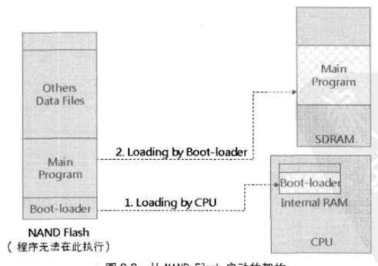

### （4）NAND Flash启动的架构和流程
启动流程为：

上电后，CPU内置程序会从NAND Flash的特定地址（一般是第一个block块地址）读出Boot-Loader程序到CPU的内部内存中。
CPU将控制权交给内部存储器中的Boot-Loader；
Boot-Loader初始化SDRAM，再从NAND Flash中将主程序载入到SDRAM中；
Boot-Loader将控制权交给主程序。
 
## 6、编写makefile文件
**备注：**在makefile中‘=’与‘:=’的区别：

‘=’ 无关位置的等于(比如:”x=a y=$(x) x=b”,那么y的值永远等于最后的值,等于 b ,而不是a)

‘:=’ 有关位置的等于(比如:”x:=a y:=$(x) x:=b”,那么y的值取决于当时位置的值,等于 a ,而不是b)
```Makefile
CC      = arm-linux-gcc               //定义CC变量=arm-linux-gcc,简化书写,编译命令,(*.C,*.S)文件生成*.O文件

LD      = arm-linux-ld                 //连接命令,将多个*.O文件生成 boot.elf       

AR      = arm-linux-ar                 //库管理命令,这里没有用到 

OBJCOPY = arm-linux-objcopy            //复制/格式转换命令, boot.elf生成boot.dis

OBJDUMP = arm-linux-objdump           //反汇编命令,boot.bin生成boot.dis

 
//GCC编译参数,-Wall:显示所有错误和警告, -O2:采用2级编译优化
CFLAGS           := -Wall -O2

//添加头文件参数,-nostdinc忽略缺省目录, -fno-builtin不连接系统标准启动文件和标准库文件（表示不用自带的strlen()等库函数）
CPPFLAGS     := -nostdinc -fno-builtin       


//定义objs变量，包含生成boot.bin目标文件需要的依赖文件
objs := start.o init.o boot.o 

//执行生成目标文件，首先是先满足objs所有依赖文件都拥有，才执行
boot.bin: $(objs)     
	${LD} -Tuboot.lds -o boot_elf $^
    ${OBJCOPY} -O binary -S boot_elf $@
    ${OBJDUMP} -D -m arm boot_elf > boot.dis

//-c编译不连接。$@表示目标文件   $<表示第一个依赖文件
%.o:%.c
	${CC} $(CPPFLAGS) $(CFLAGS) -c -o $@ $<   
 
%.o:%.S
	${CC} $(CPPFLAGS) $(CFLAGS) -c -o $@ $<

clean:
	rm -f *.bin *.elf *.dis *.o

```
## 7、下载编译
**（1）**新建一个文件夹，并命名为bootloader，将以上编写好的：boot.c、init.c、start.S、setup.h、boot.lds和Makefile文件复制进去。然后将该bootloader文件夹通过共享文件夹或FileZilla软件拷贝进虚拟机linux环境下。

**（2）**在Linux环境下通过终端命令行进入到该bootloader文件夹中，执行make命令，进行编译、链接：
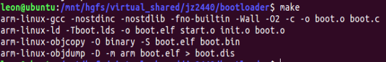
**(3)**将得到的二进制文件boot.bin拷贝到Windows环境下的D盘根目录下。

**(4)**键盘“Win + R”组合键，输入cmd回车，打开WIndows下的命令行终端，输入命令d:进入D盘根目录。

**(5)**打开开发板电源，将JTAG-USB转接工具连接到电脑USB口，在WIndows命令行终端终端输入oflash boot.bin命令，运行FLASH烧录工具，将二进制目标文件烧录进目标板的NAND Flash中：
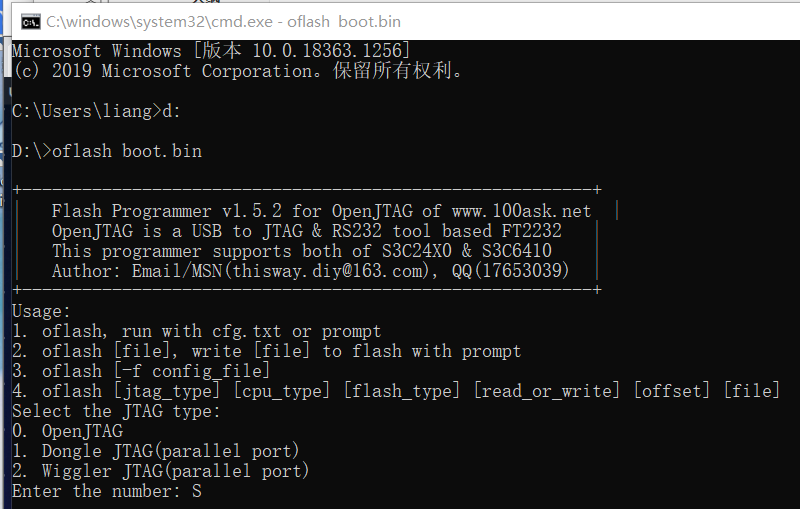
**(6)**选择0回车，进入OpenJTAG模式，再依次键入1选择S3C2440目标板、后面都键入0完成烧录。

**（7）**用串口调试线连接开发板的COM口和电脑的USB口，打开MobaXterm串口连接工具，并连接到开发板。关闭开发板电源后，再重新接通电源，通过MobaXterm软件观察开发板启动情况。

**(8)**如果程序正确，将会看到开发板顺利启动内核并运行起来了linunx。

[参考文章](https://blog.csdn.net/liangzc1124/article/details/112410745)