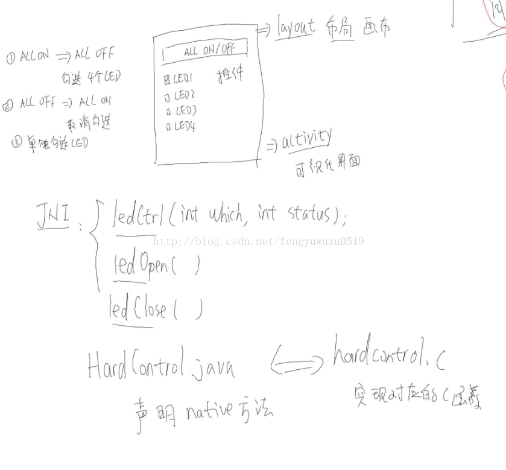

# [硬件访问服务之（一）Android通过JNI访问硬件](https://blog.csdn.net/fengyuwuzu0519/article/details/55224423?utm_medium=distribute.pc_relevant.none-task-blog-baidujs_baidulandingword-7&spm=1001.2101.3001.4242)
硬件平台：tiny4412
系统：Android  5.0.2
编译器： arm-linux-gcc-4.5.1
首先来看一下android的系统框图。google后期加入一层HAL层，硬件访问层HAL
https://developer.android.com/guide/platform/index.html


1、android访问硬件驱动的两种方式
android如何管理多个应用对硬件的访问：硬件访问服务。
方法1：

java的JNI技术 使得java可以访问C库。那我们就可以写好一个操作硬件的C库，然后加入到应用的工程中去，通过JNI来访问C库，从而实现对硬件的访问，这是操作硬件最简单的方法，但是没有凸显出android的特色。
优点：传统方法，简单易实现
缺点：jni多个设备同时访问，都可以来open吗？显然效率不好。
技术思路


方法2：

硬件访问服务：发送请求服务—jni。不同硬件对应不同服务。


2、基于JNI的硬件访问
 2.1、LED应用开发
首先我们来写一个应用程序，这个应用程序主要目的是 实现对硬件LED的操作。
开发框图



编写android应用程序
（1）创建一个android应用程序工程
（2）编写布局代码

```xml
<?xml version="1.0" encoding="utf-8"?>
<LinearLayout xmlns:android="http://schemas.android.com/apk/res/android"
    xmlns:tools="http://schemas.android.com/tools"
    android:id="@+id/activity_main"
    android:layout_width="match_parent"
    android:layout_height="match_parent"
    tools:context="com.yang.MainActivity"
    android:orientation="vertical">

    <TextView
        android:layout_width="wrap_content"
        android:layout_height="wrap_content"
        android:text="Hello World!"
        android:padding="10dp"/>

    <Button

        android:text="ALL on"
        android:layout_width="match_parent"
        android:layout_height="wrap_content"
        android:padding="10dp"
        android:id="@+id/button" />
    <CheckBox
        android:layout_width="match_parent"
        android:layout_height="wrap_content"
        android:text="LED1"
        android:onClick="onCheckboxClicked"
        android:id="@+id/led1" />

    <CheckBox
        android:layout_width="match_parent"
        android:layout_height="wrap_content"
        android:text="LED2"
        android:onClick="onCheckboxClicked"
        android:id="@+id/led2" />

    <CheckBox
        android:layout_width="match_parent"
        android:layout_height="wrap_content"
        android:text="LED3"
        android:onClick="onCheckboxClicked"
        android:id="@+id/led3" />

    <CheckBox
        android:layout_width="match_parent"
        android:layout_height="wrap_content"
        android:text="LED4"
        android:onClick="onCheckboxClicked"
        android:id="@+id/led4" />
</LinearLayout>
```

（3）添加按键和复选框的监听事件：
代码片段：
```java
button.setOnClickListener(new MyButtonListener());
class MyButtonListener implements View.OnClickListener {
    @Override
    public void onClick(View v) {

        HardControl hardControl = new HardControl();//依赖硬件

        led_on = !led_on;
        if (led_on) {
            button.setText("ALL OFF");
            led1.setChecked(true);
            led2.setChecked(true);
            led3.setChecked(true);
            led4.setChecked(true);
            for (int i = 0; i < 4; i++)
                HardControl.ledCtrl(i, 1);
        }
android:onClick="onCheckboxClicked"
public void onCheckboxClicked(View view) {
    // Is the view now checked?
    boolean checked = ((CheckBox) view).isChecked();

    // Check which checkbox was clicked
    switch(view.getId()) {
        case R.id.led1:
            if (checked)
            {
                Toast.makeText(getApplicationContext(),"led1_on",Toast.LENGTH_LONG).show();
                HardControl.ledCtrl(1, 1);
            }
    else
    {
        Toast.makeText(getApplicationContext(),"led1_off",Toast.LENGTH_LONG).show();
        HardControl.ledCtrl(1, 0);
    }
    break;
case R.id.led2:


```

（4）申明本地java方法


HardControl.JAVA：

```java 

package com.example.yangfei.hardlibrary;
public class HardControl {
    public static native int ledCtrl(int which, int status);
    public static native int ledOpen();
    public static native void ledClose();//申明三个本地方法。
 
    static {
        try {
            System.loadLibrary("hardcontrol");
        } catch (Exception e) {
            e.printStackTrace();
        }
    }
}

```

下载到单板出错，是因为找不到库


（5）修改build.gradle，告诉系统库在哪里放着

```gradle
sourceSets {
    main {
        jniLibs.srcDirs = ['libs']
    }
}
```

（6）在app/libs下建armeabi子目录，放入so文件（so怎么得到看下一节JNI文件的编写）


onCreate： HardControl.ledCtrl(0, 1);


2.2 JNI文件编写hardcontrol.c

（1）基本的JNI访问C库实现hardcontrol.c
```C

#include <jni.h>  /* /usr/lib/jvm/java-1.7.0-openjdk-amd64/include/ */
#include <stdio.h>
#include <stdlib.h>
#if 0
typedef struct {
    char *name;          /* Java里调用的函数名 */
    char *signature;    /* JNI字段描述符, 用来表示Java里调用的函数的参数和返回值类型 */
    void *fnPtr;          /* C语言实现的本地函数 */
} JNINativeMethod;
#endif
jint ledOpen(JNIEnv *env, jobject cls)
{
	return 0;
}
void ledClose(JNIEnv *env, jobject cls)
{
}
jint ledCtrl(JNIEnv *env, jobject cls, jint which, jint status)
{
	return 0;
}
static const JNINativeMethod methods[] = {
	{"ledOpen", "()I", (void *)ledOpen},
	{"ledClose", "()V", (void *)ledClose},
	{"ledCtrl", "(II)I", (void *)ledCtrl},
};
/* System.loadLibrary */
JNIEXPORT jint JNICALL
JNI_OnLoad(JavaVM *jvm, void *reserved)
{
	JNIEnv *env;
	jclass cls;
	if ((*jvm)->GetEnv(jvm, (void **)&env, JNI_VERSION_1_4)) {
		return JNI_ERR; /* JNI version not supported */
	}
	cls = (*env)->FindClass(env, "com/example/yangfei/hardlibrary/HardControl");
	if (cls == NULL) {
		return JNI_ERR;
	}
	/* 2. map java hello <-->c c_hello */
	if ((*env)->RegisterNatives(env, cls, methods, sizeof(methods)/sizeof(methods[0])) < 0)
		return JNI_ERR;
 
	return JNI_VERSION_1_4;
}

```

编译hardcontrol.c生成SO文件

arm-linux-gcc -fPIC -shared hardcontrol.c -o libhardcontrol.so -I /usr/lib/jvm/java-1.7.0-openjdk-amd64/include/  -nostdlib /work/android-5.0.2/prebuilts/ndk/9/platforms/android-19/arch-arm/usr/lib/libc.so


-I   /usr/lib/jvm/java-1.7.0-openjdk-amd64/include/ ： jni.h的存放目录


-nostdlib  不使用标准库 是android系统源码里的 如下：

/work/android-5.0.2/prebuilts/ndk/9/platforms/android-19/arch-arm/usr/lib/libc.so   ： 指定libc.so，因为依赖于这个库


（2）加入打印信息hardcontrol.c
使用：__android_log_print(ANDROID_LOG_DEBUG,"LEDDemo", "native ledOpen ...");


# [硬件访问服务之（二）Android通过硬件访问服务访问硬件](https://blog.csdn.net/fengyuwuzu0519/article/details/55271199)

# [硬件访问服务之（三）Android加入HAL层访问硬件](https://xingxingzhihuo.blog.csdn.net/article/details/55274891?utm_medium=distribute.pc_relevant.none-task-blog-BlogCommendFromMachineLearnPai2-5.control&depth_1-utm_source=distribute.pc_relevant.none-task-blog-BlogCommendFromMachineLearnPai2-5.control)

# [硬件访问服务之（四）Android应用程序APP编写](https://xingxingzhihuo.blog.csdn.net/article/details/73864567?utm_medium=distribute.pc_relevant.none-task-blog-BlogCommendFromMachineLearnPai2-4.control&depth_1-utm_source=distribute.pc_relevant.none-task-blog-BlogCommendFromMachineLearnPai2-4.control)


